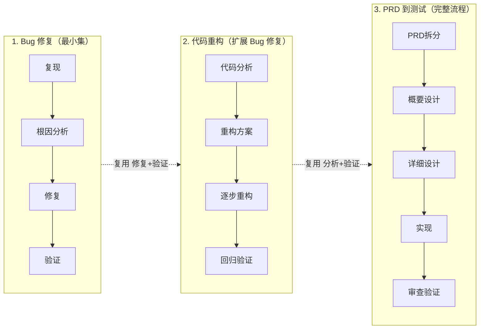
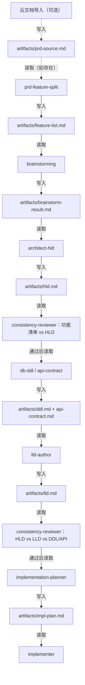
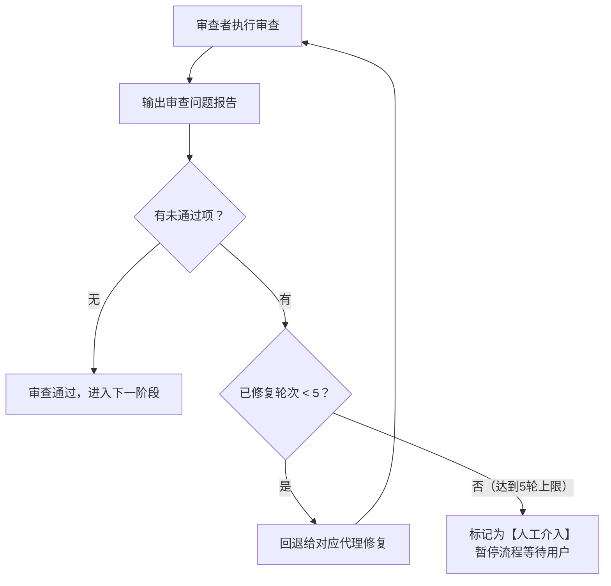

# Harness Engineering

> 一套围绕 Cursor IDE 的 AI 编码 Agent 工程化配置仓库。它通过 **Rules / Skills / Agents / Workflows / MCP** 五类资源，弥补 LLM 的固有缺陷（无状态、上下文受限、输出概率性），让 AI 在协助开发时**可靠、可追溯、可治理**。

`Agent = Model + Harness`。本仓库提供的就是那个 **Harness**——同一个模型，有了它，可以在固定工作流上稳定产出符合项目编码规范、可被人工审计的代码与设计制品。

## 目录

- [什么是 Harness 工程](#什么是-harness-工程)
- [仓库结构](#仓库结构)
- [四类资源说明](#四类资源说明)
- [三工作流渐进体系](#三工作流渐进体系)
- [快速开始](#快速开始)
- [技能详细说明](#技能详细说明)
- [制品链与一致性审查](#制品链与一致性审查)
- [审查-修复闭环机制](#审查-修复闭环机制)
- [人工检查点与决策记录](#人工检查点与决策记录)
- [记忆固化机制](#记忆固化机制)
- [全局调试日志](#全局调试日志)
- [接入业务项目](#接入业务项目)
- [扩展指引](#扩展指引)
- [模板与清单](#模板与清单)
- [仓库哲学](#仓库哲学)

---

## 什么是 Harness 工程

Harness 工程是一套围绕 AI 工具（如 Cursor）建立的工程化使用体系。它通过规则、技能、子代理、工作流四类资源，弥补 AI 模型的固有缺陷，让 AI 在辅助开发时更可靠、更高效。

AI 模型有四个固有缺陷：

| 缺陷 | 表现 | Harness 解决方案 |
|------|------|-----------------|
| 无状态 | 对话结束就忘记一切 | 记忆层：规则文件持久化项目知识 + 记忆固化机制 |
| 只能生成文字 | 无法直接操控外部世界 | 执行层：工具链 + 权限边界 |
| 上下文窗口有限 | 不能一次处理所有信息 | 编排层：任务拆解 + 渐进式信息披露 + 制品链 |
| 输出概率性 | 同样输入可能不同输出 | 反馈层：审查闭环 + 一致性审查 + 人工检查点 |

---

## 仓库结构

```
.cursor/
  AGENTS.md                ← 顶层代理指令（架构概述 + 三工作流总览）
  CLAUDE.md                ← LLM 通用行为准则（精简版）
  mcp/                     ← MCP 服务管理
    mcp-template.json        MCP 配置模板（不含密钥，复制为 .cursor/mcp.json 后填入）
  scripts/                 ← 校验脚本（check-rule-cross-refs.ps1 / .sh；init-codegraph.ps1 / .sh）
  rules/                   ← 被动规则，自动加载（共 42 条）
    memory/   (26)           编码规范：命名/异常/日志/空值/方法/注释/集合/并发/日期/POJO/依赖/API/数据库/测试/项目架构/微服务/多租户/MCP/Redis/MQ/ORM/安全/控制流/代码格式/OBS/ER 图等
    orchestration/ (6)       工作流编排：Git 分支/Git 提交/变更实施/任务拆解/阶段契约/规则加载器
    feedback/ (8)            门禁守卫：编译/Lint/测试/变更范围/Schema/纠正检测/人工检查点/Java 编辑自检
    execution/ (2)           安全边界：操作红线/环境边界
  skills/                  ← 主动技能，按需调用（共 13 个）
    shared/   (4)            调试日志/完成验证/Git Worktree/代码生成守卫
    bugfix/   (2)            结构化调试/测试驱动修复
    refactoring/ (2)         重构规划/安全重构
    feature/  (5)            头脑风暴/编写计划/全流程编排/HLD→飞书/LLD→飞书
  agents/                  ← 子代理，工作流调度（共 15 个）
    shared/   (4)            实现者/代码审查者/记忆固化/一致性审查
    bugfix/   (2)            Bug 分析师/ONES+Loki 排查
    refactoring/ (2)         重构规划师/质量审查
    feature/  (7)            PRD 拆分/HLD/DDL/API/LLD/实现规划/规格审查
  workflows/               ← 工作流 YAML（共 3 个，渐进包含）
    bugfix.yaml              Bug 修复（最小集）
    refactoring.yaml         代码重构（在 Bug 修复基础上扩展）
    feature-delivery.yaml    PRD→交付（完整流水线）
docs/
  templates/               ← 模板与清单
    review-checklist.md      AI 产出人工审查清单
    task-template.md         需求拆解模板
    decision-log-template.md 决策记录模板
    debug-log-template.md    调试日志模板
  artifacts/               ← 子代理间的制品交接目录
    archive/                 历史制品归档
link-cursor-config.ps1     ← Windows：将 .cursor/ 软链到目标业务项目
link-cursor-config.sh      ← macOS/Linux：同上
```

---

## 四类资源说明

| 类型 | 性质 | 加载方式 | 类比 |
|------|------|----------|------|
| Rules | 被动约束 | 自动加载（always/glob） | 交通规则 |
| Skills | 主动能力 | AI 检测到任务时调用 | 驾驶技能 |
| Agents | 独立代理 | 由工作流调度派出 | 专职司机 |
| Workflows | 流程编排 | 用户触发 | 导航路线 |

**混合组织原则**：Rules 按四层分类（被动加载，按职责归类），Skills 和 Agents 按工作流分组（主动调度，按场景直觉），Workflows YAML 跨层引用资源。

---

## 三工作流渐进体系

三个工作流是渐进包含关系，像俄罗斯套娃：



### 工作流 1：Bug 修复（bugfix.yaml）

```
触发 → 复现Bug → 根因分析 → 编写修复 → 验证 → 审查 → 完成
```

适用场景：修复已知 bug、处理异常报告、解决线上问题。

使用资源：
- **Agents**: `shared/implementer` + `shared/code-reviewer` + `shared/memory-consolidator` + `bugfix/bug-analyst`
- **Skills**: `shared/verification-before-completion` + `bugfix/systematic-debugging` + `bugfix/test-driven-bugfix`
- **Rules**:
  - memory: `exception-handling` + `null-safety` + `logging`
  - orchestration: `git-branch` + `git-commit`
  - feedback: `compilation-guard` + `lint-guard` + `test-guard`
  - execution: `execution-boundary` + `environment-boundary`

### 工作流 2：代码重构（refactoring.yaml）

```
触发 → 代码分析 → 制定方案 → 逐步重构 → 回归验证 → 质量审查 → 完成
```

适用场景：消除代码坏味道、改善代码结构、提升可维护性。

使用资源（Bug 修复的全部 + 以下新增）：
- **Agents**: + `refactoring/refactoring-planner` + `refactoring/code-quality-reviewer`
- **Skills**: + `refactoring/refactoring-planning` + `refactoring/safe-refactoring`
- **Rules 新增**:
  - memory: + `method-design` + `naming-conventions` + `comment-conventions`
  - orchestration: + `change-implementation`
  - feedback: + `change-scope-guard`

### 工作流 3：PRD 到测试（feature-delivery.yaml）

```
[可选: 云文档导入→prd-source.md] → 功能拆分 → 头脑风暴 → 概要设计 → [一致性审查] → [HLD→飞书→人工确认]
  → DDL/API → 详细设计 → [一致性审查] → [LLD→飞书→人工确认]
  → 实现计划 → 编码 → [规格审查] → [质量审查] → [通用审查] → 验证 → 收尾
```

适用场景：新功能开发、需求迭代、模块新建。首步可选：从飞书等云文档将 PRD 内容导入为本地 md 文件，后续全程基于本地 md 文件流转。概要设计和详细设计通过审查后，自动发布到飞书云文档供人工确认。

使用资源（重构的全部 + 以下新增）：
- **Agents**: + `feature/prd-feature-split` + `feature/architect-hld` + `feature/lld-author` + `feature/implementation-planner` + `feature/db-ddl` + `feature/api-contract` + `feature/spec-reviewer` + `shared/consistency-reviewer`
- **Skills**: + `feature/brainstorming` + `feature/writing-plans` + `feature/feature-delivery-workflow` + `feature/hld-to-feishu` + `feature/lld-to-feishu` + `shared/code-generation-guardian`
- **Rules 新增**:
  - memory: + `project-architecture` + `database-conventions` + `api-design` + `testing-conventions` + `dependency-management`（全部 memory 规则激活）
  - orchestration: + `task-decomposition`
  - feedback: + `schema-guard`

**完整审查链**（渐进继承 + 新增）：

1. `consistency-reviewer` — 阶段交接时校验制品对齐（HLD 后、LLD 后）
2. `spec-reviewer` — 实现完成后校验代码是否按 LLD 设计
3. `code-quality-reviewer` — 继承自重构流程，校验代码质量
4. `code-reviewer` — 继承自 Bug 修复流程，最终审查

---

## 快速开始

### 修复 Bug

告诉 AI："修复 [bug 描述]"，将自动启动 `bugfix` 工作流。

### 重构代码

告诉 AI："重构 [目标代码/模块]"，将自动启动 `refactoring` 工作流。

### 开发新功能

告诉 AI："实现 [PRD/需求描述]"，将自动启动 `feature-delivery` 工作流。

### 查看执行日志

工作流执行后，查看 `docs/artifacts/harness-debug.md` 了解完整轨迹。

### 查看历史制品

已完成任务的制品归档在 `docs/artifacts/archive/` 目录下。

---

## 技能详细说明

### shared/ 共享技能

**harness-debug-logger** — Harness 全局调试日志
- 记录 harness 工程运行时的完整轨迹，用于调试工作流执行过程
- 触发点：规则加载、资源冲突检测、技能调用、子代理派发、审查闭环、人工检查点
- 产出：`docs/artifacts/harness-debug.md`（格式见 `docs/templates/debug-log-template.md`）

**verification-before-completion** — 完成前验证检查清单
- 在任何任务标记"完成"前，强制执行检查清单：编译通过 → 测试全绿 → Lint 干净 → diff 只含需求相关改动 → 无遗留 TODO

**using-git-worktrees** — Git Worktree 并行开发
- 当多个子任务可并行时，用 git worktree 创建隔离工作目录，避免分支切换冲突

**code-generation-guardian** — 代码生成合规守卫
- 创建新源代码文件或新增类/接口时，检查分层、命名、是否有可复用代码、包路径

### bugfix/ Bug 修复技能

**systematic-debugging** — 结构化调试流程
- 收集信息（日志/堆栈/复现步骤）→ 形成假设列表 → 逐个验证假设 → 确认根因 → 输出根因分析报告

**test-driven-bugfix** — 测试驱动修复
- 先写一个失败测试复现 bug → 修改代码让测试通过 → 运行全量回归测试确认无副作用

### refactoring/ 重构技能

**refactoring-planning** — 重构方案规划
- 识别坏味道类型 → 选择重构手法 → 拆分为可独立验证的小步骤序列 → 输出重构计划

**safe-refactoring** — 安全重构执行
- 每步只做一种重构操作 → 每步完成后立即运行测试 → 测试红了立即回滚 → 禁止在重构中夹带功能变更

### feature/ 功能交付技能

**brainstorming** — 需求方案头脑风暴
- 梳理需求边界和约束 → 列出至少 2-3 种技术方案 → 对比优劣 → 输出推荐方案和理由

**writing-plans** — 设计转实现计划
- 拆分子任务 → 标注依赖关系 → 判断哪些可并行 → 定义验证方式 → 输出结构化计划文档

**feature-delivery-workflow** — 全流程交付编排
- 作为功能交付的总指挥，按阶段依次调度子代理（PRD 拆分→头脑风暴→概要设计→DDL/API→详细设计→实现计划→编码→审查→验证→收尾）

**hld-to-feishu** / **lld-to-feishu** — 设计文档发布飞书
- 概要设计/详细设计通过一致性审查后，自动发布到飞书云文档供人工确认

---

## 制品链与一致性审查

子代理会话隔离，通过文件交接：每个子代理读取上游制品，完成后写入下游制品，**真相在文件里**。

### 制品流转图



### 制品文件清单

| 文件 | 说明 |
|------|------|
| `prd-source.md` | PRD 原文本地副本（可选，从云文档导入） |
| `feature-list.md` | 功能点列表、优先级、验收标准 |
| `brainstorm-result.md` | 技术方案选项、对比、推荐理由 |
| `hld.md` | 模块划分、接口草案、数据流、技术选型 |
| `ddl.md` | 表结构、索引、约束 |
| `api-contract.md` | 接口路径、请求/响应体、状态码 |
| `lld.md` | 类设计、方法签名、序列图、关键算法 |
| `impl-plan.md` | 子任务清单、依赖关系、并行策略、验证方式 |
| `decision-log.md` | 用户决策记录（格式见 `docs/templates/decision-log-template.md`） |
| `harness-debug.md` | Harness 调试日志（格式见 `docs/templates/debug-log-template.md`） |

### 制品生命周期

活跃制品始终在 `docs/artifacts/` 根目录，任务完成后自动归档。

```
docs/artifacts/
  feature-list.md          ← 当前任务的活跃制品（平铺）
  hld.md
  lld.md
  ...
  archive/                 ← 历史归档
    2026-04-16-用户注册功能/
      feature-list.md
      hld.md
      lld.md
      review-report-final.md
```

**归档规则**：
1. 触发时机：任务收尾阶段（`verification-before-completion` 技能执行后）
2. 归档动作：将 `docs/artifacts/` 根目录下所有 `.md` 文件移入 `archive/{日期}-{任务简称}/`
3. 命名格式：`archive/YYYY-MM-DD-{任务简称}/`
4. 归档后根目录恢复干净状态，只保留 `.gitkeep` 和 `archive/`
5. 归档只是移动，不删除任何文件，历史可追溯

### 一致性审查

在关键阶段交接点插入 `consistency-reviewer` 子代理，校验上下游制品对齐。

**审查点 1**：HLD 完成后
- 输入：`feature-list.md` + `hld.md`
- 校验：每个功能点是否都有对应的模块/接口？HLD 是否引入了功能清单没有的内容？
- 不通过：输出差异报告，回退给 `architect-hld` 修正

**审查点 2**：LLD 完成后
- 输入：`hld.md` + `ddl.md` + `api-contract.md` + `lld.md`
- 校验：LLD 中的类/方法是否覆盖 HLD 所有接口？DDL 字段是否与 LLD 实体一致？API 契约参数是否与 LLD 方法签名匹配？
- 不通过：输出差异报告，回退给 `lld-author` 修正

**审查点 3**（可选）：实现完成后
- 输入：`lld.md` + 实际代码
- 校验：代码是否按 LLD 的类/方法设计实现？
- 由 `spec-reviewer` 执行

---

## 审查-修复闭环机制

所有审查节点统一遵循同一套闭环流程：



**闭环规则**：

1. **输出报告**：每轮审查产出结构化报告，记录到 `docs/artifacts/`，含问题列表（阻塞/警告/建议）、涉及文件和行号、修复建议
2. **自动回退修复**：审查不通过时，自动将报告发给对应上游代理修正
3. **再次审查**：修复完成后重新进入同一审查节点
4. **最多 5 轮**：防止死循环
5. **超限处理**：达到 5 轮仍有未通过项时，合并所有历史轮次报告，剩余问题标记为【人工介入】，暂停等待用户

**各工作流的审查闭环**：

| 工作流 | 审查链 |
|--------|--------|
| Bug 修复 | 编码 → `code-reviewer`（闭环）→ 验证 → 完成 |
| 代码重构 | 重构 → `code-quality-reviewer`（闭环）→ `code-reviewer`（闭环）→ 验证 → 完成 |
| 功能交付 | 编码 → `spec-reviewer`（闭环）→ `code-quality-reviewer`（闭环）→ `code-reviewer`（闭环）→ 验证 → 完成 |

---

## 人工检查点与决策记录

工作流执行过程中遇到不确定情况时，暂停询问用户，并将问答记录持久化。

**暂停条件**（`human-checkpoint.mdc`，always 加载）：

| 场景 | 说明 |
|------|------|
| 需求模糊 | 需求描述有歧义、缺少边界条件、可以有多种理解 |
| 方案抉择 | 存在多个可行方案且各有明显优劣，无法自行判定 |
| 风险操作 | 删表、改接口签名、移除公共方法、破坏性数据迁移等不可逆变更 |
| 超出范围 | 发现需求涉及的改动超出预期范围 |
| 假设不确定 | 对业务逻辑的理解基于假设，无法从代码/文档中确认 |

每次暂停后将问答追加到 `docs/artifacts/decision-log.md`（格式见 `docs/templates/decision-log-template.md`）。下游子代理启动时必须读取该文件，确保不违背已有决策。

---

## 记忆固化机制

当用户在指导过程中重复指出同类错误时，自动将纠正固化为持久规则。


**correction-detection.mdc**（反馈层规则）：
- always 加载，监听对话中的纠正信号（"我说过""又犯了""之前提过"等）
- 检测到重复纠正时，调度 `memory-consolidator` 子代理

**memory-consolidator.md**（共享子代理）：
- 提取核心规则 → 判断归属分类 → 追加写入对应 `.mdc` 文件

**分类映射表**：

| 纠正类别 | 目标文件 |
|----------|----------|
| 命名 | `memory/naming-conventions.mdc` |
| 异常处理 | `memory/exception-handling.mdc` |
| 日志 | `memory/logging.mdc` |
| 空值 | `memory/null-safety.mdc` |
| 方法设计 | `memory/method-design.mdc` |
| 注释 | `memory/comment-conventions.mdc` |
| 数据库 | `memory/database-conventions.mdc` |
| API | `memory/api-design.mdc` |
| 测试 | `memory/testing-conventions.mdc` |
| 集合处理 | `memory/collection-handling.mdc` |
| 并发处理 | `memory/concurrency.mdc` |
| 日期时间 | `memory/datetime.mdc` |
| POJO/OOP | `memory/pojo-conventions.mdc` |
| 依赖管理 | `memory/dependency-management.mdc` |
| 项目架构 | `memory/project-architecture.mdc` |
| 多租户隔离 | `memory/tenant-isolation.mdc` |
| Git 分支 | `orchestration/git-branch.mdc` |
| Git 提交 | `orchestration/git-commit.mdc` |
| 无法归类 | 新建 `memory/<topic>.mdc` |

---

## 全局调试日志

由 `harness-debug-logger` 技能在工作流每个步骤执行前后自动记录，输出到 `docs/artifacts/harness-debug.md`。

**记录粒度**：步骤级别（技能调用、子代理派发、审查轮次），不记录代码行级细节。

**必录字段**：时间戳、阶段、资源名称（文件路径）、输入摘要、输出摘要、引用文件列表。

**资源冲突检测**：工作流启动后、第一个步骤执行前，自动扫描所有激活资源间的冲突：

| 类型 | 说明 |
|------|------|
| 职责重叠 | 两个资源对同一件事都有定义，可能执行两次或标准不一致 |
| 定义矛盾 | 两个资源对同一件事给出相反的指令 |
| 引用缺失 | 某个资源引用了另一个资源，但后者未被激活 |
| 覆盖空白 | 工作流的某个阶段没有任何规则/技能覆盖 |

冲突记入日志作为告警，不阻塞流程。日志格式详见 `docs/templates/debug-log-template.md`。

---

## 接入业务项目

1. 克隆本仓库到本地任意目录
2. 在目标业务项目根目录执行链接脚本：
   - Windows：`powershell -File <harness-path>\link-cursor-config.ps1 <业务项目路径>`
   - macOS/Linux：`bash <harness-path>/link-cursor-config.sh <业务项目路径>`（无需事先 `chmod +x`；脚本会自修复 harness 内 `.sh` 可执行权限）
3. 链接脚本会把 `.cursor/rules`、`.cursor/skills`、`.cursor/agents`、`.cursor/workflows`、`.cursor/scripts` 以 symlink 方式挂到业务项目下，并**复制** `mcp/mcp-template.json` 到目标项目
4. 复制 `.cursor/mcp/mcp-template.json` 为 `.cursor/mcp.json`，填入实际密钥（`.cursor/mcp.json` 已被 gitignore 忽略）
5. （可选）初始化 CodeGraph 索引（配合 `codegraph-mcp`）：
   - Windows：`powershell -File <harness-path>\.cursor\scripts\init-codegraph.ps1 -ProjectPath <业务项目路径>`
   - macOS/Linux：`bash <harness-path>/.cursor/scripts/init-codegraph.sh <业务项目路径>`
   - 建议在 init 时接受 git hooks，切分支后会自动 sync
6. （可选）安装 Loki MCP（配合 `loki-mcp` / `ones-loki-trace-investigator`）：
   - Windows：`powershell -File <harness-path>\.cursor\scripts\init-loki-mcp.ps1 -LokiUrl <LOKI_URL> -ProjectPath <业务项目路径>`
   - macOS/Linux：`bash <harness-path>/.cursor/scripts/init-loki-mcp.sh --loki-url <LOKI_URL> <业务项目路径>`
7. 业务项目内的所有 AI 操作即自动遵守本仓库规则；升级规则只需在 harness 仓库 `git pull`

---

## 扩展指引

| 扩展类型 | 操作 |
|----------|------|
| 新增编码规范 | `rules/memory/<topic>.mdc`，设置 `globs` 匹配模式；在 `coding-standards-loader.mdc` 场景表添加加载条目 |
| 规则组合阅读 | 在 `coding-standards-loader.mdc` 场景表并列列出，**禁止**在规则正文互引其他 `.mdc` |
| 规则交叉引用检查 | Windows: `.cursor/scripts/check-rule-cross-refs.ps1`；macOS/Linux: `bash .cursor/scripts/check-rule-cross-refs.sh`（或链接后 `./…`，见 `rule-cross-ref-guard.mdc`） |
| 新增技能 | `skills/<工作流>/<技能名>/SKILL.md` |
| 新增子代理 | `agents/<工作流>/<代理名>.md` |
| 新增 MCP | 在 `.cursor/mcp/mcp-template.json` 中添加配置，在 `rules/memory/mcp-conventions.mdc` 注册 |
| 新增分类映射 | 同步更新三处分类表：`coding-standards-loader.mdc`、`correction-detection.mdc`、`memory-consolidator.md` |
| 适配新项目 | 编辑 `rules/memory/project-architecture.mdc` 填入分层结构；不需要的规则把 `alwaysApply` 改为 `false` |

---

## 模板与清单

以下模板位于 `docs/templates/` 目录：

| 模板 | 用途 |
|------|------|
| [review-checklist.md](docs/templates/review-checklist.md) | 人工审查 AI 产出代码时的检查清单 |
| [task-template.md](docs/templates/task-template.md) | 需求拆解的结构化模板 |
| [decision-log-template.md](docs/templates/decision-log-template.md) | 人工检查点的决策记录格式 |
| [debug-log-template.md](docs/templates/debug-log-template.md) | Harness 全局调试日志的记录格式 |

---

## 仓库哲学

> 每当 Agent 犯了一个错误，你就花时间设计一个解决方案，让 Agent 再也不会犯同样的错。 — Mitchell Hashimoto

本仓库的所有规则、技能、代理都是这种"沉淀"的产物。如果发现 AI 输出不符合预期，优先考虑：
1. 这条经验能不能写成一条 `.mdc` 规则？
2. 这个工作流能不能拆出一个 skill？
3. 这个任务能不能交给一个专用子代理？

不要靠"下次再提醒一次"。靠仓库。

---

⚙️ 当前版本：v2（三工作流渐进体系） | 📦 资源数：33 rules + 13 skills + 15 agents + 3 workflows + 8 MCP
