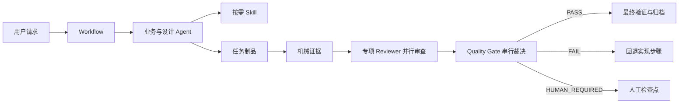

# Harness v2

Harness v2 是一套面向 Cursor 的工程交付资源库，用 Agent、Skill、Workflow 和
Rule 组织需求分析、系统设计、代码实施、多视角质量审查以及任务制品归档。

它不是业务代码框架，也不要求项目引入运行时依赖。仓库通过 `.cursor/` 配置和
`docs/` 制品协议，为现有工程提供可追踪、可恢复、可审查的 AI 协作流程。

## 为什么需要 Harness

单个大 Prompt 很容易同时混合角色、方法、编排和规则，最终出现职责漂移、上下
文膨胀、阶段遗漏以及“实现者自己宣布通过”的问题。本项目把四类职责分开：

```text
Agent    = WHO + WHAT + CONTRACT + ROLE POLICY
Skill    = REUSABLE / OPTIONAL / COMPLEX HOW
Workflow = WHEN + ORDER + BINDING + STATE
Rule     = ALWAYS-APPLICABLE CONSTRAINT
```

- Agent 定义谁负责、输入输出、完成标准和岗位判断策略。
- Skill 保存复杂且可复用的方法、命令、模板和工具操作。
- Workflow 是阶段顺序、条件、并行、回退和制品链的唯一来源。
- Rule 保存对所有匹配任务持续生效的工程约束和门禁红线。

Agent 与 Skill 不要求一一对应。设计岗位可以只依赖自身的角色策略；复杂调试、
安全重构、计划编写和机械验证则按需加载 Skill。

## 能力概览

- 三个稳定入口：`bugfix`、`refactoring`、`feature-delivery`。
- 21 个 Agent：12 个业务/治理角色、9 个专项质量角色。
- 18 个 Skill：调试、计划、重构、TDD、验证、质量路由、资源创建、工作区、MCP 和文档发布等。
- 3 个主 Workflow 与 8 个 Feature phase，使用同一 version 2 步骤 Schema。
- 任务级制品隔离、断点恢复、决策记录、风险审查路由和追加式质量报告。
- Windows 与 macOS/Linux 项目链接脚本。
- 不绑定质量模型；可在各质量 Agent 中独立配置 Cursor 支持的模型。

## 工作方式


```mermaid
flowchart LR
    U["用户请求"] --> W["Workflow"]
    W --> A["业务与设计 Agent"]
    A --> S["按需 Skill"]
    A --> ART["任务制品"]
    ART --> E["机械证据"]
    E --> R["专项 Reviewer 并行审查"]
    R --> G["Quality Gate 串行裁决"]
    G -->|PASS| V["最终验证与归档"]
    G -->|FAIL| F["回退实现步骤"]
    G -->|HUMAN_REQUIRED| H["人工检查点"]
```

Workflow 步骤统一声明：

```yaml
- id: root-cause-analysis
  description: 确认问题根因并形成可实施结论
  agent: agents/problem-analyst
  skills:
    required: [skills/systematic-debug]
    on_demand: []
  entry_artifacts:
    required: [context/issue-context.md]
    optional: [analysis/log-investigation.md]
  exit_artifacts: [analysis/root-cause.md]
  condition: null
  next:
    on_pass: implementation
    on_fail: human-checkpoint
```

`agent` 和 Skill 可以为空，但字段结构保持一致。所有制品路径均相对当前任务的
`artifact_root`。

## 三个用户入口

### Bugfix

适用于缺陷、测试失败、构建失败和线上异常：

Bugfix 入口先判断用户意图：只有 ONES 链接、Issue Key，或用户表达“排查、分析、
定位、查看”时，默认进入只读 `investigation`，完成 Issue 获取、可选日志调查和
根因分析后结束，不修改代码。只有用户明确要求“修复、修改代码或实施修复”时，
才进入 `fix` 分支。

```text
Issue / 用户描述
→ 意图路由
→ 问题上下文与可选日志调查
→ 有证据的根因
├─ investigation：返回排查结论并结束
└─ fix：可选实现计划 → TDD 修复 → 机械证据 → 质量门禁 → 验证归档
```

### Refactoring

适用于行为保持的结构调整：

```text
仓库上下文
→ 影响分析与行为基线
→ 安全切片计划
→ 渐进重构
→ 机械证据
→ 多视角质量门禁
→ 最终验证与归档
```

### Feature delivery

适用于从 PRD 到实现的完整交付：

```text
PRD → 功能清单 → 方案讨论 → HLD 门禁
→ DDL / API 并行设计 → LLD 门禁
→ 实现计划 → 代码实施 → 实现质量门禁
→ 最终验证与归档
```

八阶段编排只在 `.cursor/workflows/feature-delivery.yaml` 和
`.cursor/workflows/feature-delivery/phase-*.yaml` 中维护，入口 Skill 不复制
阶段清单。

## Agent 清单

### 业务与治理角色

| Agent | 职责 |
|---|---|
| `issue-context-fetcher` | 获取并规范化 ONES Issue 上下文 |
| `log-investigator` | 使用 Loki/LogQL 调查日志证据 |
| `requirements-analyst` | 将 PRD 转为可验收功能清单 |
| `problem-analyst` | 通过系统化调试形成根因结论 |
| `solution-architect` | 产出系统边界和模块级 HLD |
| `database-designer` | 设计 Schema、索引和迁移策略 |
| `api-designer` | 设计 HTTP/RPC/事件契约 |
| `detail-designer` | 产出类、方法、事务和测试级 LLD |
| `implementation-planner` | 形成可执行实现计划 |
| `refactoring-planner` | 建立行为保持的重构计划 |
| `implementer` | 修改代码、测试并登记变更清单 |
| `memory-consolidator` | 将已批准候选归入 Rule 的正确语义章节 |

### 多模型质量委员会

| Agent | 审查重点 | 触发方式 |
|---|---|---|
| `static-analysis-reviewer` | 编译、Lint、静态分析、依赖扫描与误报 | 必跑 |
| `logic-correctness-reviewer` | 分支、状态、边界、异常和业务逻辑 | 必跑 |
| `maintainability-reviewer` | 职责、复杂度、耦合、重复和扩展成本 | 必跑 |
| `test-adequacy-reviewer` | 场景、断言、边界和回归保护 | 必跑 |
| `security-reviewer` | 鉴权、越权、注入、敏感信息和攻击面 | 风险路由 |
| `data-concurrency-reviewer` | 事务、幂等、锁、缓存、MQ 和迁移 | 风险路由 |
| `diagnosability-reviewer` | 日志、指标、Trace、告警和生产排查 | 风险路由 |
| `consistency-reviewer` | 需求、设计、计划、代码和测试一致性 | 设计/风险路由 |
| `quality-gate-reviewer` | 报告完整性、冲突裁决和唯一门禁结论 | 必跑且串行 |

质量 Agent 默认省略 `model`，继承 Cursor 默认模型。需要多模型交叉验证时，可在
单个 Agent frontmatter 手工添加 Cursor 当前版本支持的模型字段；Workflow 和
制品路径无需修改。

## 质量协议

所有实现变更至少运行静态分析、逻辑正确性、可维护性和测试充分性审查。
Workflow 根据 `delivery/change-manifest.md`、实际 diff 和设计制品生成
`workflow/review-routing.md`，决定是否追加安全、数据并发、可排查性和一致性
审查。

每个专项问题必须包含稳定问题 ID、严重级别、状态、证据、影响、修复要求和
置信度：

- `BLOCKER`：未解决时门禁必须 `FAIL`。
- `WARNING`：可以随 `PASS` 交付，但必须汇总并跟踪。
- `ADVISORY`：非阻塞改进建议。
- 证据不足或权威语义冲突：`HUMAN_REQUIRED`。

同一质量文件追加 `Check 001`、`Check 002`；机械证据追加 `Run 001`、
`Run 002`。历史记录禁止覆盖，最后一个完整记录是当前有效状态。

## 制品目录

每个任务拥有独立目录：

```text
docs/artifacts/work/{task-id}/
  context/
  analysis/
  design/
  plans/
  delivery/
  quality/
    evidence/implementation/
    gates/hld-design/
    gates/lld-design/
    gates/implementation/
    verification-report.md
  workflow/
```

例如：

```text
{artifact_root}/workflow/decision-log.md
= docs/artifacts/work/{task-id}/workflow/decision-log.md
```

`{artifact_root}` 是 Workflow 变量，不是实际目录名。任务完成后整个目录移动到
`docs/artifacts/archive/{date}-{task-id}/`，历史归档保持只读。

所有现行制品模板位于 [`docs/templates/`](docs/templates/README.md)，目录结构与
活动制品一一对应。

## 仓库结构

```text
.
├─ .cursor/
│  ├─ agents/       # 角色与交付契约
│  ├─ skills/       # 可复用复杂方法
│  ├─ workflows/    # 三个入口和八个 Feature phase
│  ├─ rules/        # 始终生效或按文件匹配的约束
│  ├─ scripts/      # 资源与交叉引用校验
│  └─ AGENTS.md     # Cursor Harness 总约定
├─ docs/
│  ├─ architecture.md
│  ├─ resource-placement-guide.md
│  ├─ templates/
│  └─ artifacts/
├─ link-cursor-config.ps1
└─ link-cursor-config.sh
```

Agent 与 Skill 保持扁平目录。项目不使用 Agent/Skill Registry、alias、`domain`
或 `tags` 作为发现机制。

## 安装到业务项目

克隆本仓库后，通过链接脚本把 Harness 资源接入目标项目。

Windows PowerShell：

```powershell
.\link-cursor-config.ps1 -Target "D:\Work\Project\your-project"
```

macOS / Linux：

```bash
./link-cursor-config.sh ~/Work/Project/your-project
```

目标已存在同名资源时脚本默认跳过；确认需要替换后，Windows 使用 `-Force`，
macOS/Linux 使用 `-f`。强制模式会覆盖目标项目中的同名资源，执行前应确认目标
目录没有需要保留的本地配置。

脚本会链接 `.cursor` 与 `docs` 下的全部子项（Windows 目录用 junction、文件用硬链；
macOS/Linux 用 symlink），但**不链接** `docs/templates`。`docs/artifacts/work` 与
`docs/artifacts/archive` 仍为目标项目本地目录，任务制品不会回写 Harness 仓库。

### 会话标题自动命名

链接后，新 Agent 会话会按首条用户消息自动设置侧边栏标题：

| 输入格式 | 标题 |
|---|---|
| ONES 缺陷粘贴（如 `BTOC-1307 【标题】描述` + `ones.cn/.../issue/BTOC-1307`） | **Key + 同行中文**（最多 40 字，如 `BTOC-1471 【C端商城】品鉴大师推广订单...`）；仅 Key 无中文时用 Key |
| 其他含中文的首条消息 | 首行中文（最多 40 字） |

**当前生效机制（双保险）：**

1. **Hook `beforeSubmitPrompt`** — 从首条消息提取标题，通过官方支持的 `additional_context` 注入重命名指令（Hook 的 `title` 字段 Cursor 不消费）。
2. **Rule `session-title.mdc`** — Agent 收到消息后调用 Cursor **内置** MCP `cursor-app-control` 的 `rename_chat`。该 MCP 由 Cursor 自带，**不要**写入 `.cursor/mcp.json`。

若标题仍为英文自动摘要：

- 确认业务项目已执行 `link-cursor-config`（`hooks` + `hooks.json` + `session-title.mdc` 已链接）
- 在 Cursor **Settings → Hooks** 确认已加载，必要时重启 Cursor
- **新开 Agent 会话**重试（旧会话不会 retroactive 重命名）
- 首次调用 `rename_chat` 时**允许** MCP 授权弹窗

## MCP 配置

链接完成后，在 Cursor **Settings → MCP** 中按需启用 `dbx`、`middle-mcp`、`{projectId}-loki-mcp`、`{env}-mysql-mcp` 等服务。

`issue-context-fetcher` 的描述保留 ONES/ONES MCP 发现关键词；
`log-investigator` 保留 Loki、LogQL 和 traceId 关键词。平台名称不进入 Agent
文件名，但不会丢失 Cursor 的能力发现提示。

## 校验

Windows：

```powershell
powershell -NoProfile -ExecutionPolicy Bypass -File .cursor/scripts/check-harness-resources.ps1
powershell -NoProfile -ExecutionPolicy Bypass -File .cursor/scripts/check-rule-cross-refs.ps1
powershell -NoProfile -ExecutionPolicy Bypass -File .cursor/scripts/smoke-workflows.ps1
```

macOS / Linux：

```bash
./.cursor/scripts/check-harness-resources.sh
./.cursor/scripts/check-rule-cross-refs.sh
./.cursor/scripts/smoke-workflows.sh
```

资源校验覆盖：

- 21/15/11 资源数量与 frontmatter 名称；
- Workflow Agent/Skill 引用和统一步骤字段；
- `review-routing`、`repository-context` 的生产者契约与质量 fan-out/join；
- Bugfix、Refactoring、Feature delivery 三条制品链；
- 废弃名称、旧制品根路径和旧 Schema；
- 设计/质量 Agent 的岗位策略章节；
- `stage-contracts.mdc` 与 Agent 的标题、路径和关键词重复风险。

## 文档

- [架构与运行模型](docs/architecture.md)
- [资源放置指南](docs/resource-placement-guide.md)
- [完整制品模板](docs/templates/README.md)

## 修改原则

1. 调整角色职责时修改 Agent；复杂可复用 HOW 才进入 Skill。
2. 阶段、顺序、并行、回退和制品生产消费关系只修改 Workflow。
3. 对所有任务始终生效的红线进入 Rule。
4. 修改资源后同步更新引用和模板，并运行两项校验。
5. 不修改历史归档来迁就新结构；需要解释时新增迁移记录。
