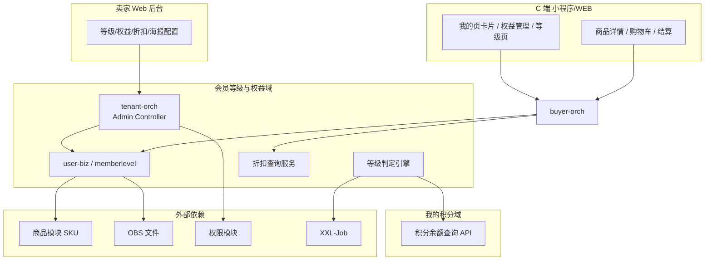
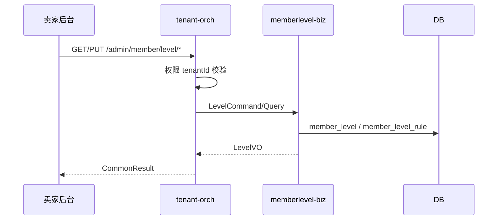
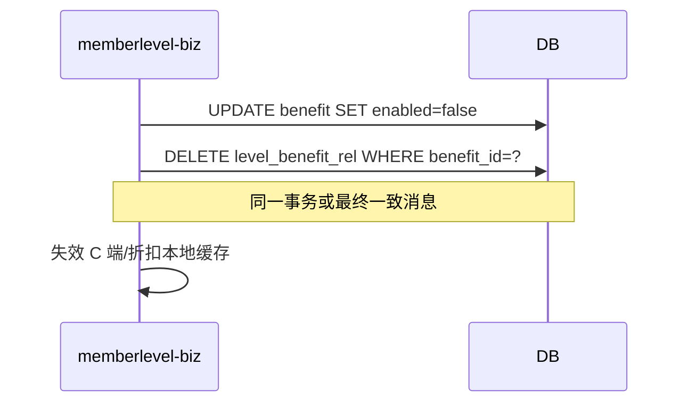
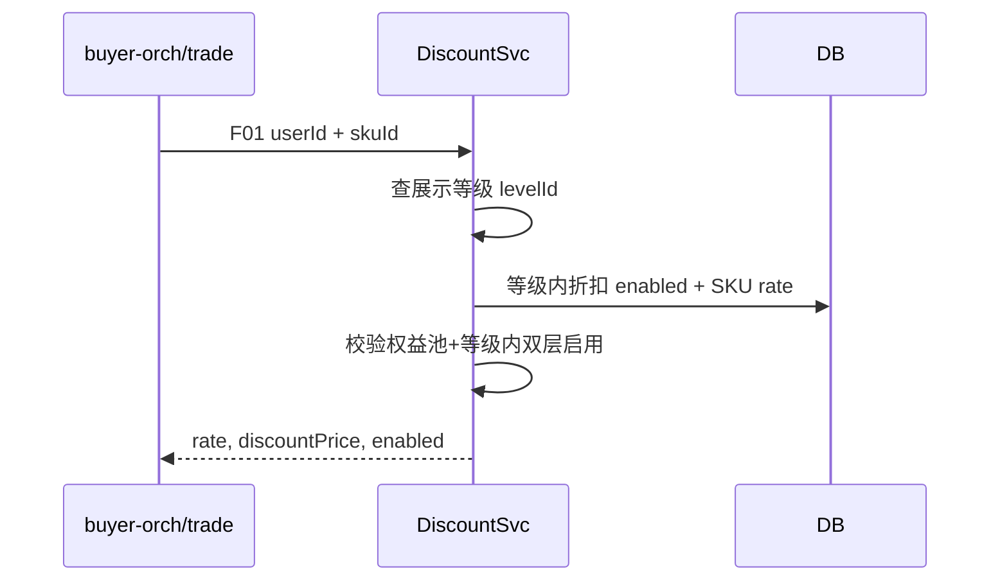
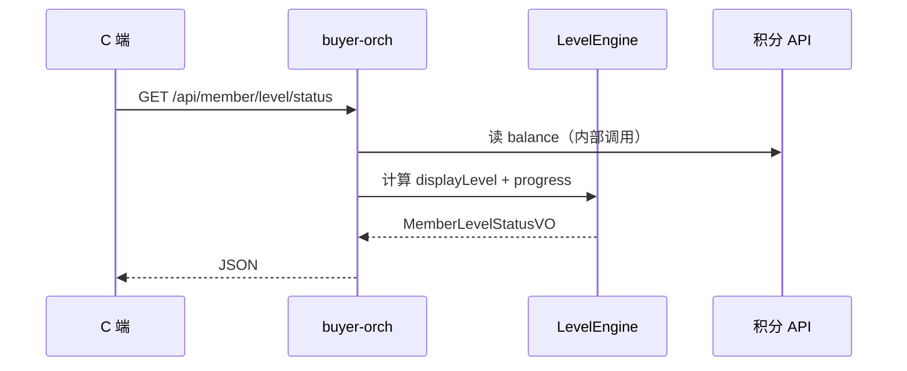
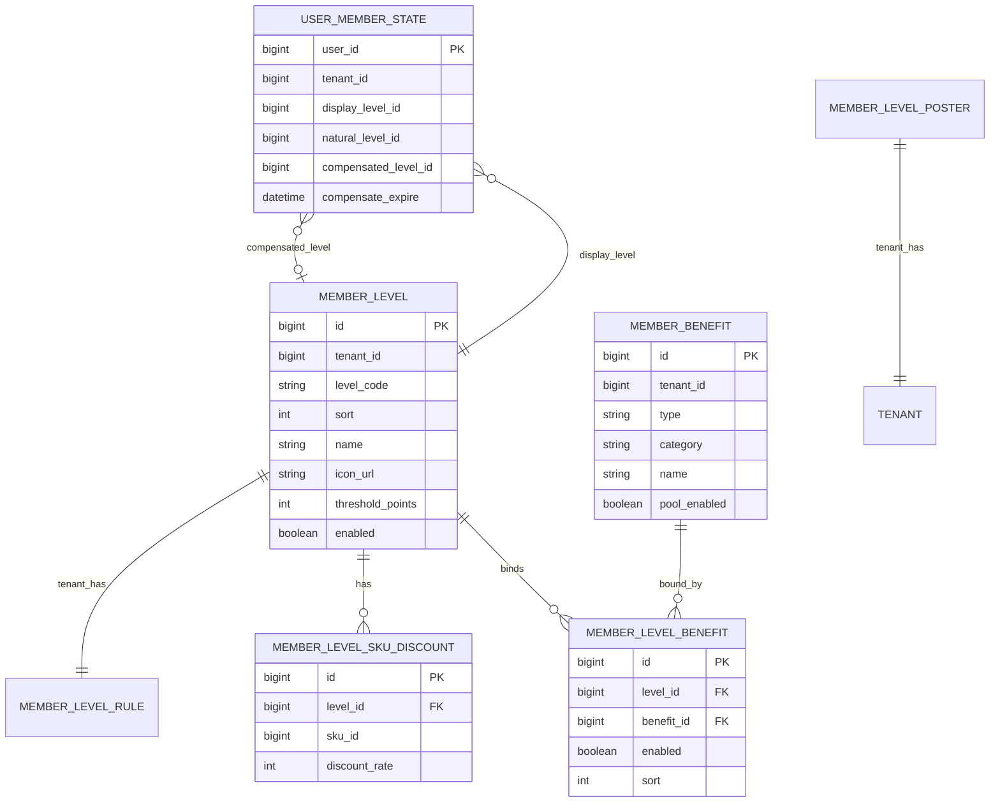

# 概要设计（HLD）— 会员等级与权益

## 元数据

| 项 | 值 |
|---|---|
| 任务 ID | member-level-benefit-20260714 |
| 子域 | 会员等级与权益（Member Level & Benefit） |
| 输入版本 | feature-list.md @ 2026-07-14；brainstorm-result.md @ 2026-07-14 |
| 关联契约 | [`docs/design/member-level-points-api-contract.md`](../../../../design/member-level-points-api-contract.md) §二、§五、§七（A/D/F 组） |
| 作者 | Agent |
| 更新时间 | 2026-07-14 |
| 状态 | DRAFT |

---

## 背景、目标与非目标

### 背景

B2C 积分商城需建立**积分驱动的五档会员等级体系**，并在卖家后台可配置等级、权益池、等级-权益绑定、SKU 专属折扣与规则海报；C 端展示成长进度与权益，下单链路读取等级折扣。

当前代码库仅有 `UserDO.memberLevel`（Integer 1~5）及卖家手动改等级接口，无等级配置表、权益配置、升级引擎与折扣计价能力。

### 业务目标

1. 卖家可在 Web 后台完成等级/权益/折扣/海报全量配置（PRD 四菜单）。
2. 会员展示等级由「积分自然等级 + 手动补偿等级」取 max，支持实时升级、消费保级、年度刷新。
3. 专属折扣在「权益池启用 ∧ 等级内启用」双层条件下对 C 端展示与结算生效。
4. C 端（小程序 + WEB）可读等级状态、权益模块、规则海报。

### 非目标（本期或 PRD 明确排除）

| 项 | 说明 |
|---|---|
| 积分账户/流水/兑换 | 归属「我的积分」子域 HLD，本域仅消费积分余额 |
| 积分规则配置、积分商品后台 | 归属积分子域；本域读积分余额判级 |
| 站内信/短信 | PRD 未要求 |
| 历史数据迁移脚本 | PRD：无历史数据处理 |
| 数据埋点方案 | PRD 为空，本期不强制 |

### 分期策略（推荐方案 C）

| 阶段 | 范围 | 验收重点 |
|------|------|---------|
| **一期** | 卖家后台 F-001~F-009；配置持久化；模块联动；折扣存取与修改历史 | 后台配置可验收 |
| **二期** | 升级引擎 F-010；对接积分余额；年度刷新 Job；B 端会员详情等级展示 | 判级/保级/刷新可观测 |
| **三期** | C 端 D 组；F01/F02/F04 结算折扣；替换旧 memberLevel | 端到端折扣与展示 |

> Decision 001 未决前，HLD 按**三期目标架构**描述，一期实现范围在「需求追踪」标注阶段列。

---

## 需求追踪

| 功能 ID | 设计章节 | 模块 | 阶段 | 验收方式 |
|---------|---------|------|------|---------|
| F-001 | §4.1、§5.1 | tenant-orch / memberlevel | 一 | 等级列表与升级机制 CRUD |
| F-002 | §4.1、§6.1 | memberlevel | 一 | 等级编辑/图标/校验 |
| F-003 | §4.2、§5.2 | memberlevel | 一 | 权益池启停/删除联动 |
| F-004 | §4.2 | memberlevel | 一 | 权益表单与资源 |
| F-005 | §4.3、§5.2 | memberlevel | 一 | 等级-权益绑定 |
| F-006 | §4.4 | memberlevel + product-api | 一 | SKU 折扣配置与历史 |
| F-007 | §4.5 | memberlevel | 一 | 双端海报 |
| F-008 | §7.1 | tenant-orch + operate-user | 一 | 权限点与只读态 |
| F-009 | §5.2 | memberlevel | 一 | 联动集成测试 |
| F-010 | §5.3、§5.4 | memberlevel + points-api | 二~三 | 升级/刷新/折扣计价 |

---

## 系统边界与模块职责

### 上下文图



### 模块归属

| 层次 | 模块 | 职责 |
|------|------|------|
| 接入层 | `b2cmall-tenant-orch` | 卖家后台 HTTP：A01–A21；会员运营读等级 C01/C10/C11 |
| 接入层 | `b2cmall-buyer-orch` | C 端 HTTP：D01–D07 |
| 领域层 | `b2cmall-module-user-biz` / `memberlevel` | 等级/权益/绑定/折扣/海报 CRUD；等级引擎；折扣查询 |
| API 契约 | `b2cmall-module-user-api` | Feign：`MemberLevelApi`、`MemberDiscountApi`（F01–F04） |
| 外部 | `product-api` | H01/H02 SKU 查询 |
| 外部 | 积分子域 API | 读用户当前积分余额（判级） |

### 与积分子域边界

| 本域提供 | 积分域提供 |
|---------|-----------|
| 等级阈值配置、判级规则 | 用户当前积分余额 |
| 展示等级、进度条计算 | 积分变动事件（可选 MQ，触发升级） |
| SKU 折扣率、折后价查询 | — |
| 手动补偿等级 C10 | — |

**禁止**：本域直接写积分账户；判级只读积分余额。

### 与旧 `memberLevel` 兼容

| 阶段 | 策略 |
|------|------|
| 一期 | 新增 `member_level_id` 配置表；`UserDO.memberLevel` 保留；手动改等级接口标记 `@Deprecated` 文档 |
| 二期 | 双写：引擎更新 `member_level_id` + 映射旧 1~5 |
| 三期 | 下单快照改读 F04；逐步下线 Integer 字段 |

---

## 关键流程

### 5.1 卖家配置等级（F-001/F-002）



**规则**：sort 不可改；阈值五档严格递增；名称/图标/阈值变更后 F-009 联动刷新权益展示缓存。

### 5.2 权益池停用/删除级联（F-003/F-009）



### 5.3 等级判定引擎（F-010）

```mermaid
flowchart TD
  A[读取当前积分 balance] --> B[计算自然等级 naturalLevel]
  C[读取手动补偿 compensatedLevel] --> D{displayLevel = max(natural, compensated)}
  B --> D
  D --> E{积分 >= 下一档阈值?}
  E -->|是且 natural 升高| F[写 UPGRADE 台账]
  E -->|否| G[保持展示等级]
  H[年度刷新 Job] --> I[清除 compensatedLevel]
  I --> J[按 balance 重算 naturalLevel]
  J --> K[可升可降 写 REFRESH 台账]
```

**核心规则**（与 PRD 一致）：

```text
展示等级 = max(积分自然等级, 手动补偿等级)
消费积分：balance 减少，展示等级不即时降（消费保级）
年度刷新：按剩余积分重判自然等级；清除手动补偿
进度条：rangeMin=0，percent=currentPoints/targetPoints
```

**触发点**：

| 触发 | 动作 |
|------|------|
| 积分余额增加（MQ/回调） | 判断是否升级 |
| 积分余额减少 | 仅更新 balance 展示，不降级 |
| 手动补偿 C10 | 直接提升展示等级 |
| 年度 Cron G04 | 重判 + 清补偿 |

### 5.4 下单折扣查询（F-006/F-010，三期）



**降级**：折扣服务超时 → 按无折扣（enabled=false）继续下单，不阻断主干。

### 5.5 C 端等级状态（D01）



**弱依赖**：积分 API 失败 → 返回注册会员 + balance=0 + 降级文案（Q20）。

---

## 数据设计（概念模型）

### 核心实体



### 表清单（一期必建）

| 表 | 说明 |
|---|---|
| `member_level` | 五档等级配置 |
| `member_level_rule` | 年度刷新时间（租户一条） |
| `member_benefit` | 权益池 |
| `member_level_benefit_rel` | 等级-权益绑定 |
| `member_level_sku_discount` | 等级 SKU 折扣 |
| `member_level_discount_history` | 折扣修改历史 |
| `member_level_poster` | 双端海报 URL |
| `member_level_change_log` | 等级变动台账（二期） |
| `user_member_state` | 用户展示/补偿等级快照（二期） |

> 完整 DDL 在 LLD 阶段输出；须走 schema-guard 评审。

### 缓存策略

| Key | 内容 | TTL | 失效 |
|-----|------|-----|------|
| `member:level:list:{tenantId}` | 等级列表 | 10min | A03 变更 |
| `member:discount:{tenantId}:{levelId}:{skuId}` | 折扣率 | 5min | A18 变更 |
| `member:status:{userId}` | D01 聚合 | 1min | 积分/等级变更 |

---

## 接口与集成

### 对外 HTTP（摘要）

| 组 | 路径前缀 | 说明 |
|----|---------|------|
| A | `/admin/member/**` | 卖家配置 21 个接口 |
| D | `/api/member/**` | C 端读 7 个接口 |
| C 部分 | `/admin/member/{userId}/level-*` | B 端会员等级读/补偿 |

完整字段见 API 契约文档。

### 对内 RPC（F 组）

| API | 消费方 | 说明 |
|-----|--------|------|
| F01/F02 | 商品/购物车/结算 | SKU 折扣 |
| F03 | 会员列表 | 批量等级+积分摘要 |
| F04 | 订单 | 买家等级快照 |

### 依赖外部

| 编号 | 能力 | 用途 |
|------|------|------|
| H01/H02 | 商品 SKU | F-006 折扣配置页 |
| H11 | OBS | 图标/海报 |
| H15 | 权限 | 菜单按钮 |
| 积分 API | balance 查询 | F-010 判级 |

---

## 关键设计决策

| 决策 | 约束 | 备选 | 取舍 | 可逆性 |
|------|------|------|------|--------|
| 子域放在 user-biz | 与用户强相关 | 新建 member-biz | 减少模块碎片化 | 中 |
| 分期交付（方案 C） | Decision 001 未决 | 一次性全链路 | 降低阻塞 | 高 |
| 双层权益启用 | PRD 明确 | 单层开关 | 运营灵活 | 低 |
| 折扣查询降级为无折扣 | 弱依赖原则 | 阻断下单 | 保障交易主干 | 高 |
| 五档等级系统种子 | PRD 默认阈值 | 运营手工建 | 开箱即用 | 低 |
| 进度条 rangeMin=0 | PRD 多处 | 区间门槛 | 与 UI 一致 | 低 |

---

## 非功能设计

### 权限与租户

- 所有配置表带 `tenant_id`；MyBatis 租户插件拦截。
- 权限点：`member:level:view/edit`、`member:benefit:edit`、`member:discount:edit`、`member:level:compensate`。

### 一致性 / 幂等 / 并发

- 权益停用/删除与解除绑定：**同事务**。
- 等级升级写台账：按 `userId` 乐观锁或分布式锁，防并发重复升级。
- 折扣配置批量保存：单次 ≤200 SKU，避免大事务。

### 性能与容量

- F03 批量：单批 ≤500 userId，P99 ≤1s。
- A17 SKU 树：分页 pageSize ≤50；商品名模糊走 ES/索引（若已有）。
- 折扣热路径：Redis 缓存 + 本地 Caffeine 二级（三期）。

### 可观测性

- 等级变更、折扣修改写操作日志（对齐 `MallSellerOperateLog`）。
- 折扣修改历史表 A19。
- 年度刷新 Job 执行批次/失败数监控。

### 兼容、迁移与回滚

- 一期不影响现有 `updateMemberLevel`。
- 配置变更可回滚：等级阈值变更不 retroactive 改历史订单快照。
- Feature flag 控制 C 端 D 组与 F01 是否启用（三期开关）。

---

## 风险与待验证假设

| 风险/假设 | 验证方式 | 负责人 |
|-----------|---------|--------|
| Decision 001：C 端/计价是否本期 | 产品确认 | PM |
| 积分 API 就绪时间（Decision 002） | 联调里程碑 | 积分域 |
| 商品 SKU 范围：全店 vs 积分商城子集 | PRD 确认 F-006 | PM |
| 旧 memberLevel 1~5 与新 levelId 映射 | 迁移脚本 + 双写期测试 | 后端 |
| 年度刷新大数据量租户 | 分批 Job + 压测 | 后端 |
| 手动改等级与新体系并存 | decision-log 决策 | PM |

---

## 附录：默认等级种子

| levelCode | name | threshold | sort |
|-----------|------|-----------|------|
| REGISTER | 注册会员 | 0 | 1 |
| BRONZE | 青铜会员 | 1000 | 2 |
| SILVER | 白银会员 | 5000 | 3 |
| GOLD | 黄金会员 | 20000 | 4 |
| DIAMOND | 钻石会员 | 50000 | 5 |

租户初始化时插入；名称/图标/阈值可在 A03 修改。
