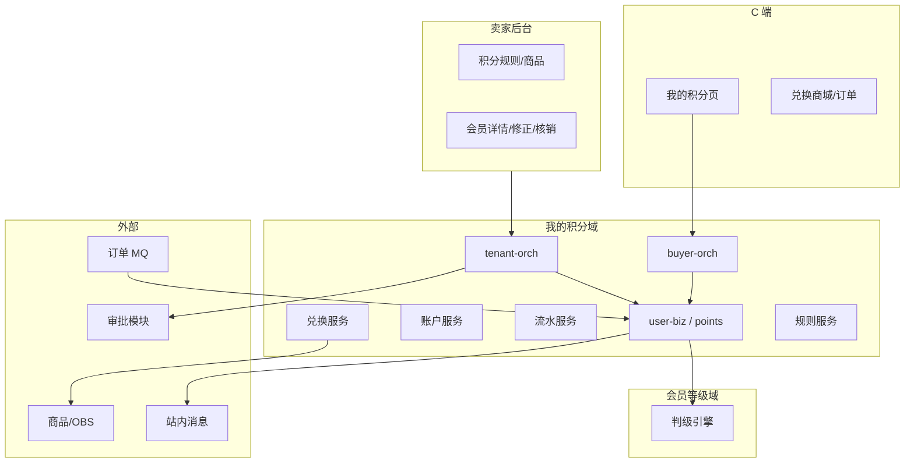
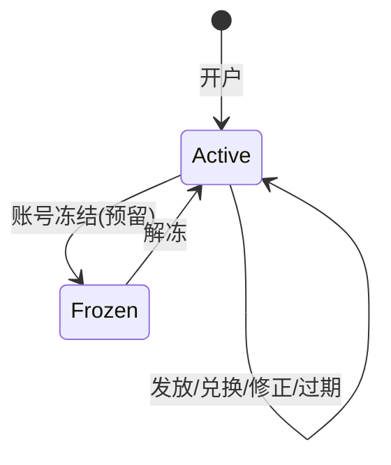
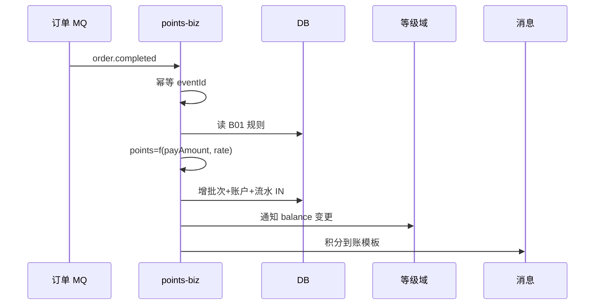
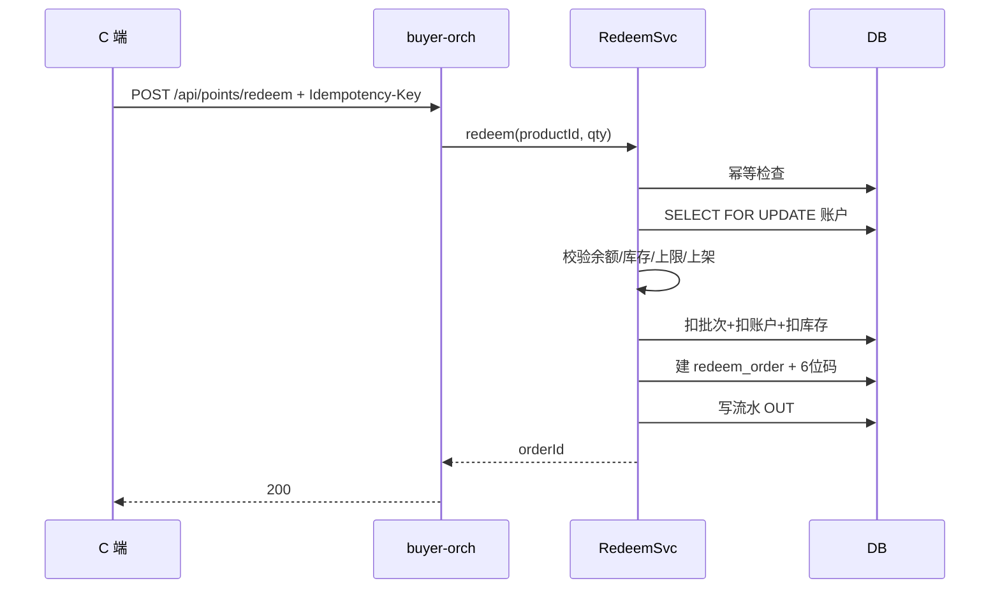
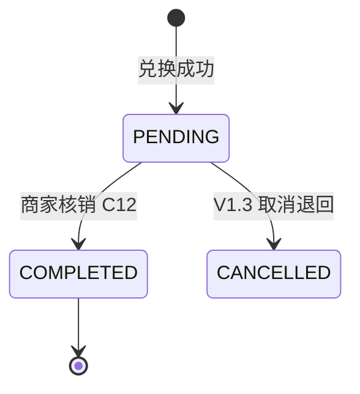
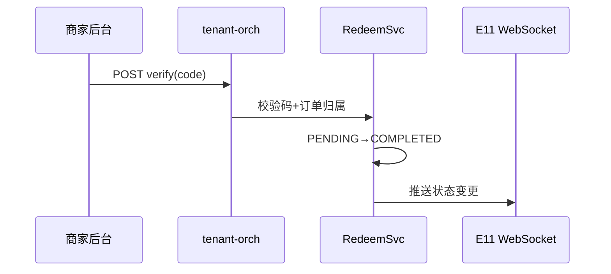
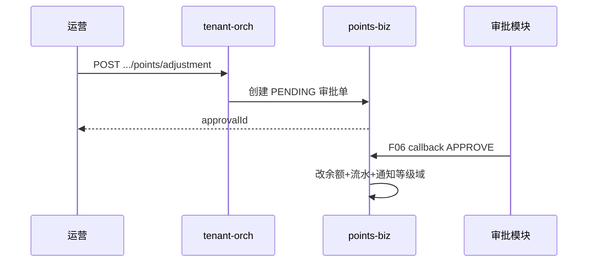
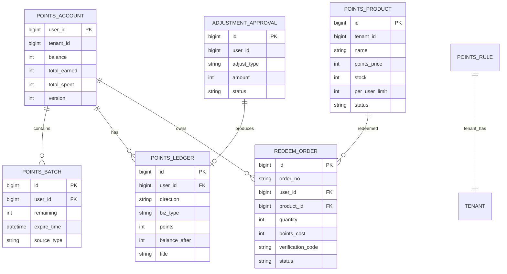

# 概要设计（HLD）— 我的积分

## 元数据

| 项 | 值 |
|---|---|
| 任务 ID | member-level-benefit-20260714 |
| 子域 | 我的积分（Points / Loyalty Points） |
| 输入版本 | 6 份 PRD 积分相关章节；API 契约 v3.1 @ 2026-07-14 |
| 关联契约 | [`docs/design/member-level-points-api-contract.md`](../../../../design/member-level-points-api-contract.md) §三、§四、§六、§八（B/C/E/G 组） |
| 关联 HLD | [`hld-member-level-benefit.md`](./hld-member-level-benefit.md)（判级消费本域余额） |
| 作者 | Agent |
| 更新时间 | 2026-07-14 |
| 状态 | DRAFT |

---

## 背景、目标与非目标

### 背景

积分商城 C 端需「我的积分」独立能力：余额展示、流水明细、积分兑换商城、兑换订单与商家核销；卖家后台需积分规则、积分商品配置、会员积分展示与修正审批；订单完成需按规则发放积分。

当前仓库**无积分账户/流水/兑换**实现；`UserDO` 无积分字段。会员等级判级、消费返积分、兑换扣减均依赖本子域建设。

### 业务目标

1. **C 端**：小程序 + WEB 统一的积分账户、流水、兑换商城、兑换订单（E01–E11）。
2. **卖家后台**：积分规则、积分商品、会员积分摘要/明细、发起修正与审批联动（B01–B07、C02–C09、C12）。
3. **交易联动**：订单完成/退款驱动积分发放或重算（G01/G02）。
4. **与等级域协作**：提供余额查询与变动通知，供等级引擎判级；**不**在本域实现等级逻辑。

### 非目标

| 项 | 说明 |
|---|---|
| 等级/权益/折扣配置 | 会员等级 HLD |
| 积分退回/取消兑换 C13 | V1.3 预留 |
| 站内信具体模板设计 | 仅调用消息模块 H12 |
| 邓兆翠积分管理后台完整复刻 | Q01 未决；审批页可能外部跳转 |
| 历史积分数据迁移 | PRD：无 |

### 分期策略

| 阶段 | 范围 |
|------|------|
| **一期** | 积分账户 + 流水 + 规则配置 B01；C 端 E01/E03/E04 |
| **二期** | 积分商品 B02–B07 + 兑换 E05–E10 + 核销 C12 + 幂等事务 |
| **三期** | 消费返积分 G01/G02；修正审批 C04–C09；过期批次 E02；B 端会员详情 C02/C03 |

---

## 需求追踪

| 来源 PRD | 能力 | 接口组 | 阶段 |
|---------|------|--------|------|
| 我的积分 小程序/WEB | 余额、流水、兑换、订单 | E01–E11 | 一~二 |
| 卖家 积分规则 | 发放比例、有效期 | B01 | 一 |
| 卖家 积分商品 | 商品 CRUD、库存 | B02–B07 | 二 |
| 卖家 会员管理二期 | 积分摘要/明细/修正/核销 | C02–C09、C12 | 二~三 |
| WEB 权益管理 | 积分摘要（累计获取/消耗） | 供 D01 聚合或 E01 | 一 |
| 订单 MQ | 消费返积分 | G01/G02 | 三 |

---

## 系统边界与模块职责

### 上下文图

### 模块归属

| 层次 | 模块 | 职责 |
|------|------|------|
| 接入层 | `b2cmall-buyer-orch` | C 端 E 组 HTTP |
| 接入层 | `b2cmall-tenant-orch` | B 组/C 组积分相关 HTTP |
| 领域层 | `b2cmall-module-user-biz` / `points` | 账户、流水、批次、规则、商品、兑换、审批 |
| API | `b2cmall-module-user-api` | `PointsAccountApi`（内部读余额）、`PointsInternalApi` |
| 定时 | XXL-Job | 积分过期扣减、死信补偿 |

> **模块命名**：与 `memberlevel` 并列于 `user-biz` 下；若后续积分能力膨胀可拆独立 `points-biz` 模块。

### 与会员等级域边界

| 本域负责 | 等级域负责 |
|---------|-----------|
| 积分账户 balance、流水、批次 | 阈值、展示等级、进度条 |
| 兑换扣减、发放增加 | 监听 balance 变化判级 |
| 提供 `getBalance(userId)` | 提供 `getDisplayLevel(userId)` |

**协作方式**：

1. **同步**：等级 D01 内部调本域 `PointsAccountApi.getSummary(userId)`。
2. **异步（推荐）**：本域发 `points.balance.changed`；等级域订阅触发 G03/G05。

---

## 关键流程

### 5.1 积分账户模型

**账户字段（概念）**：

| 字段 | 说明 |
|------|------|
| `balance` | 可用积分 |
| `totalEarned` | 累计获取 |
| `totalSpent` | 累计消耗 |
| `version` | 乐观锁 |

**批次模型**（支持有效期 E02）：

| 字段 | 说明 |
|------|------|
| `batchId` | 批次 ID |
| `remaining` | 剩余积分 |
| `expireTime` | 过期时间；null=永不过期 |
| `sourceType` | ORDER_REWARD / ADJUST / … |

扣减：**FIFO 按 expireTime 优先**消耗临期批次。

### 5.2 消费返积分（G01）

**规则**（B01）：

- 实付金额（不含券）× 发放比例 → 向下取整。
- 有效期：按规则创建批次；变更规则**不影响**已有批次。
- 发放时机：Q06 待确认（已完成即发 vs 售后期届满）。

### 5.3 积分兑换（E07）— 核心事务

**状态机 — 兑换订单**：

**pendingCount**：统计 `PENDING` **订单条数**，非 SKU 份数。

### 5.4 商家核销（C12）

### 5.5 积分修正与审批（C04–C09）

> Q01：若审批归邓兆翠模块，本域仅提供发起 + F06 回调入口，C09 不实现。

### 5.6 积分过期（定时任务）

- Cron：每日扫描 `expireTime <= now` 且 `remaining > 0` 的批次。
- 扣减账户 balance，写 OUT 流水（bizType=EXPIRE）。
- **不触发等级降级**（消费保级原则由等级域保障）。

---

## 数据设计（概念模型）

### 表清单

| 表 | 阶段 |
|---|---|
| `points_account` | 一 |
| `points_batch` | 一（可先简化无批次，三上过期） |
| `points_ledger` | 一 |
| `points_rule` | 一 |
| `points_product` | 二 |
| `points_redeem_order` | 二 |
| `points_adjustment_approval` | 三 |
| `points_idempotent_record` | 二（兑换/ MQ 幂等） |

---

## 接口与集成

### C 端（E 组）

| 接口 | 说明 |
|------|------|
| E01 summary | 余额、pendingCount、过期提醒 |
| E02 expiring | 近 3 月过期批次 |
| E03/E04 ledger | 流水分页与详情 |
| E05/E06 products | 兑换商品 |
| E07 redeem | 幂等兑换 |
| E08/E09/E10 orders | 兑换订单与快照 |
| E11 WS | 核销态推送 |

### 卖家后台（B/C 组）

| 接口 | 说明 |
|------|------|
| B01 | 积分规则 |
| B02–B07 | 积分商品 |
| C02/C03 | 会员积分摘要/明细 |
| C04–C09 | 修正与审批 |
| C12 | 核销 |

### 对内 API（供等级域 / 账号）

| 方法 | 说明 |
|------|------|
| `getBalance(userId)` | 判级 |
| `getSummary(userId)` | D01 积分摘要 |
| `canDeactivate(userId)` | F05 注销校验（有无 PENDING 兑换单） |

### 消费外部

| 编号 | 说明 |
|------|------|
| H04/H05/H06 | 订单 MQ |
| H12 | 积分到账/兑换/核销消息 |
| H11 | 商品图片上传 |
| H13/H14 | 待审批聚合（若审批外部） |

### 提供外部

| 编号 | 说明 |
|------|------|
| G01/G02 | 订阅订单事件 |
| F05 | 注销前置 |
| F06 | 审批回调 |
| 余额变更事件 | 等级域订阅 |

---

## 关键设计决策

| 决策 | 约束 | 备选 | 取舍 | 可逆性 |
|------|------|------|------|--------|
| 子域放 user-biz/points | 与用户账户同库 | 独立 points 模块 | 一期快速落地 | 中 |
| 批次 FIFO 扣减 | 支持过期 | 单桶 balance | 符合 PRD 有效期 | 中 |
| 兑换本地事务 | 强一致 | Saga | 链路短、易测 | 低 |
| Idempotency-Key | E07/G01 必幂等 | 仅 DB 唯一键 | 防重复扣款/发分 | 高 |
| 兑换不即时降级 | PRD 消费保级 | 扣减即判级 | 等级域统一规则 | 高 |
| 审批内外部化 | Q01 | 全自研 C09 | 减少重复建设 | 高 |

---

## 非功能设计

### 权限与租户

- B 端：`points:rule:edit`、`points:product:edit`、`points:adjustment:create`、`points:redeem:verify`。
- C 端：所有读写校验资源归属当前 userId。

### 一致性 / 幂等 / 并发

| 场景 | 策略 |
|------|------|
| E07 兑换 | 账户行锁 + 幂等表 |
| G01 发积分 | MQ eventId 幂等 |
| 库存扣减 | 乐观锁 `stock` 字段 |
| 修正审批 | approvalId 状态机 CAS |

### 性能

- E01/E03：读多写少，账户 summary 可 Redis 缓存 30s。
- E05 商品列表：分页；库存排序在 SQL 层。
- G01 消费：异步，不阻塞订单主流程。

### 可观测性

- 兑换/发分/修正写 info 日志（orderNo、userId、delta）。
- MQ 消费失败进死信 G06，7 天内人工补发告警。
- 账户 balance 与批次 sum 对账 Job（日级）。

### 降级

| 弱依赖 | 降级策略 |
|--------|---------|
| 站内消息 H12 | 失败不影响积分入账 |
| E11 WebSocket | 降级为客户端轮询 |
| 等级通知 | 异步 MQ 重试，最终一致 |

---

## 风险与待验证假设

| 风险 | 缓解 |
|------|------|
| Q01 审批归属不清 | decision-log 确认后调整 C09/F06 |
| Q06 发积分时机 | 统一 MQ 契约后再实现 G01 |
| 积分商品与商城商品关系 | B 组独立 SKU，不绑 trade SPU（除非 PRD 另定） |
| 批次表复杂度 | 一期可只做 balance，二期补批次与 E02 |
| 与邓兆翠模块重复 | 明确 ownership，避免双写 |

---

## 附录：C 端与等级域入口拆分

| 用户入口 | 调用域 | 主要接口 |
|---------|--------|---------|
| 我的页「会员积分卡片」 | 等级域 | D01–D07 |
| 「我的积分」独立页 | **本域** | E01–E11 |
| WEB 权益管理「积分摘要」 | 等级 D01 聚合 或 E01 | pointsSummary |

PRD 要求两入口业务分离（Q22：是）。
