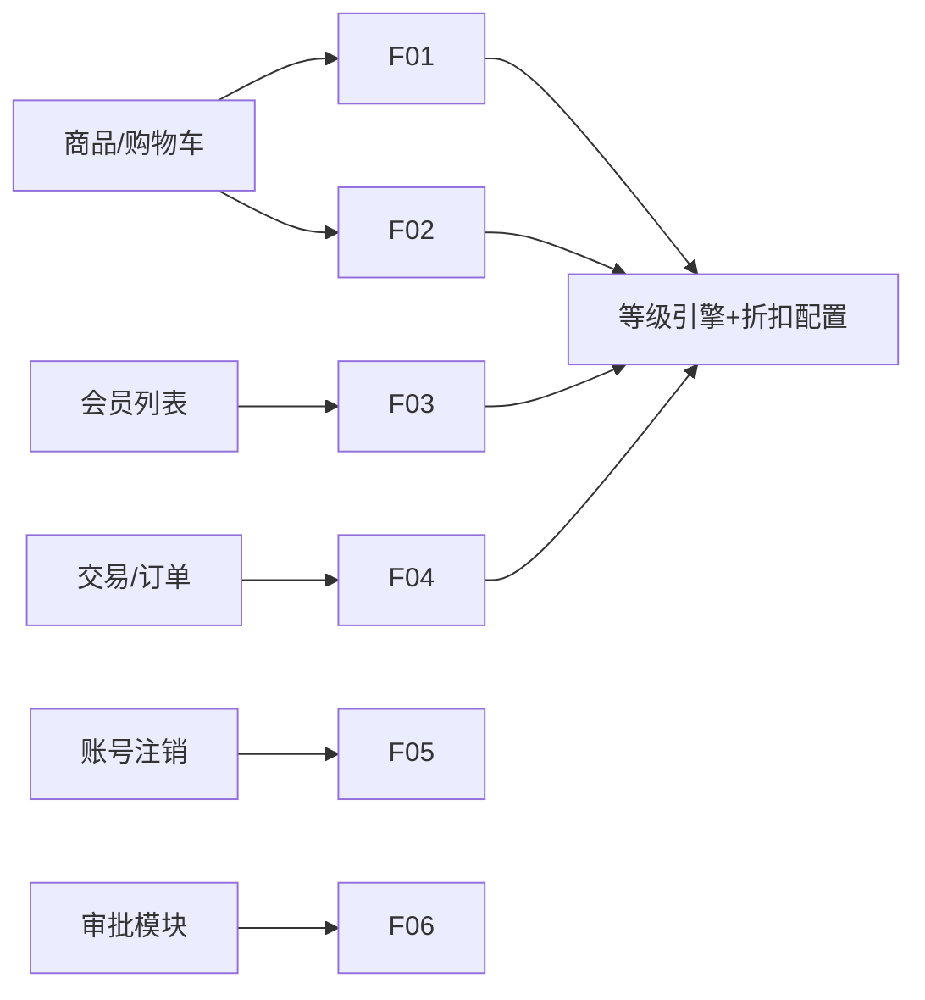

# 积分 & 会员等级权益 — 详细 API 契约

> **版本**：v3.1（单文件）  
> **日期**：2026-07-14  
> **负责域**：积分 + 会员等级权益  
> **状态**：DRAFT

## 关联 PRD

| 文档 | 链接 |
|------|------|
| 会员等级权益模块（卖家后台配置） | https://zfnyunshang.feishu.cn/docx/RN5XdgrDWoVwxDxtb44czLmxnlf |
| C端商城管理后台 会员管理二期 | https://zfnyunshang.feishu.cn/wiki/Il1Rw80XMiWfKyk7hqkc5Fr7nvd |
| 我的积分 小程序 | https://zfnyunshang.feishu.cn/docx/JjxmdsbyhoR3s5xGjhyc6Hnrn8c |
| 我的积分 WEB | https://zfnyunshang.feishu.cn/docx/W1IYdf9d1oyGrFxzdgdcZgRNnNg |
| 小程序 会员积分与等级展示 | https://zfnyunshang.feishu.cn/wiki/RNuPwGxEsiklYukqLpKctcGanub |
| WEB 会员积分与等级展示 | https://zfnyunshang.feishu.cn/wiki/EzrBwjshPi0vnMktgxJc3MvknNd |

## 目录

- [一、全局约定与公共类型](#一全局约定与公共类型)
- [二、卖家后台 — 等级与权益配置 A01–A21](#二卖家后台--等级与权益配置-a01a21)
- [三、卖家后台 — 积分规则与商品 B01–B09](#三卖家后台--积分规则与商品-b01b09)
- [四、卖家后台 — 会员运营 C01–C13](#四卖家后台--会员运营-c01c13)
- [五、C 端 — 会员等级与权益 D01–D07](#五c-端--会员等级与权益-d01d07)
- [六、C 端 — 我的积分 E01–E11](#六c-端--我的积分-e01e11)
- [七、内部接口 F01–F06](#七内部接口-f01f06)
- [八、事件 / MQ / 外部依赖 G、H](#八事件--mq--外部依赖-g-h)
- [九、待确认问题 Q01–Q25](#九待确认问题-q01q25)

---


# 一、全局约定与公共类型

## 1. 基础约定

### 1.1 协议与格式

| 项 | 约定 |
|---|---|
| 协议 | HTTPS |
| 编码 | UTF-8 |
| 请求体 | `application/json`（文件上传除外） |
| 响应体 | 统一包装 `CommonResult<T>`（见 §2.1） |
| 时间 | ISO-8601 字符串，时区 `Asia/Shanghai`，例 `2026-07-14T14:30:00+08:00` |
| 金额 | 分（Integer），不含券实付等同 PRD「实付金额」 |
| 积分 | 非负整数；扣减在流水层体现为负值或独立方向字段 |

### 1.2 上下文隐式参数（**接口文档不列出**）

| 参数 | 获取方式 | 适用 |
|------|---------|------|
| `userId`（当前登录 C 端会员） | SecurityContext / 网关解析 token | 全部 `/api/**` |
| `operatorId`（当前 B 端操作人） | SecurityContext | 全部 `/admin/**` 写操作 |
| `tenantId`（当前商城租户） | SecurityContext | `/admin/**` 配置类、`/api/**`（多租户场景） |

### 1.3 显式参数规则

| 参数 | 传递方式 | 适用 |
|------|---------|------|
| `{userId}` | URL 路径 | B 端查/改**指定会员**（非当前登录人） |
| `userId` / `userIds[]` | Body / Query | `/internal/**`（无 C 端登录态） |
| `targetUserId` | **禁止**与路径重复 | B 端统一用路径 `{userId}` |

### 1.4 鉴权与归属

| 场景 | 要求 |
|------|------|
| C 端 `/api/**` | 登录态；读写数据必须校验资源归属当前 `userId` |
| B 端 `/admin/**` | 登录态 + 权限点 + 租户隔离 |
| Internal `/internal/**` | 服务间鉴权（mTLS / 内部 token）；显式传 `userId` |

### 1.5 分页约定

| 字段 | 类型 | 默认 | 校验 |
|------|------|------|------|
| `pageNo` | Integer | 1 | ≥ 1 |
| `pageSize` | Integer | 20 | 1–100（F03 批量除外） |

分页响应见 `PageResult<T>`（§2.3）。

---

## 2. 公共响应包装

### 2.1 CommonResult\<T\>

| 字段 | 类型 | 可空 | 语义 |
|------|------|------|------|
| `code` | Integer | 否 | 0=成功，非 0=业务/系统错误 |
| `msg` | String | 是 | 错误描述；成功时可为空 |
| `data` | T | 是 | 业务数据；失败时为 null |

### 2.2 成功示例

```json
{
  "code": 0,
  "msg": "",
  "data": { }
}
```

### 2.3 PageResult\<T\>

| 字段 | 类型 | 可空 | 语义 |
|------|------|------|------|
| `list` | T[] | 否 | 当前页数据 |
| `total` | Long | 否 | 总条数 |
| `pageNo` | Integer | 否 | 当前页码 |
| `pageSize` | Integer | 否 | 每页条数 |

---

## 3. 公共枚举

### 3.1 会员等级（固定五档）

| levelCode | 默认名称 | 积分阈值 | sort |
|-----------|---------|---------|------|
| `REGISTER` | 注册会员 | 0 | 1 |
| `BRONZE` | 青铜会员 | 1000 | 2 |
| `SILVER` | 白银会员 | 5000 | 3 |
| `GOLD` | 黄金会员 | 20000 | 4 |
| `DIAMOND` | 钻石会员 | 50000 | 5 |

> 名称、图标、阈值可在卖家后台编辑（A03）；**sort 不可改**。

### 3.2 BenefitType — 权益类型

| 值 | 说明 |
|---|---|
| `SYSTEM` | 系统默认权益（如专属折扣），不可删除 |
| `CUSTOM` | 自定义权益，租户自建，上限 100 条 |

### 3.3 BenefitCategory — 权益分类

| 值 | 说明 | 启用作用 |
|---|---|---|
| `EXCLUSIVE_DISCOUNT` | 专属折扣 | 控制 C 端展示 **且** 下单折扣计算 |
| `CUSTOM_DISPLAY` | 自定义展示权益 | 仅控制 C 端展示 |

### 3.4 DisplayMode — C 端展示模式

| 值 | 说明 |
|---|---|
| `GROWTH` | 非满级：展示成长进度 |
| `MAX_LEVEL` | 满级：展示满级态（钻石） |

### 3.5 PointsLedgerDirection — 流水方向

| 值 | 说明 |
|---|---|
| `IN` | 获取（发放、调增、退回预留） |
| `OUT` | 消耗（兑换、调减、过期） |

### 3.6 PointsLedgerBizType — 流水业务类型

| 值 | 说明 |
|---|---|
| `ORDER_REWARD` | 消费返积分 |
| `REDEEM` | 积分兑换 |
| `ADJUST` | 人工修正 |
| `EXPIRE` | 过期扣减 |
| `REFUND_REVERSAL` | 退款重算（预留） |

### 3.7 AdjustType — 积分修正类型

| 值 | 说明 |
|---|---|
| `INCREASE` | 调增 |
| `DECREASE` | 调减 |

### 3.8 ApprovalStatus — 审批状态

| 值 | 说明 |
|---|---|
| `PENDING` | 待审批 |
| `APPROVED` | 已通过 |
| `REJECTED` | 已驳回 |
| `WITHDRAWN` | 已撤回 |

### 3.9 RedeemOrderStatus — 兑换订单状态

| 值 | 说明 | 本期 |
|---|---|---|
| `PENDING` | 待核销 | ✅ |
| `COMPLETED` | 已核销 | ✅ |
| `CANCELLED` | 已取消/退回 | ❌ V1.3 预留 |

### 3.10 Platform — 终端平台

| 值 | 说明 |
|---|---|
| `MOBILE` | 小程序 |
| `WEB` | WEB 端 |

---

## 4. 公共对象类型

### 4.1 LevelBrief — 等级摘要

| 字段 | 类型 | 可空 | 语义 |
|------|------|------|------|
| `levelId` | Long | 否 | 等级 ID |
| `levelCode` | String | 否 | 枚举码，见 §3.1 |
| `name` | String | 否 | 展示名称，如「黄金会员」 |
| `iconUrl` | String | 是 | 等级图标 CDN URL |
| `thresholdPoints` | Integer | 否 | 进入该等级所需积分门槛 |
| `sort` | Integer | 否 | 排序序号 1–5 |

### 4.2 ProgressInfo — 成长进度

| 字段 | 类型 | 可空 | 语义 |
|------|------|------|------|
| `currentPoints` | Integer | 否 | 当前积分余额 |
| `targetPoints` | Integer | 否 | 目标积分；满级时等于 currentPoints |
| `gapPoints` | Integer | 是 | 距下一等级差额；满级为 null |
| `percent` | Integer | 否 | 进度百分比 0–100；**区间最小值固定为 0** |
| `rangeMin` | Integer | 否 | 固定 0 |
| `rangeMax` | Integer | 否 | 等于 targetPoints（下一等级门槛） |

### 4.3 BenefitCard — 权益卡片（C 端展示）

| 字段 | 类型 | 可空 | 语义 |
|------|------|------|------|
| `benefitId` | Long | 否 | 权益 ID |
| `category` | String | 否 | BenefitCategory |
| `name` | String | 否 | 权益名称 |
| `iconUrl` | String | 是 | 权益图标 |
| `cardTitle` | String | 是 | 卡片标题 |
| `cardDesc` | String | 是 | 卡片描述 |
| `cardImageUrl` | String | 是 | 卡片配图 |
| `sort` | Integer | 否 | 排序 |
| `enabled` | Boolean | 否 | 等级内是否启用 |

### 4.4 PointsSummary — 积分摘要

| 字段 | 类型 | 可空 | 语义 |
|------|------|------|------|
| `balance` | Integer | 否 | 当前可用积分 |
| `totalEarned` | Integer | 否 | 累计获取 |
| `totalSpent` | Integer | 否 | 累计消耗（绝对值） |
| `pendingRedeemCount` | Integer | 否 | 待核销兑换订单**条数**（非 SKU 份数） |
| `expiryReminder` | String | 是 | 到期提醒文案，如「您有 200 积分将于 30 天内过期」 |

### 4.5 SkuDiscountItem — SKU 折扣项

| 字段 | 类型 | 可空 | 语义 |
|------|------|------|------|
| `skuId` | Long | 否 | SKU ID |
| `discountRate` | Integer | 否 | 折扣率 1–100（100=原价，90=九折） |
| `salePrice` | Integer | 是 | 销售价（分）；来自商品模块 |
| `discountPrice` | Integer | 是 | 折后价（分）；服务端计算 |

---

## 5. 通用错误码（本域）

| code | HTTP | 场景 | 调用方行为 | 可重试 |
|------|------|------|-----------|--------|
| 0 | 200 | 成功 | — | — |
| 40000 | 400 | 参数校验失败 | 修正入参 | 否 |
| 40100 | 401 | 未登录 | 跳转登录 | 否 |
| 40300 | 403 | 无权限 / 资源非归属 | 提示无权限 | 否 |
| 40400 | 404 | 资源不存在 | 提示或返回空态 | 否 |
| 40900 | 409 | 状态冲突（如重复审批） | 刷新后重试 | 否 |
| 42900 | 429 | 限流 | 退避重试 | 是 |
| 50000 | 500 | 系统异常 | 兜底展示 + 告警 | 是 |

### 5.1 积分兑换专用（E07）

| code | 场景 | 用户感知 |
|------|------|---------|
| 40001 | 积分不足 | 按钮置灰 / toast |
| 40002 | 库存不足 | toast + 刷新详情 |
| 40003 | 账号冻结（WEB） | toast 联系客服 |
| 40004 | 超出单用户兑换上限 | toast |
| 40005 | 商品已下架 | toast + 刷新列表 |
| 40901 | 幂等重复提交 | 返回原 orderId |

---

## 6. 核心业务规则（实现必读）

### 6.1 等级判定

```text
展示等级 = max(积分自然等级, 手动补偿等级)
自然等级 = 当前积分余额命中的最高阈值档
升级：积分达阈值 → 实时升级，写等级变动台账
消费积分：余额减少，等级不即时降（消费保级）
年度刷新（默认 1/1 00:00）：按剩余积分重判；清除手动补偿
进度条：rangeMin 固定 0，rangeMax = 下一等级门槛；percent = currentPoints / rangeMax * 100
满级：isMaxLevel=true，gapPoints=null，targetPoints=currentPoints，percent=100
```

### 6.2 权益双层启用

| 层级 | 配置位置 | 停用效果 |
|------|---------|---------|
| 权益池启用 | A10 | 所有等级绑定移除；C 端与结算均不可用 |
| 等级内启用 | A14 | 专属折扣：C 端不展示且结算无折扣；自定义：C 端不展示 |

### 6.3 积分兑换事务（E07）

```text
1. 幂等键：clientRequestId（Header 或 Body，建议 Header Idempotency-Key）
2. 锁用户积分账户
3. 校验：余额、库存、上架态、单用户上限、账号状态
4. 扣积分 → 扣库存 → 创建兑换订单（单号 PD+时间戳，6位核销码）
5. 写积分流水
6. 任一步失败整体回滚
```

### 6.4 pendingCount 计数

- 统计**兑换订单条数**，非 SKU 份数
- 同一订单分次核销（若支持）仍计 1 条


---


# 二、卖家后台 — 等级与权益配置（A01–A21）

> **前缀**：`/admin/member`  
> **鉴权**：B 端登录 + 权限点（等级管理查看/编辑、权益管理）+ `tenantId` 租户隔离  
> **PRD**：[会员等级权益模块](https://zfnyunshang.feishu.cn/docx/RN5XdgrDWoVwxDxtb44czLmxnlf)

---

## A01 查询等级列表

- **方法/路径**：`GET /admin/member/level/list`
- **语义**：Query
- **鉴权**：`member:level:view`
- **幂等**：是（读）

### 请求

无 Query / Body（`tenantId` 从上下文取）。

### 响应 data

| 字段 | 类型 | 可空 | 语义 |
|------|------|------|------|
| `list` | LevelAdminVO[] | 否 | 按 `sort` 升序 |

**LevelAdminVO**

| 字段 | 类型 | 可空 | 校验 | 语义 |
|------|------|------|------|------|
| `levelId` | Long | 否 | — | 主键 |
| `levelCode` | String | 否 | §3.1 | 等级码 |
| `sort` | Integer | 否 | 1–5 | 序号，**不可编辑** |
| `name` | String | 否 | 1–20 字 | 等级名称 |
| `iconUrl` | String | 是 | URL | 等级图标 |
| `thresholdPoints` | Integer | 否 | ≥0，严格递增 | 积分门槛 |
| `enabled` | Boolean | 否 | — | 启用状态 |
| `benefitCount` | Integer | 否 | ≥0 | 已绑定权益数量 |
| `updateTime` | String | 否 | ISO-8601 | 最后更新时间 |

### 示例

```json
{
  "code": 0,
  "data": {
    "list": [
      {
        "levelId": 1,
        "levelCode": "REGISTER",
        "sort": 1,
        "name": "注册会员",
        "iconUrl": "https://cdn.example.com/level/register.png",
        "thresholdPoints": 0,
        "enabled": true,
        "benefitCount": 0,
        "updateTime": "2026-07-01T10:00:00+08:00"
      }
    ]
  }
}
```

---

## A02 查询等级详情

- **方法/路径**：`GET /admin/member/level/{levelId}`
- **语义**：Query

### 路径参数

| 字段 | 类型 | 必填 | 校验 | 语义 |
|------|------|------|------|------|
| `levelId` | Long | 是 | >0，租户内存在 | 等级 ID |

### 响应 data — LevelDetailVO

在 LevelAdminVO 基础上增加：

| 字段 | 类型 | 可空 | 语义 |
|------|------|------|------|
| `createTime` | String | 否 | 创建时间 |
| `updaterName` | String | 是 | 最后修改人 |

---

## A03 编辑等级

- **方法/路径**：`PUT /admin/member/level/{levelId}`
- **语义**：Command
- **鉴权**：`member:level:edit`

### 路径参数

同 A02。

### 请求 Body

| 字段 | 类型 | 必填 | 校验 | 语义 |
|------|------|------|------|------|
| `name` | String | 是 | 1–20 字，租户内不重复 | 等级名称 |
| `iconUrl` | String | 是 | 合法 URL，≤512 | 图标（先走 OBS H11 上传） |
| `thresholdPoints` | Integer | 是 | ≥0；须满足：REGISTER<BRONZE<…<DIAMOND | 积分门槛 |
| `enabled` | Boolean | 否 | — | 默认 true |

**不可修改**：`sort`、`levelCode`。

### 响应 data

| 字段 | 类型 | 语义 |
|------|------|------|
| `success` | Boolean | true |

### 业务规则

- 修改名称/图标/阈值后，C 端 D01/D02 读配置即时生效
- 阈值变更不 retroactive 改历史等级台账；仅影响后续判级
- 若调低门槛导致大量用户「应升级」，由 G03/G05 异步或同步重算（实现选型）

### 错误

| code | 条件 |
|------|------|
| 40000 | 名称重复、阈值非递增 |
| 40400 | levelId 不存在 |

---

## A04 查询升级/刷新规则

- **方法/路径**：`GET /admin/member/level/upgrade-rule`

### 响应 data — UpgradeRuleVO

| 字段 | 类型 | 可空 | 语义 |
|------|------|------|------|
| `refreshType` | String | 否 | 固定 `ANNUAL`（年度刷新） |
| `refreshMonth` | Integer | 否 | 月 1–12，默认 1 |
| `refreshDay` | Integer | 否 | 日 1–28，默认 1 |
| `refreshHour` | Integer | 否 | 时 0–23，默认 0 |
| `refreshMinute` | Integer | 否 | 分 0–59，默认 0 |
| `description` | String | 是 | 规则说明文案 |

---

## A05 保存升级/刷新规则

- **方法/路径**：`PUT /admin/member/level/upgrade-rule`
- **鉴权**：`member:level:edit`

### 请求 Body

| 字段 | 类型 | 必填 | 校验 | 语义 |
|------|------|------|------|------|
| `refreshMonth` | Integer | 是 | 1–12 | |
| `refreshDay` | Integer | 是 | 1–28 | 避免 2/29 歧义 |
| `refreshHour` | Integer | 是 | 0–23 | |
| `refreshMinute` | Integer | 是 | 0–59 | |

### 业务规则

- 触发 G04 定时任务 cron 同步更新
- 变更只影响下一次刷新周期

---

## A06 权益池列表

- **方法/路径**：`GET /admin/member/benefit/pool/list`

### 响应 data

| 字段 | 类型 | 语义 |
|------|------|------|
| `systemBenefits` | BenefitPoolVO[] | 系统默认权益 |
| `customBenefits` | BenefitPoolVO[] | 自定义权益 |
| `customLimit` | Integer | 上限，固定 100 |
| `customUsed` | Integer | 已用数量 |

**BenefitPoolVO**

| 字段 | 类型 | 可空 | 语义 |
|------|------|------|------|
| `benefitId` | Long | 否 | |
| `type` | String | 否 | SYSTEM / CUSTOM |
| `category` | String | 否 | EXCLUSIVE_DISCOUNT / CUSTOM_DISPLAY |
| `name` | String | 否 | 权益名称 |
| `iconUrl` | String | 是 | |
| `enabled` | Boolean | 否 | 权益池启用状态 |
| `boundLevelCount` | Integer | 否 | 已绑定等级数 |
| `updateTime` | String | 否 | |

---

## A07 新增自定义权益

- **方法/路径**：`POST /admin/member/benefit`
- **鉴权**：`member:benefit:edit`

### 请求 Body — BenefitSaveReq

| 字段 | 类型 | 必填 | 校验 | 语义 |
|------|------|------|------|------|
| `category` | String | 是 | CUSTOM_DISPLAY（新增不可选 EXCLUSIVE_DISCOUNT） | 分类 |
| `name` | String | 是 | 1–30 字 | 权益名称 |
| `iconUrl` | String | 否 | URL | 列表图标 |
| `description` | String | 否 | ≤500 字 | 内部说明 |
| `cardTitle` | String | 是 | 1–40 字 | C 端卡片标题 |
| `cardDesc` | String | 否 | ≤200 字 | C 端卡片描述 |
| `cardImageUrl` | String | 否 | URL | C 端卡片配图 |
| `enabled` | Boolean | 否 | 默认 true | |

### 响应 data

| 字段 | 类型 | 语义 |
|------|------|------|
| `benefitId` | Long | 新建 ID |

### 错误

| code | 条件 |
|------|------|
| 40000 | 已达 customLimit 100 |

---

## A08 权益详情

- **方法/路径**：`GET /admin/member/benefit/{benefitId}`

### 路径参数

| 字段 | 类型 | 必填 |
|------|------|------|
| `benefitId` | Long | 是 |

### 响应

BenefitPoolVO + `cardTitle` / `cardDesc` / `cardImageUrl` / `description` / `createTime`。

---

## A09 编辑权益

- **方法/路径**：`PUT /admin/member/benefit/{benefitId}`

### 请求 Body

同 A07（`category` 不可改；系统权益 `name` 部分字段不可改 — 仅 CUSTOM 全量可编辑）。

---

## A10 启用/停用权益（权益池级）

- **方法/路径**：`PUT /admin/member/benefit/{benefitId}/status`

### 请求 Body

| 字段 | 类型 | 必填 | 语义 |
|------|------|------|------|
| `enabled` | Boolean | 是 | false=停用 |

### 业务规则

- 停用：从**所有等级**解除绑定关系（逻辑删除 level-benefit）
- C 端与 F01/F02 立即不可见/不可用

---

## A11 删除自定义权益

- **方法/路径**：`DELETE /admin/member/benefit/{benefitId}`
- **鉴权**：`member:benefit:edit`

### 业务规则

- 仅 `type=CUSTOM` 可删
- 须先无等级绑定或级联解除绑定

### 错误

| code | 条件 |
|------|------|
| 40000 | 系统权益不可删 |
| 40900 | 仍有关联等级且未强制解除 |

---

## A12 等级已绑定权益列表

- **方法/路径**：`GET /admin/member/level/{levelId}/benefits`

### 响应 data.list — LevelBenefitVO[]

| 字段 | 类型 | 语义 |
|------|------|------|
| `id` | Long | 等级-权益关联 ID（levelBenefitId） |
| `benefitId` | Long | |
| `name` | String | |
| `category` | String | |
| `iconUrl` | String | |
| `enabled` | Boolean | **等级内**启用状态 |
| `poolEnabled` | Boolean | 权益池启用（false 时等级内必 false） |
| `sort` | Integer | 排序 |

---

## A13 从权益池添加到等级

- **方法/路径**：`POST /admin/member/level/{levelId}/benefits`

### 请求 Body

| 字段 | 类型 | 必填 | 校验 | 语义 |
|------|------|------|------|------|
| `benefitIds` | Long[] | 是 | 非空；须为 pool 中 enabled 的权益 | 批量添加 |

### 业务规则

- 重复添加忽略或 409（建议幂等忽略）
- 默认 `enabled=true`，sort 追加到末尾

---

## A14 等级内启用/停用权益

- **方法/路径**：`PUT /admin/member/level-benefit/{id}/status`

### 路径参数

| 字段 | 类型 | 语义 |
|------|------|------|
| `id` | Long | levelBenefitId |

### 请求 Body

| 字段 | 类型 | 必填 | 语义 |
|------|------|------|------|
| `enabled` | Boolean | 是 | |

### 业务规则

- `EXCLUSIVE_DISCOUNT`：影响 C 端 D03 展示 + F01/F02 结算
- `CUSTOM_DISPLAY`：仅影响 C 端展示
- `poolEnabled=false` 时不可设为 true

---

## A15 解除等级权益绑定

- **方法/路径**：`DELETE /admin/member/level-benefit/{id}`

---

## A16 等级权益排序

- **方法/路径**：`PUT /admin/member/level-benefit/sort`

### 请求 Body

| 字段 | 类型 | 必填 | 语义 |
|------|------|------|------|
| `levelId` | Long | 是 | 等级 ID |
| `items` | SortItem[] | 是 | 全量排序 |

**SortItem**

| 字段 | 类型 | 必填 |
|------|------|------|
| `id` | Long | levelBenefitId |
| `sort` | Integer | 从 1 连续 |

---

## A17 查询等级 SKU 折扣配置树

- **方法/路径**：`GET /admin/member/level/{levelId}/discount/skus`
- **依赖**：商品模块 H01

### Query

| 字段 | 类型 | 必填 | 校验 | 语义 |
|------|------|------|------|------|
| `productName` | String | 否 | ≤50 | SPU 名称模糊 |
| `spuOrSkuCode` | String | 否 | 精确 | SPU/SKU 编码 |
| `pageNo` | Integer | 否 | | |
| `pageSize` | Integer | 否 | ≤50 | |

### 响应 data — PageResult\<SpuDiscountTreeVO\>

**SpuDiscountTreeVO**

| 字段 | 类型 | 语义 |
|------|------|------|
| `spuId` | Long | |
| `spuName` | String | |
| `coverUrl` | String | |
| `skus` | SkuDiscountRowVO[] | |

**SkuDiscountRowVO**

| 字段 | 类型 | 语义 |
|------|------|------|
| `skuId` | Long | |
| `skuCode` | String | |
| `specDesc` | String | 规格文案 |
| `salePrice` | Integer | 分 |
| `shelfStatus` | String | ON_SALE / OFF_SALE |
| `discountRate` | Integer | 1–100；未配置默认 100 |
| `hasConfig` | Boolean | 是否已单独配置 |

---

## A18 保存 SKU 折扣

- **方法/路径**：`PUT /admin/member/level/{levelId}/discount/skus`
- **鉴权**：`member:discount:edit`

### 请求 Body

| 字段 | 类型 | 必填 | 语义 |
|------|------|------|------|
| `items` | SkuDiscountSaveItem[] | 是 | 支持批量 |

**SkuDiscountSaveItem**

| 字段 | 类型 | 必填 | 校验 |
|------|------|------|------|
| `skuId` | Long | 是 | 存在且租户可见 |
| `discountRate` | Integer | 是 | 1–100 整数 |

### 业务规则

- 即时生效；写 A19 历史
- 新 SKU 默认值见 Q13

---

## A19 SKU 折扣修改历史

- **方法/路径**：`GET /admin/member/level/{levelId}/discount/history`

### Query

| 字段 | 类型 | 必填 |
|------|------|------|
| `skuId` | Long | 是 |
| `pageNo` | Integer | 否 |
| `pageSize` | Integer | 否 |

### 响应 list — DiscountHistoryVO

| 字段 | 类型 | 语义 |
|------|------|------|
| `operatorName` | String | 修改人 |
| `beforeRate` | Integer | 修改前 |
| `afterRate` | Integer | 修改后 |
| `operateTime` | String | 时间 |

---

## A20 查询规则海报

- **方法/路径**：`GET /admin/member/rule-poster`

### 响应 data — RulePosterVO

| 字段 | 类型 | 可空 | 校验 | 语义 |
|------|------|------|------|------|
| `mobilePosterUrl` | String | 是 | URL | 小程序海报，≤10MB |
| `webPosterUrl` | String | 是 | URL | WEB 海报，≤10MB |
| `mobilePosterTitle` | String | 是 | ≤50 字 | 可选标题 |
| `webPosterTitle` | String | 是 | ≤50 字 | |

---

## A21 保存规则海报

- **方法/路径**：`PUT /admin/member/rule-poster`

### 请求 Body

同 A20 响应字段（至少一张非空）。

### 业务规则

- 各终端仅 1 张；上传走 OBS H11
- C 端 D06 按 `platform` 返回对应 URL


---


# 三、卖家后台 — 积分规则与商品（B01–B09）

> **前缀**：`/admin/points`、`/admin/member/benefit/explain`  
> **归属说明**：PRD 引用积分管理后台（邓兆翠），**默认按本域设计**；若 Q01 确认不归本域，则 B01–B07、C09 由积分管理模块实现，本文档标记为消费契约。  
> **PRD**：[我的积分](https://zfnyunshang.feishu.cn/docx/JjxmdsbyhoR3s5xGjhyc6Hnrn8c)、等级权益模块

---

## B01 查询积分规则

- **方法/路径**：`GET /admin/points/rule`
- **语义**：Query
- **鉴权**：`points:rule:view`

### 响应 data — PointsRuleVO

| 字段 | 类型 | 可空 | 校验 | 语义 |
|------|------|------|------|------|
| `earnEnabled` | Boolean | 否 | — | 是否开启消费返积分 |
| `earnRate` | Integer | 否 | 1–10000 | 返积分比例：每消费 1 元得 N 积分（或「每 100 分得 N 积分」，实现统一为 rateBasis） |
| `rateBasis` | String | 否 | `PER_YUAN` / `PER_FEN` | 比例基数 |
| `excludeCouponAmount` | Boolean | 否 | 默认 true | 实付不含券 |
| `validityType` | String | 否 | `FIXED_DAYS` / `NEVER` | 积分有效期类型 |
| `validityDays` | Integer | 是 | 1–3650 | FIXED_DAYS 时必填 |
| `levelRuleLinked` | Boolean | 否 | true | 是否与 A04/A05 等级刷新规则联动 |
| `description` | String | 是 | ≤500 | 规则说明 |

### 业务规则

- 规则变更**仅影响变更后新产生的积分批次**（G01）
- 与 A04/A05 年度刷新配合：过期批次在刷新前按 validity 扣减

---

## B01-PUT 保存积分规则

- **方法/路径**：`PUT /admin/points/rule`
- **鉴权**：`points:rule:edit`

### 请求 Body

同 B01 响应字段（`levelRuleLinked` 只读不可改）。

---

## B02 积分商品列表

- **方法/路径**：`GET /admin/points/products`

### Query

| 字段 | 类型 | 必填 | 校验 | 语义 |
|------|------|------|------|------|
| `productName` | String | 否 | 模糊 | 商品名称 |
| `status` | String | 否 | ON_SALE/OFF_SALE | 上下架 |
| `pageNo` | Integer | 否 | | |
| `pageSize` | Integer | 否 | | |

### 响应 list — PointsProductAdminVO

| 字段 | 类型 | 语义 |
|------|------|------|
| `productId` | Long | |
| `name` | String | 商品名称 |
| `coverUrl` | String | 封面 |
| `pointsPrice` | Integer | 兑换所需积分 |
| `stock` | Integer | 库存 |
| `soldCount` | Integer | 已兑换量 |
| `sort` | Integer | 排序 |
| `status` | String | ON_SALE / OFF_SALE |
| `perUserLimit` | Integer | 单用户兑换上限；0=不限 |
| `updateTime` | String | |

---

## B03 新增积分商品

- **方法/路径**：`POST /admin/points/products`
- **鉴权**：`points:product:edit`

### 请求 Body — PointsProductSaveReq

| 字段 | 类型 | 必填 | 校验 | 语义 |
|------|------|------|------|------|
| `name` | String | 是 | 1–50 字 | |
| `coverUrl` | String | 是 | URL | |
| `images` | String[] | 否 | ≤9 张 | 轮播图 |
| `pointsPrice` | Integer | 是 | >0 | 单价积分 |
| `stock` | Integer | 是 | ≥0 | 初始库存 |
| `sort` | Integer | 否 | ≥0 | 默认 0 |
| `perUserLimit` | Integer | 否 | ≥0 | 0=不限 |
| `description` | String | 否 | 富文本/HTML | 详情 |
| `params` | KeyValue[] | 否 | | 参数表 [{key,value}] |
| `status` | String | 否 | 默认 OFF_SALE | |

### 响应

| 字段 | 类型 |
|------|------|
| `productId` | Long |

---

## B04 积分商品详情

- **方法/路径**：`GET /admin/points/products/{productId}`

### 路径

| 字段 | 类型 |
|------|------|
| `productId` | Long |

### 响应

PointsProductSaveReq 全字段 + `productId`、`soldCount`、`createTime`。

---

## B05 编辑积分商品

- **方法/路径**：`PUT /admin/points/products/{productId}`

### 请求 Body

同 B03；**不可改** `soldCount`。

---

## B06 删除积分商品

- **方法/路径**：`DELETE /admin/points/products/{productId}`

### 业务规则

- 存在未完成兑换订单（PENDING）时不可删 → 40900

---

## B07 上下架

- **方法/路径**：`PUT /admin/points/products/{productId}/status`

### 请求 Body

| 字段 | 类型 | 必填 |
|------|------|------|
| `status` | String | ON_SALE / OFF_SALE |

---

## B08 查询权益说明配置

- **方法/路径**：`GET /admin/member/benefit/explain`
- **消费方**：C 端 D04/D05；卖家后台若 Q04 无独立菜单则仅 API 维护

### Query

| 字段 | 类型 | 必填 | 语义 |
|------|------|------|------|
| `category` | String | 否 | 分类编码；空=全部 |

### 响应 data.list — BenefitExplainVO[]

| 字段 | 类型 | 语义 |
|------|------|------|
| `id` | Long | |
| `category` | String | 如 `BASIC_POINTS`、`REDEEM`、`DISCOUNT` |
| `categoryName` | String | 分类展示名 |
| `title` | String | 模块标题 |
| `content` | String | 正文（富文本） |
| `imageUrls` | String[] | 补充图片 |
| `sort` | Integer | |
| `enabled` | Boolean | |

---

## B09 保存权益说明配置

- **方法/路径**：`PUT /admin/member/benefit/explain`

### 请求 Body

| 字段 | 类型 | 必填 | 语义 |
|------|------|------|------|
| `items` | BenefitExplainSaveItem[] | 是 | 全量覆盖或增量（实现约定全量） |

**BenefitExplainSaveItem**：同 B08 字段；`id` 空则新增。

---

## C 端映射

| 后台配置 | C 端接口 |
|---------|---------|
| B01 积分规则 | E01 摘要文案、G01 发放计算 |
| B02–B07 积分商品 | E05/E06 兑换商城 |
| B08–B09 权益说明 | D04/D05 |


---


# 四、卖家后台 — 会员运营（C01–C13）

> **前缀**：`/admin/member/{userId}`、`/admin/points`  
> **PRD**：[C端商城管理后台 会员管理二期](https://zfnyunshang.feishu.cn/wiki/Il1Rw80XMiWfKyk7hqkc5Fr7nvd)  
> **说明**：路径 `{userId}` = **被操作会员**；`operatorId` 从上下文取

---

## C01 会员等级状态（B 端）

- **方法/路径**：`GET /admin/member/{userId}/level-status`
- **语义**：Query
- **鉴权**：`member:detail:view`
- **口径**：与 C 端 D01 一致，供会员详情/列表展示

### 路径参数

| 字段 | 类型 | 必填 |
|------|------|------|
| `userId` | Long | 被查询会员 |

### 响应 data — MemberLevelStatusVO

| 字段 | 类型 | 可空 | 语义 |
|------|------|------|------|
| `currentLevel` | LevelBrief | 否 | 当前展示等级 |
| `naturalLevel` | LevelBrief | 否 | 积分自然等级 |
| `compensatedLevel` | LevelBrief | 是 | 手动补偿等级；无则 null |
| `currentPoints` | Integer | 否 | 当前积分 |
| `nextLevel` | LevelBrief | 是 | 下一等级；满级 null |
| `targetPoints` | Integer | 否 | 下一等级门槛或满级=当前积分 |
| `gapPoints` | Integer | 是 | 差额；满级 null |
| `progress` | ProgressInfo | 否 | 见 00 §4.2 |
| `isMaxLevel` | Boolean | 否 | |
| `displayMode` | String | 否 | GROWTH / MAX_LEVEL |
| `manualCompensated` | Boolean | 否 | 是否存在有效手动补偿 |
| `adjustmentPending` | Boolean | 否 | 是否有待审批积分修正 |

---

## C02 会员积分摘要

- **方法/路径**：`GET /admin/member/{userId}/points/summary`

### 响应 data — PointsSummary

见 00 §4.4（B 端可不返回 `expiryReminder`）。

---

## C03 会员积分明细（最近/分页）

- **方法/路径**：`GET /admin/member/{userId}/points/ledger`

### Query

| 字段 | 类型 | 必填 | 校验 | 语义 |
|------|------|------|------|------|
| `direction` | String | 否 | IN/OUT | 方向 |
| `bizType` | String | 否 | §3.6 | 业务类型 |
| `pageNo` | Integer | 否 | | |
| `pageSize` | Integer | 否 | 会员详情默认 5 | |

### 响应 list — PointsLedgerVO

| 字段 | 类型 | 语义 |
|------|------|------|
| `ledgerId` | Long | |
| `direction` | String | IN/OUT |
| `bizType` | String | |
| `points` | Integer | 变动绝对值 |
| `balanceAfter` | Integer | 变动后余额 |
| `title` | String | 展示标题 |
| `remark` | String | 备注 |
| `relatedOrderNo` | String | 关联单号 |
| `createTime` | String | |

---

## C04 发起积分修正

- **方法/路径**：`POST /admin/member/{userId}/points/adjustment`
- **语义**：Command
- **鉴权**：`points:adjustment:create`
- **幂等**：建议 `clientRequestId` 防重复提交

> **路径修正**：相对 v2 概要文档 `POST /admin/points/adjustment` + body userId，**统一为路径指定会员**。

### 路径参数

| 字段 | 类型 | 必填 |
|------|------|------|
| `userId` | Long | 被修正会员 |

### 请求 Body

| 字段 | 类型 | 必填 | 校验 | 语义 |
|------|------|------|------|------|
| `adjustType` | String | 是 | INCREASE/DECREASE | 调增/调减 |
| `amount` | Integer | 是 | >0 | 调整积分数 |
| `reason` | String | 是 | 1–200 字 | 调整原因 |
| `clientRequestId` | String | 否 | UUID | 幂等键 |

### 响应 data

| 字段 | 类型 | 语义 |
|------|------|------|
| `approvalId` | Long | 审批单 ID |
| `status` | String | 固定 PENDING |

### 业务规则

- 提交后进入审批流；**通过后**才变更余额并写流水、触发等级重算（F06/G03）
- 调减须校验通过后余额 ≥0
- 同一会员同时仅允许 1 笔 PENDING（或允许多笔 — 待 Q01 确认）

### 错误

| code | 条件 |
|------|------|
| 40000 | 原因为空、amount≤0 |
| 40900 | 重复 clientRequestId |

---

## C05 撤回积分修正

- **方法/路径**：`POST /admin/points/adjustment/{approvalId}/withdraw`
- **鉴权**：发起人本人或管理员

### 路径

| 字段 | 类型 |
|------|------|
| `approvalId` | Long |

### 业务规则

- 仅 `status=PENDING` 可撤回
- 校验 `operatorId` = 发起人

### 响应 data

| 字段 | 类型 |
|------|------|
| `status` | WITHDRAWN |

---

## C06 积分修正审批历史

- **方法/路径**：`GET /admin/points/adjustment/history`

### Query

| 字段 | 类型 | 必填 | 语义 |
|------|------|------|------|
| `userId` | Long | 否 | 指定会员；弹窗场景必传 |
| `status` | String | 否 | 审批状态 |
| `startTime` | String | 否 | ISO-8601 |
| `endTime` | String | 否 | |
| `pageNo` | Integer | 否 | |
| `pageSize` | Integer | 否 | |

### 响应 list — AdjustmentHistoryVO

| 字段 | 类型 | 语义 |
|------|------|------|
| `approvalId` | Long | |
| `userId` | Long | 会员 |
| `userDisplayName` | String | 昵称/手机号脱敏 |
| `applyTime` | String | 申请时间 |
| `adjustType` | String | |
| `amount` | Integer | |
| `adjustDisplay` | String | 展示用，如「+500」「-300」 |
| `reason` | String | 调整原因 |
| `status` | String | PENDING/APPROVED/REJECTED/WITHDRAWN |
| `approverName` | String | 审批人；待审批为 null |
| `approveTime` | String | |
| `rejectReason` | String | 驳回原因 |

---

## C07 待审批数量

- **方法/路径**：`GET /admin/points/adjustment/pending-count`
- **鉴权**：按权限过滤可见范围

### 响应 data

| 字段 | 类型 | 语义 |
|------|------|------|
| `count` | Integer | 待审批条数 |

### 业务规则

- 租户级 + 当前操作人权限范围内
- 若审批归邓兆翠模块（Q01），本接口改为调 H13

---

## C08 审批处理页 URL

- **方法/路径**：`GET /admin/points/adjustment/handle-url`

### 响应 data

| 字段 | 类型 | 语义 |
|------|------|------|
| `url` | String | 跳转邓兆翠审批页或本域页 |

---

## C09 审批通过/驳回

- **方法/路径**：`POST /admin/points/adjustment/{approvalId}/approve`
- **归属**：**若 Q01 归邓兆翠则本域不实现**；否则本域提供

### 请求 Body

| 字段 | 类型 | 必填 | 校验 | 语义 |
|------|------|------|------|------|
| `action` | String | 是 | APPROVE/REJECT | |
| `rejectReason` | String | 条件 | action=REJECT 时 1–200 字 | |

### 业务规则（APPROVE）

1. 更新审批状态
2. 变更积分账户 + 写流水（bizType=ADJUST）
3. 调用等级重算
4. 可选站内信 H12

---

## C10 手动调高等级（补偿）

- **方法/路径**：`POST /admin/member/{userId}/level/compensate`
- **鉴权**：`member:level:compensate`
- **语义**：Command

### 请求 Body

| 字段 | 类型 | 必填 | 校验 | 语义 |
|------|------|------|------|------|
| `targetLevelId` | Long | 是 | ≥ 当前展示等级 | 目标等级 |
| `reason` | String | 是 | 1–200 字 | 原因 |

### 响应 data

| 字段 | 类型 | 语义 |
|------|------|------|
| `displayLevel` | LevelBrief | 补偿后展示等级 |
| `manualCompensated` | Boolean | true |

### 业务规则

- **PRD 正文：直接生效，无审批**（与 F2.9 清单冲突，见 Q05）
- 写入等级变动台账（type=MANUAL_COMPENSATE）
- 年度刷新 G04 清除补偿

### 错误

| code | 条件 |
|------|------|
| 40000 | targetLevelId 低于当前展示等级 |

---

## C11 等级变动台账

- **方法/路径**：`GET /admin/member/{userId}/level/change-log`

### Query

| 字段 | 类型 | 必填 |
|------|------|------|
| `pageNo` | Integer | 否 |
| `pageSize` | Integer | 否 |

### 响应 list — LevelChangeLogVO

| 字段 | 类型 | 语义 |
|------|------|------|
| `id` | Long | |
| `changeType` | String | UPGRADE/DOWNGRADE_REFRESH/MANUAL_COMPENSATE/COMPENSATE_CLEAR |
| `beforeLevel` | LevelBrief | |
| `afterLevel` | LevelBrief | |
| `triggerPoints` | Integer | 触发时积分快照 |
| `reason` | String | |
| `operatorName` | String | 系统/操作人 |
| `createTime` | String | |

---

## C12 核销兑换订单

- **方法/路径**：`POST /admin/points/redeem/verify`
- **鉴权**：`points:redeem:verify`
- **消费方**：商家后台

### 请求 Body

| 字段 | 类型 | 必填 | 校验 | 语义 |
|------|------|------|------|------|
| `verificationCode` | String | 是 | 6 位数字 | 核销码 |

### 响应 data

| 字段 | 类型 | 语义 |
|------|------|------|
| `orderId` | Long | |
| `orderNo` | String | PD 开头 |
| `status` | String | COMPLETED |
| `useTime` | String | 核销时间 |
| `productName` | String | |
| `quantity` | Integer | |

### 业务规则

- 校验码有效、订单 PENDING、未过期
- 更新订单状态 → COMPLETED
- 推送 E11（若启用）
- 站内信 H12

### 错误

| code | 条件 |
|------|------|
| 40400 | 码不存在 |
| 40900 | 已核销 |

---

## C13 取消兑换订单（预留）

- **方法/路径**：`POST /admin/points/redeem/orders/{orderId}/cancel`
- **本期**：**不实现**（V1.3）

### 请求 Body（预留）

| 字段 | 类型 | 语义 |
|------|------|------|
| `reason` | String | 取消原因 |

### 预期行为（V1.3）

- 退积分 + 释库存 + 订单 CANCELLED


---


# 五、C 端 — 会员等级与权益（D01–D07）

> **前缀**：`/api/member`  
> **鉴权**：C 端登录；**不传 userId**，从 SecurityContext 取当前会员  
> **PRD**：[小程序展示](https://zfnyunshang.feishu.cn/wiki/RNuPwGxEsiklYukqLpKctcGanub)、[WEB 展示](https://zfnyunshang.feishu.cn/wiki/EzrBwjshPi0vnMktgxJc3MvknNd)

---

## D01 当前会员等级状态（核心）

- **方法/路径**：`GET /api/member/level/status`
- **语义**：Query
- **消费场景**：
  - 小程序：我的页会员积分卡片（MP-01/MP-06）、我的等级页（MP-02）
  - WEB：权益管理首页（WB-02/03/04/09）、Hero 区 + 进度区

### 请求

无显式参数（可选 Header `X-Platform: MOBILE|WEB` 用于差异化字段，非必须）。

### 响应 data — MemberLevelStatusVO

| 字段 | 类型 | 可空 | 语义 | PRD 字段 |
|------|------|------|------|---------|
| `currentLevel` | LevelBrief | 否 | 当前展示等级名称/图标 | 当前等级名称 |
| `currentPoints` | Integer | 否 | 当前积分余额 | 当前积分 |
| `nextLevel` | LevelBrief | 是 | 下一等级；满级 null | — |
| `targetPoints` | Integer | 否 | 下一等级门槛；满级=currentPoints | 目标积分 |
| `gapPoints` | Integer | 是 | 距下一等级差额；满级 null | 差额积分 |
| `progress` | ProgressInfo | 否 | percent/rangeMin=0/rangeMax=target | 进度条 |
| `isMaxLevel` | Boolean | 否 | 是否钻石满级 | 满级标识 |
| `displayMode` | String | 否 | GROWTH / MAX_LEVEL | 控制 UI 模板 |
| `maxLevelTag` | String | 是 | 满级标签文案 | 「已达到当前最高等级」 |
| `maxLevelDesc` | String | 是 | 满级说明 | 满级说明文案 |
| `manualCompensated` | Boolean | 否 | 是否含手动补偿 | — |
| `ruleSummary` | String | 是 | 规则摘要 40–120 字 | WEB Hero 规则摘要 |
| `pointsSummary` | PointsSummaryLite | 是 | WEB 需要；小程序可不返回 | 累计获取/消耗 |

**PointsSummaryLite**（仅 WEB WB-04）

| 字段 | 类型 | 语义 |
|------|------|------|
| `balance` | Integer | 当前积分 |
| `totalEarned` | Integer | 累计获取 |
| `totalSpent` | Integer | 累计消耗 |

### 示例（非满级）

```json
{
  "code": 0,
  "data": {
    "currentLevel": {
      "levelId": 4,
      "levelCode": "GOLD",
      "name": "黄金会员",
      "iconUrl": "https://cdn.example.com/gold.png",
      "thresholdPoints": 20000,
      "sort": 4
    },
    "currentPoints": 15000,
    "nextLevel": {
      "levelId": 5,
      "levelCode": "DIAMOND",
      "name": "钻石会员",
      "iconUrl": "https://cdn.example.com/diamond.png",
      "thresholdPoints": 50000,
      "sort": 5
    },
    "targetPoints": 50000,
    "gapPoints": 35000,
    "progress": {
      "currentPoints": 15000,
      "targetPoints": 50000,
      "gapPoints": 35000,
      "percent": 30,
      "rangeMin": 0,
      "rangeMax": 50000
    },
    "isMaxLevel": false,
    "displayMode": "GROWTH",
    "manualCompensated": false,
    "ruleSummary": "会员等级由积分余额决定，每年1月1日按剩余积分重新核定等级。"
  }
}
```

### 示例（满级 MP-07 / WB-09）

```json
{
  "code": 0,
  "data": {
    "currentLevel": { "levelCode": "DIAMOND", "name": "钻石会员", "thresholdPoints": 50000 },
    "currentPoints": 52000,
    "nextLevel": null,
    "targetPoints": 52000,
    "gapPoints": null,
    "progress": {
      "currentPoints": 52000,
      "targetPoints": 52000,
      "percent": 100,
      "rangeMin": 0,
      "rangeMax": 52000
    },
    "isMaxLevel": true,
    "displayMode": "MAX_LEVEL",
    "maxLevelTag": "已达到当前最高等级",
    "maxLevelDesc": "当前已满级，可享受钻石会员权益"
  }
}
```

### 业务规则

- `展示等级 = max(自然等级, 补偿等级)`
- 进度条：**最小值固定 0**，非「当前档门槛~下一档门槛」
- `targetPoints` 取值见 Q07（建议：下一等级 thresholdPoints）
- 服务异常兜底见 Q20

### 错误

| code | 条件 |
|------|------|
| 40100 | 未登录 |
| 50000 | 降级展示默认注册会员（可选策略） |

---

## D02 五档等级列表（Tab/Chips）

- **方法/路径**：`GET /api/member/level/list`
- **场景**：等级页切换 Tab（MP-03、WB-06）

### 响应 data.list — LevelBrief[]

按 `sort` 升序返回租户配置的五档；含 `thresholdPoints`、`iconUrl`。

---

## D03 指定等级权益模块

- **方法/路径**：`GET /api/member/level/{levelId}/benefits`
- **场景**：切换等级查看权益（MP-09、WB-10）

### 路径

| 字段 | 类型 | 必填 |
|------|------|------|
| `levelId` | Long | 是 |

### 响应 data

| 字段 | 类型 | 语义 |
|------|------|------|
| `level` | LevelBrief | 所选等级 |
| `benefits` | BenefitCard[] | 已启用且权益池启用的权益，按 sort |

### 过滤规则

- `poolEnabled=false` 或 `enabled=false` → 不返回
- 专属折扣权益在 C 端展示为模块卡片（不含 SKU 列表；SKU 折扣在商品详情由 F01 计算）

---

## D04 权益说明内容

- **方法/路径**：`GET /api/member/benefit/explain`
- **场景**：权益说明页（MP-08、WB-07）

### Query

| 字段 | 类型 | 必填 |
|------|------|------|
| `category` | String | 否 |

### 响应

同 B08 `BenefitExplainVO[]`（仅 `enabled=true`）。

---

## D05 权益说明分类

- **方法/路径**：`GET /api/member/benefit/explain/categories`

### 响应 list

| 字段 | 类型 | 语义 |
|------|------|------|
| `category` | String | 编码 |
| `categoryName` | String | 展示名 |
| `sort` | Integer | |

---

## D06 规则说明海报

- **方法/路径**：`GET /api/member/rule/poster`
- **场景**：点击「规则说明」（MP-04、WB-08）

### Query

| 字段 | 类型 | 必填 | 校验 |
|------|------|------|------|
| `platform` | String | 是 | MOBILE / WEB |

### 响应 data

| 字段 | 类型 | 语义 |
|------|------|------|
| `posterUrl` | String | 海报 CDN URL |
| `posterTitle` | String | 可选标题 |
| `displayMode` | String | FULL_SCREEN / MODAL（见 Q11） |

---

## D07 规则摘要文案

- **方法/路径**：`GET /api/member/rule/summary`
- **场景**：WEB Hero 区（可合并进 D01.ruleSummary，独立接口便于配置）

### 响应 data

| 字段 | 类型 | 校验 | 语义 |
|------|------|------|------|
| `summary` | String | 40–120 字 | 等级逻辑摘要 |

### 备注

- 配置来源待 Q09（后台配置 vs 固定模板）

---

## 前端路由映射

| PRD 功能 | 主要接口 |
|---------|---------|
| MP-01 我的页卡片 | D01 |
| MP-02 成长页 | D01 + D02 + D03 |
| MP-06/07 满级 | D01（displayMode=MAX_LEVEL） |
| MP-04 规则说明 | D06 |
| MP-05 权益说明 | D05 + D04 |
| WB-02~04 权益管理 | D01（含 pointsSummary） |
| WB-05 积分详情跳转 | 前端路由 → E 组，非本接口 |
| WB-06 等级切换 | D02 + D03 |


---


# 六、C 端 — 我的积分（E01–E11）

> **前缀**：`/api/points`  
> **鉴权**：C 端登录；资源归属当前 userId  
> **PRD**：[我的积分 小程序](https://zfnyunshang.feishu.cn/docx/JjxmdsbyhoR3s5xGjhyc6Hnrn8c)、[我的积分 WEB](https://zfnyunshang.feishu.cn/docx/W1IYdf9d1oyGrFxzdgdcZgRNnNg)

---

## E01 积分首页摘要

- **方法/路径**：`GET /api/points/summary`
- **场景**：P1/V1 首页；支持下拉刷新

### 响应 data — PointsSummary

| 字段 | 类型 | 可空 | 语义 |
|------|------|------|------|
| `balance` | Integer | 否 | 当前可用积分 |
| `totalEarned` | Integer | 否 | 累计获取 |
| `totalSpent` | Integer | 否 | 累计消耗（绝对值） |
| `pendingRedeemCount` | Integer | 否 | 待核销订单**条数** |
| `expiryReminder` | String | 是 | 近过期提醒文案 |
| `hasExpiring` | Boolean | 否 | 是否有 3 个月内过期积分 |

---

## E02 即将过期积分批次

- **方法/路径**：`GET /api/points/expiring`

### 响应 data.list — PointsBatchVO[]

| 字段 | 类型 | 语义 |
|------|------|------|
| `batchId` | Long | 批次 ID |
| `points` | Integer | 该批剩余积分 |
| `expireTime` | String | 过期时间 |
| `daysLeft` | Integer | 剩余天数 |

### 业务规则

- 默认返回未来 3 个月内将过期批次，按 expireTime 升序

---

## E03 积分流水列表

- **方法/路径**：`GET /api/points/ledger`

### Query

| 字段 | 类型 | 必填 | 校验 | 语义 |
|------|------|------|------|------|
| `type` | String | 否 | `in` / `out` / 空=全部 | 方向筛选 |
| `pageNo` | Integer | 否 | | |
| `pageSize` | Integer | 否 | 默认 20 | |

### 响应 list — PointsLedgerVO

| 字段 | 类型 | 语义 |
|------|------|------|
| `ledgerId` | Long | |
| `direction` | String | IN/OUT |
| `points` | Integer | 变动绝对值 |
| `title` | String | 如「消费返积分」「积分兑换」 |
| `createTime` | String | |
| `hasDetail` | Boolean | 是否可进详情页 |

---

## E04 积分流水详情

- **方法/路径**：`GET /api/points/ledger/{ledgerId}`
- **场景**：P6/V6

### 路径

| 字段 | 类型 |
|------|------|
| `ledgerId` | Long |

### 响应 data — PointsLedgerDetailVO

在 PointsLedgerVO 基础上：

| 字段 | 类型 | 语义 |
|------|------|------|
| `bizType` | String | ORDER_REWARD/REDEEM/… |
| `balanceBefore` | Integer | |
| `balanceAfter` | Integer | |
| `remark` | String | |
| `relatedOrderNo` | String | |
| `relatedProductName` | String | |
| `expireTime` | String | 该笔关联批次过期时间（若有） |

### 错误

| code | 条件 |
|------|------|
| 40300 | ledger 不属于当前用户 |
| 40400 | 不存在 |

---

## E05 兑换商品列表

- **方法/路径**：`GET /api/points/products`
- **场景**：P2/V2 兑换商城

### Query

| 字段 | 类型 | 必填 |
|------|------|------|
| `pageNo` | Integer | 否 |
| `pageSize` | Integer | 否 |

### 响应 list — PointsProductListVO

| 字段 | 类型 | 语义 |
|------|------|------|
| `productId` | Long | |
| `name` | String | |
| `coverUrl` | String | |
| `pointsPrice` | Integer | |
| `stock` | Integer | 剩余库存 |
| `soldOut` | Boolean | stock=0 |
| `sort` | Integer | |

### 排序

- 先 `sort` 升序，再库存多者优先（PRD）

---

## E06 兑换商品详情

- **方法/路径**：`GET /api/points/products/{productId}`
- **场景**：P3/V3

### 响应 data — PointsProductDetailVO

| 字段 | 类型 | 语义 |
|------|------|------|
| `productId` | Long | |
| `name` | String | |
| `coverUrl` | String | |
| `images` | String[] | 轮播 |
| `pointsPrice` | Integer | |
| `stock` | Integer | |
| `description` | String | 富文本 |
| `params` | KeyValue[] | |
| `perUserLimit` | Integer | 0=不限 |
| `userRedeemedCount` | Integer | 当前用户已兑数量 |
| `canRedeem` | Boolean | 综合可兑态 |
| `cannotRedeemReason` | String | 不可兑原因码文案 |

### canRedeem 判定

- 上架、库存>0、积分足够、未超 perUserLimit、账号未冻结（WEB 40003）

---

## E07 确认兑换

- **方法/路径**：`POST /api/points/redeem`
- **语义**：Command
- **幂等**：**必须** — Header `Idempotency-Key` 或 body `clientRequestId`
- **超时**：建议 5s；事务内完成

### 请求 Body

| 字段 | 类型 | 必填 | 校验 | 语义 |
|------|------|------|------|------|
| `productId` | Long | 是 | 上架存在 | |
| `quantity` | Integer | 是 | ≥1 | 兑换份数 |
| `clientRequestId` | String | 否 | UUID | 与 Header 二选一 |

### 响应 data

| 字段 | 类型 | 语义 |
|------|------|------|
| `orderId` | Long | |
| `orderNo` | String | PD 前缀 |
| `verificationCode` | String | 6 位数字 |
| `pointsCost` | Integer | 总消耗积分 |
| `status` | String | PENDING |

### 事务步骤

```text
1. 幂等检查 → 已存在则返回原单（40901）
2. SELECT FOR UPDATE 积分账户
3. 校验余额、库存、上限、账号态
4. 扣减积分（按批次 FIFO 或 PRD 策略）
5. 扣减库存
6. 创建 redeem_order + 生成核销码
7. 写 OUT 流水
8. 提交
```

### 错误码

见 00 §5.1（40001–40005、40901）。

### 示例

```json
// Request
POST /api/points/redeem
Idempotency-Key: 550e8400-e29b-41d4-a716-446655440000
{ "productId": 1001, "quantity": 1 }

// Response
{
  "code": 0,
  "data": {
    "orderId": 90001,
    "orderNo": "PD202607141430001",
    "verificationCode": "382916",
    "pointsCost": 500,
    "status": "PENDING"
  }
}
```

---

## E08 兑换订单列表

- **方法/路径**：`GET /api/points/redeem/orders`
- **场景**：P4/V4

### Query

| 字段 | 类型 | 必填 |
|------|------|------|
| `pageNo` | Integer | 否 |
| `pageSize` | Integer | 否 |

### 响应 list — RedeemOrderListVO

| 字段 | 类型 | 语义 |
|------|------|------|
| `orderId` | Long | |
| `orderNo` | String | |
| `productName` | String | |
| `coverUrl` | String | |
| `quantity` | Integer | |
| `pointsCost` | Integer | |
| `status` | String | PENDING/COMPLETED |
| `createTime` | String | |

### 排序

- `PENDING` 优先，再按 createTime 降序

---

## E09 兑换订单详情

- **方法/路径**：`GET /api/points/redeem/orders/{orderId}`
- **场景**：P5/V5

### 响应 data — RedeemOrderDetailVO

| 字段 | 类型 | 语义 |
|------|------|------|
| `orderId` | Long | |
| `orderNo` | String | |
| `status` | String | |
| `verificationCode` | String | PENDING 时展示；COMPLETED 可掩码 |
| `productId` | Long | |
| `productName` | String | |
| `coverUrl` | String | |
| `pointsPrice` | Integer | 单价 |
| `quantity` | Integer | |
| `pointsCost` | Integer | 总价 |
| `createTime` | String | |
| `useTime` | String | 核销时间；未核销 null |
| `snapshotAvailable` | Boolean | 是否有快照 |
| `merchantTip` | String | 核销提示文案 |

### 归属校验

- `order.userId` 必须等于当前 userId → 否则 40300

---

## E10 兑换商品快照

- **方法/路径**：`GET /api/points/redeem/orders/{orderId}/snapshot`

### 响应 data

| 字段 | 类型 | 语义 |
|------|------|------|
| `productName` | String | 兑换时点名称 |
| `coverUrl` | String | |
| `pointsPrice` | Integer | 兑换时点单价 |
| `description` | String | 快照 HTML |
| `params` | KeyValue[] | |
| `snapshotTime` | String | |

---

## E11 核销状态推送（WebSocket）

- **路径**：`WS /api/points/redeem/orders/{orderId}/status`
- **场景**：WEB 订单详情实时刷新（Q18）

### 连接

- 鉴权：同 HTTP token
- 订阅：单 orderId

### 服务端推送消息

| 字段 | 类型 | 语义 |
|------|------|------|
| `orderId` | Long | |
| `status` | String | COMPLETED |
| `useTime` | String | |

### 备选

- 若 Q18 选长轮询：`GET .../status?since=timestamp`

---

## 与 D 组边界

| 入口 | 接口组 | 不含 |
|------|--------|------|
| 我的页「会员积分卡片」 | D01–D07 | 流水、兑换 |
| 「我的积分」独立页 | E01–E11 | 等级 Tab 详细配置 |


---


# 七、内部接口（F01–F06）

> **前缀**：`/internal`  
> **鉴权**：服务间 token / mTLS；**必须显式传 userId**（无 C 端登录态）  
> **消费方**：商品详情、购物车、结算、订单、账号、会员列表

---

## F01 单 SKU 会员折扣查询

- **方法/路径**：`GET /internal/member/discount/sku`
- **消费方**：商品详情、结算页
- **SLA**：P99 < 50ms（缓存）

### Query

| 字段 | 类型 | 必填 | 校验 | 语义 |
|------|------|------|------|------|
| `userId` | Long | 是 | | 买家会员 ID |
| `skuId` | Long | 是 | | SKU ID |
| `tenantId` | Long | 否 | 多租户 | |

### 响应 data — SkuMemberDiscountVO

| 字段 | 类型 | 可空 | 语义 |
|------|------|------|------|
| `enabled` | Boolean | 否 | 双层启用均 true 时为 true |
| `levelId` | Long | 是 | 生效等级 |
| `levelName` | String | 是 | |
| `discountRate` | Integer | 是 | 1–100；enabled=false 为 null |
| `salePrice` | Integer | 是 | 分；可透传 H02 |
| `discountPrice` | Integer | 是 | 分；floor(salePrice * rate / 100) |
| `savedAmount` | Integer | 是 | salePrice - discountPrice |

### 业务规则

- `enabled=false`：调用方按无会员价展示
- 折扣率来自 A18 配置 × 用户展示等级对应 levelId

### 示例

```json
{
  "code": 0,
  "data": {
    "enabled": true,
    "levelId": 4,
    "levelName": "黄金会员",
    "discountRate": 95,
    "salePrice": 10000,
    "discountPrice": 9500,
    "savedAmount": 500
  }
}
```

---

## F02 批量 SKU 会员折扣

- **方法/路径**：`POST /internal/member/discount/skus/batch`
- **消费方**：购物车、商品列表

### 请求 Body

| 字段 | 类型 | 必填 | 校验 |
|------|------|------|------|
| `userId` | Long | 是 | |
| `skuIds` | Long[] | 是 | 1–200/批 |
| `tenantId` | Long | 否 | |

### 响应 data

| 字段 | 类型 | 语义 |
|------|------|------|
| `discounts` | Map\<String, SkuMemberDiscountVO\> | key=skuId 字符串 |

- 未配置或无折扣的 skuId 也返回 entry，`enabled=false`

---

## F03 批量会员状态（列表）

- **方法/路径**：`POST /internal/member/users/batch-status`
- **消费方**：卖家会员列表
- **SLA**：万级 userIds ≤ 1s（Q19 分批）

### 请求 Body

| 字段 | 类型 | 必填 | 校验 |
|------|------|------|------|
| `userIds` | Long[] | 是 | 建议单批 ≤500 |

### 响应 data.list — UserMemberStatusVO[]

| 字段 | 类型 | 语义 |
|------|------|------|
| `userId` | Long | |
| `levelName` | String | 展示等级名 |
| `levelIconUrl` | String | |
| `currentPoints` | Integer | |
| `adjustmentPending` | Boolean | 积分修正审批中 |
| `manualCompensated` | Boolean | |

- 不存在的 userId 可省略或返回默认值（约定：省略）

---

## F04 买家等级快照

- **方法/路径**：`GET /internal/member/{userId}/level`
- **消费方**：下单创建订单买家快照（替换旧 `memberLevel` Integer）

### 路径

| 字段 | 类型 |
|------|------|
| `userId` | Long |

### 响应 data

| 字段 | 类型 | 语义 |
|------|------|------|
| `levelId` | Long | |
| `levelCode` | String | |
| `name` | String | |
| `iconUrl` | String | |
| `snapshotTime` | String | 查询时刻 |

---

## F05 账号注销前置校验

- **方法/路径**：`GET /internal/account/{userId}/can-deactivate`
- **消费方**：账号模块

### 响应 data

| 字段 | 类型 | 语义 |
|------|------|------|
| `canDeactivate` | Boolean | |
| `hasPendingRedeemOrder` | Boolean | 存在 PENDING 兑换单则为 true |
| `reason` | String | 不可注销原因 |

---

## F06 积分审批通过回调

- **方法/路径**：`POST /internal/points/approval/callback`
- **消费方**：审批模块（或本域 C09 内部调用）
- **幂等**：approvalId + action

### 请求 Body

| 字段 | 类型 | 必填 | 语义 |
|------|------|------|------|
| `userId` | Long | 是 | 被修正会员 |
| `approvalId` | Long | 是 | |
| `action` | String | 是 | APPROVE / REJECT |
| `adjustType` | String | APPROVE 时 | INCREASE/DECREASE |
| `delta` | Integer | APPROVE 时 | 变动积分 |
| `operatorId` | Long | 是 | 审批人 |

### 响应

`{ "success": true }`

### APPROVE 处理

1. 更新账户余额
2. 写 ADJUST 流水
3. 等级重算 G03/G05
4. 可选消息 H12

---

## 调用关系图




---


# 八、事件 / MQ / 外部依赖（G01–G06、H01–H15）

---

## 一、本域事件与定时任务（G 组）

### G01 消费返积分

| 项 | 说明 |
|---|---|
| **触发** | 订阅订单 MQ（主题待 Q06 确认） |
| **候选主题** | `order.completed` 或 `order.afterSaleExpired` |
| **载荷** | 见下表 |
| **处理** | 按 B01 规则计算积分 → 增加批次余额 → 写 IN 流水 → 触发 G03/G05 → 站内信 H12 |

**消息载荷 OrderCompletedEvent**

| 字段 | 类型 | 必填 | 语义 |
|------|------|------|------|
| `orderNo` | String | 是 | 订单号 |
| `userId` | Long | 是 | 买家 |
| `tenantId` | Long | 是 | |
| `payAmount` | Integer | 是 | 实付（分，不含券） |
| `status` | String | 是 | COMPLETED |
| `completedTime` | String | 是 | |
| `eventId` | String | 是 | 幂等键 |

**计算规则**

```text
points = floor(payAmount / rateBasis * earnRate)
若 B01.validityType=FIXED_DAYS → 创建带 expireTime 的批次
```

**失败**

- 消费失败进死信 → G06

---

### G02 退款积分处理

| 项 | 说明 |
|---|---|
| **触发** | 订单退款 MQ H05 |
| **策略** | 未发放则不发；已发放则按剩余实付重算或扣回（待 Q06 细化） |

**消息载荷 OrderRefundEvent**

| 字段 | 类型 | 语义 |
|------|------|------|
| `orderNo` | String | |
| `userId` | Long | |
| `refundAmount` | Integer | |
| `refundType` | String | FULL/PARTIAL |

---

### G03 积分变动副作用

| 项 | 说明 |
|---|---|
| **触发** | 积分账户任何变更（本地事件） |
| **处理** | 刷新缓存；判断自然等级是否达到升级阈值 → 触发 G05 |
| **不做** | 消费积分不触发降级 |

---

### G04 年度等级刷新

| 项 | 说明 |
|---|---|
| **触发** | Cron，由 A05 配置（默认 `0 0 0 1 1 ?`） |
| **处理** | 按用户剩余积分重判自然等级；清除 manualCompensated；写 DOWNGRADE_REFRESH 台账 |
| **范围** | 租户内全量会员（分批） |

---

### G05 等级升级

| 项 | 说明 |
|---|---|
| **触发** | G01/G03/C09/F06/C10 等导致积分或补偿变化 |
| **处理** | 若展示等级升高 → 写 UPGRADE 台账；可选消息 |

---

### G06 MQ 死信补偿

| 项 | 说明 |
|---|---|
| **触发** | G01/G02 消费失败超过重试 |
| **处理** | 7 天内人工补发；运维告警 |

---

## 二、本域发出的事件（供其他模块订阅，可选）

| 主题（建议） | 触发 | 载荷要点 | 消费方 |
|-------------|------|---------|--------|
| `member.level.changed` | G05/G04/C10 | userId, beforeLevelId, afterLevelId | 消息、数据分析 |
| `points.balance.changed` | 账户变更 | userId, balance, delta | 缓存失效 |
| `points.redeem.completed` | C12 | orderId, userId, useTime | 消息 |

---

## 三、你需要消费的外部能力（H 组）

### H01 商品 SPU/SKU 分页查询

| 项 | 说明 |
|---|---|
| **提供方** | 商品模块 |
| **你传入** | `productName`(模糊)、`spuOrSkuCode`(精确)、`pageNo`、`pageSize`、`tenantId` |
| **你需要** | SPU 树：spuId、名称、封面、skuId、skuCode、规格、salePrice、shelfStatus |
| **用途** | A17 折扣配置 |

---

### H02 SKU 销售价批量查询

| 项 | 说明 |
|---|---|
| **你传入** | `skuIds[]`、`tenantId` |
| **你需要** | `Map<skuId, salePrice>` |
| **用途** | F01/F02 折后价、A17 展示 |

---

### H03 新 SKU 上架事件（可选）

| 项 | 说明 |
|---|---|
| **载荷** | skuId、spuId、tenantId |
| **用途** | 初始化各等级默认 discountRate（Q13） |

---

### H04 订单完成 MQ

| 项 | 说明 |
|---|---|
| **载荷** | 见 G01 |
| **用途** | 发积分 |

---

### H05 订单退款 MQ

| 项 | 说明 |
|---|---|
| **载荷** | 见 G02 |

---

### H06 售后期届满事件

| 项 | 说明 |
|---|---|
| **载荷** | orderNo、userId、remainingPayAmount |
| **用途** | 若 Q06 选「过售后期才发积分」 |

---

### H07 下单链路（你提供 F04）

| 项 | 说明 |
|---|---|
| **交易传入** | userId |
| **你返回** | levelId、name、icon（买家快照） |

---

### H08 用户基础信息批量

| 项 | 说明 |
|---|---|
| **你传入** | `userIds[]` |
| **你需要** | nickname、mobile（脱敏）、avatar |
| **用途** | 会员列表、C06 历史 |

---

### H09 登录态解析

| 项 | 说明 |
|---|---|
| **说明** | 网关/框架层；你消费 SecurityContext，不暴露接口 |

---

### H10 注销前置（你提供 F05）

见 F05。

---

### H11 OBS 图片上传

| 项 | 说明 |
|---|---|
| **你传入** | multipart 文件 |
| **你需要** | cdnUrl |
| **用途** | A03 图标、A07 权益图、A21 海报 |

---

### H12 站内消息投递

| 项 | 说明 |
|---|---|
| **你传入** | templateCode、userId、params{} |
| **模板场景** | 积分到账、兑换成功、核销完成 |
| **params 示例** | `{ "points": 100, "balance": 1500 }` |

---

### H13 积分审批待办数（若归邓兆翠）

| 项 | 说明 |
|---|---|
| **你传入** | tenantId（上下文） |
| **你需要** | count |
| **替代** | 本域 C07 |

---

### H14 积分审批处理页 URL（若归邓兆翠）

| 项 | 说明 |
|---|---|
| **你需要** | url |
| **替代** | 本域 C08 |

---

### H15 权限点鉴权

| 权限点（建议） | 说明 |
|---------------|------|
| `member:level:view` / `edit` | A 组 |
| `member:benefit:edit` | 权益池 |
| `member:discount:edit` | 折扣 |
| `points:rule:view` / `edit` | B01 |
| `points:product:edit` | 积分商品 |
| `member:detail:view` | C01–C03 |
| `points:adjustment:create` | C04 |
| `member:level:compensate` | C10 |
| `points:redeem:verify` | C12 |

---

## 四、联调顺序

```text
Phase 1  A01–A21 + D02/D03/D06
Phase 2  B01 + 等级引擎 + D01
Phase 3  H01/H02 → A17/A18 + F01/F02
Phase 4  E01–E10 + C12
Phase 5  H04/H05 → G01/G02
Phase 6  C01–C11 + F03
Phase 7  Q01/Q05/Q06 确认后 → 审批链
```


---


# 九、待确认问题（Q01–Q25）

| 编号 | 分类 | 问题 | 影响接口/模块 | 建议 |
|------|------|------|--------------|------|
| Q01 | 归属 | 积分管理后台（规则、审批页、全量明细）归本域还是邓兆翠？ | B01、C04–C09、H13/H14 | 拉会确认 ownership |
| Q02 | 归属 | 积分商品后台 PRD 在哪？是否归本域？ | B02–B07、E05/E06 | |
| Q03 | 范围 | WEB「积分详情」跳转页是否单独 PRD？ | WB-05 → E 组 | |
| Q04 | 范围 | 权益说明 B08/B09 是否有卖家菜单？ | B08/B09 | |
| Q05 | 冲突 | 调高等级 C10 是否走审批？F2.9 vs 正文 | C10 | 以正文「直接生效」为准 |
| Q06 | 规则 | 发积分时机：已完成即发 vs 售后期届满 | G01、H04/H06 | 产品统一 MQ |
| Q07 | 规则 | progress.targetPoints 取下一档门槛还是封顶值 | D01 | 建议下一档 threshold |
| Q08 | 规则 | 满级是否统一 isMaxLevel | D01 | 建议是 |
| Q09 | 配置 | WEB ruleSummary 谁配置？ | D01/D07 | 后台可配置 |
| Q10 | 配置 | 权益说明是否富文本、按等级差异化 | B08/D04 | |
| Q11 | 交互 | 规则海报：新页/弹层/WebView | D06 | |
| Q12 | 规则 | 钻石会员积分超门槛是否永远满级 | D01 | 建议是 |
| Q13 | 规则 | 新 SKU 默认折扣率；是否自动进表 | A18、H03 | |
| Q14 | 规则 | 单用户兑换上限是否在商品后台配置 | B03、E06 | 已在 B03 设计 |
| Q15 | 规则 | 分次核销本期是否支持 | C12、E11 | |
| Q16 | 技术 | 旧 memberLevel Integer 迁移 | F04 | |
| Q17 | 技术 | 积分有效期批次表结构 | E02、G01 | |
| Q18 | 技术 | 核销态 WebSocket vs 长轮询 | E11 | |
| Q19 | 技术 | F03 单批 userIds 上限 | F03 | 建议 500 |
| Q20 | 技术 | 服务异常 C 端兜底 | D01、E01 | |
| Q21 | 范围 | C13 积分退回本期是否做 | C13 | V1.3 不做 |
| Q22 | 范围 | 小程序等级与「我的积分」是否分离 | D/E | 是 |
| Q23 | 范围 | 账号冻结 40003 本期是否做 | E07 | WEB 有 |
| Q24 | 验收 | 主页会员数据对账误差 0 口径 | F03 | |
| Q25 | 技术 | B 端 userId 统一路径 vs body | C04 | **已统一路径** |

## 决策记录模板

确认后在本文档追加：

```markdown
### [日期] Qxx
**决策**: ...
**影响**: 接口 xxx 字段/路径变更
```


---

## 变更记录

| 版本 | 日期 | 变更 |
|------|------|------|
| v3.1 | 2026-07-14 | 合并为单文件 |
| v3.0 | 2026-07-14 | 字段级详细契约；C/B 端 userId 从上下文取 |
| v2.0 | 2026-07-14 | 概要全景表 |