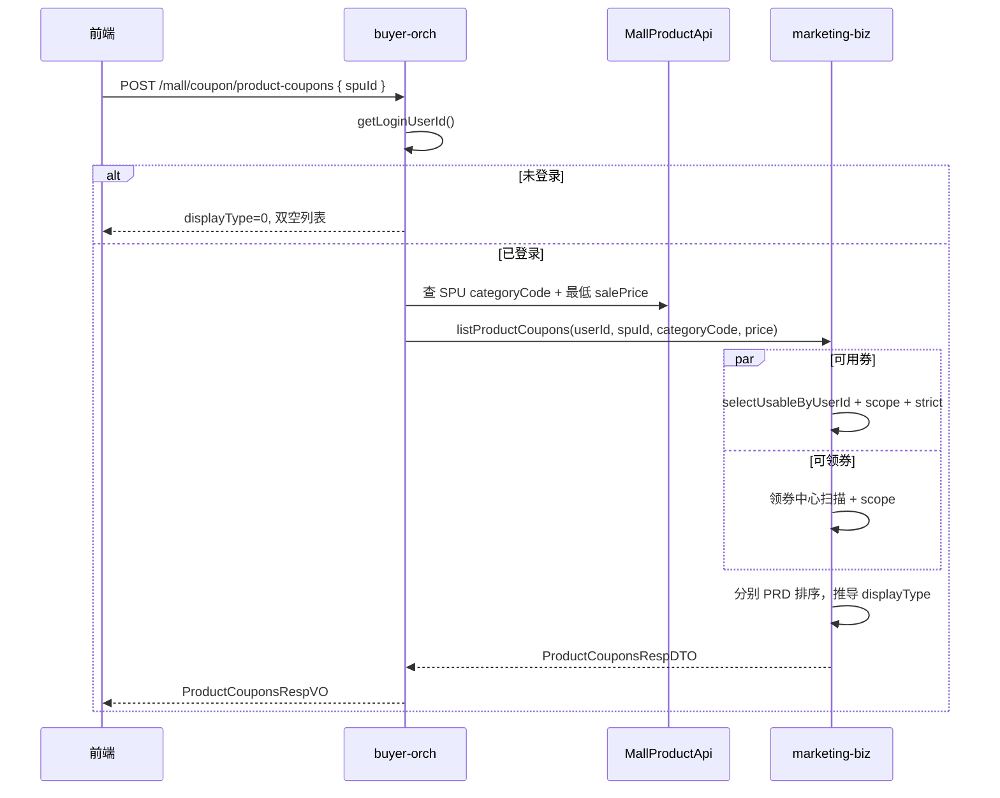

# U12 商品详情券列表 — 接口文档

> **版本**：v1.0  
> **日期**：2026-07-16  
> **负责域**：营销 / 优惠券（C 端商品详情）  
> **状态**：已实现  
> **服务**：`buyer-orch-server`  
> **Controller**：`CouponClaimController#listProductCoupons`

---

## 1. 接口概述

| 项 | 说明 |
|---|---|
| 接口编号 | U12 |
| 接口名称 | 商品详情券列表 |
| 使用场景 | 商品详情页，商品名称下方展示「可用券」「可领券」模块 |
| 维度 | **SPU 维度**（不传 `skuId`） |
| 查询策略 | 登录用户**并行**查询可用券与可领券，两路结果独立填充 |

---

## 2. 基本信息

| 项 | 值 |
|---|---|
| 请求方式 | `POST` |
| 请求路径 | `/mall/coupon/product-coupons` |
| Content-Type | `application/json` |
| 鉴权 | 需要登录态 Token（未登录不报错，返回空结果） |
| Swagger 标签 | `App-优惠券-领券` |

### 2.1 调用说明

- 前端**只传 `spuId`**，不传 `userId`
- `userId` 由服务端从登录态解析（`SecurityFrameworkUtils.getLoginUserId()`）
- 商品 `categoryCode`、最低销售价 `price` 由编排层按 `spuId` 查商品后内部组装，前端不可见

---

## 3. 请求参数

### 3.1 Body：`ProductCouponsReqVO`

| 字段 | 类型 | 必填 | 说明 |
|---|---|---|---|
| `spuId` | Long | 是 | 商品 SPU ID（`mall_product.id`），当前详情页商品 |

### 3.2 请求示例

```json
{
  "spuId": 2012345678901234567
}
```

### 3.3 参数校验

| 规则 | 失败表现 |
|---|---|
| `spuId` 为空 | 参数校验失败（`@NotNull`，提示「商品SPU ID不能为空」） |
| `spuId` 对应商品不存在 / 无品类 / 无有效 SKU 价格 | 业务异常，见「错误码」 |

---

## 4. 响应结构

### 4.1 统一包装：`CommonResult<ProductCouponsRespVO>`

| 字段 | 类型 | 说明 |
|---|---|---|
| `code` | Integer | `0` 表示成功 |
| `data` | Object | 业务数据，见下表 |
| `msg` | String | 提示信息，成功时一般为「成功」 |

### 4.2 业务数据：`ProductCouponsRespVO`

| 字段 | 类型 | 说明 |
|---|---|---|
| `displayType` | Integer | 展示类型，见 §5 |
| `availableCoupons` | List | 可用券列表（已领取、账户内待使用、对本商品可用） |
| `claimableCoupons` | List | 可领券列表（领券中心可领、对本商品适用） |

**约定：**

- **不返回** `availableTotal`、`claimableTotal`、`total` 等计数字段，条数用 `list.length` / `list.size()`
- **不返回** 列表项 `status`、`itemType` 等冗余标识；语义由所在 List 区分
- **不返回** 展示文案字段（`thresholdText`、`scopeText`、`expireText` 等），全部由前端拼装
- 两个 List **永不为 null**，无数据时为 `[]`

---

## 5. `displayType` 四态说明

由 `availableCoupons` 与 `claimableCoupons` **是否为空**推导：

| displayType | 枚举名 | availableCoupons | claimableCoupons | 前端展示 |
|---|---|---|---|---|
| `0` | NONE（都无） | `[]` | `[]` | 隐藏优惠券区域 |
| `1` | AVAILABLE_ONLY（仅有可用） | 有数据 | `[]` | 只渲染可用券 |
| `2` | CLAIMABLE_ONLY（仅有可领） | `[]` | 有数据 | 只渲染可领券 |
| `3` | BOTH（可用可领） | 有数据 | 有数据 | **先可用、后可领** |

### 5.1 未登录特殊场景

未登录（`userId == null`）时**不查券**，直接返回：

```json
{
  "displayType": 0,
  "availableCoupons": [],
  "claimableCoupons": []
}
```

与「已登录但无券」的 `displayType=0` 结构相同，前端均可隐藏券模块。

---

## 6. 列表项字段：`ProductCouponItemRespVO`

两个 List 元素类型相同，字段按场景有差异。

### 6.1 公共字段

| 字段 | 类型 | 说明 |
|---|---|---|
| `couponId` | Long | 券模板 ID |
| `couponType` | Integer | 券类型：`0` 满减 / `1` 折扣 / `2` 无门槛 |
| `discountSubType` | Integer | 折扣子类型（折扣券使用） |
| `discountAmount` | BigDecimal | 优惠金额（元） |
| `discountRate` | BigDecimal | 折扣率 |
| `thresholdAmount` | BigDecimal | 门槛金额（元） |
| `name` | String | 券名称 |
| `scopeType` | Integer | 适用范围类型，见 §7.1 |
| `validStart` | Long | 有效期开始，**毫秒时间戳**；无则 `null` |
| `validEnd` | Long | 有效期结束，**毫秒时间戳**；无则 `null` |
| `longTermValid` | Boolean | 是否长期有效 |

### 6.2 仅 `availableCoupons` 有值

| 字段 | 类型 | 说明 |
|---|---|---|
| `couponUserId` | Long | 用户单券 ID（`coupon_user.id`） |

可领券项中 `couponUserId` 为 `null`。

### 6.3 仅 `claimableCoupons` 有值

| 字段 | 类型 | 说明 |
|---|---|---|
| `validType` | Integer | 使用期限类型，见 §7.3 |
| `validDays` | Integer | 领取后有效天数（`validType=1` 时有值） |
| `dispatchRuleType` | Integer | 发放规则类型（推广任务券） |
| `configValue` | Integer | 任务门槛数 |
| `taskCount` | Integer | 任务当前进度 |
| `remainQuantity` | Integer | 剩余可领数量（限量券时有值） |

---

## 7. 枚举与字段取值

### 7.1 `scopeType` 适用范围

| 值 | 含义 | 匹配规则 |
|---|---|---|
| `0` | 全平台 | 直接命中 |
| `1` | 指定类目 | `categoryCode` 层级互含 |
| `2` | 指定单品 | `spuId` 在 `coupon_scope.target_id` 中 |

### 7.2 `couponType` 券类型

| 值 | 含义 |
|---|---|
| `0` | 满减券 |
| `1` | 折扣券 |
| `2` | 无门槛券 |

### 7.3 `validType` 使用期限（可领券）

| 值 | 含义 | `validStart` / `validEnd` | `longTermValid` | `validDays` |
|---|---|---|---|---|
| `0` | 固定期限 | 模板起止时间（毫秒） | `false` | `null` |
| `1` | 领取后有效 | `null` | `false` | 有值 |
| `2` | 无期限 | `null` | `true` | `null` |

### 7.4 可用券有效期（来自 `coupon_user`）

| 字段 | 来源 | 规则 |
|---|---|---|
| `validStart` | `coupon_user.effective_time` | 转毫秒时间戳，空则 `null` |
| `validEnd` | `coupon_user.expire_time` | 转毫秒时间戳，空则 `null` |
| `longTermValid` | — | `expire_time == null` 时为 `true` |

---

## 8. 业务规则

### 8.1 可用券（`availableCoupons`）

**数据来源：** 用户账户已储存的待使用单券（`coupon_user`，状态与结算 U5 同源）

**过滤条件（须同时满足）：**

1. 单券状态为「待使用」
2. 适用范围命中当前 SPU（scope 规则，见 §7.1）
3. **strict 门槛**：商品金额 `price × 1` 达到券门槛（`price` = SPU 下 SKU **最低销售价**）

未达门槛的券**不进列表**。

### 8.2 可领券（`claimableCoupons`）

**数据来源：** 领券中心（`claimStatus = 1` 可领），分页扫描后按 SPU scope 过滤

**说明：** 与可用券**并行查询**，不再「有可用则跳过可领」。

### 8.3 列表排序（PRD M7 §4.2.5.1）

后端已排序，**列表顺序即展示优先级**，无 `recommendedCouponUserIds` 字段。

#### 可用券排序

| 优先级 | 规则 |
|---|---|
| 1 | 用券后实付 `actualPay` 越低越靠前 |
| 2 | 同价时临期优先（`validEnd` 越早越靠前；`longTermValid=true` 排最后） |

**优选券：** `availableCoupons[0]` 即为最优可用券，前端可直接高亮。

`actualPay` 计算（`price` 为 SPU 最低价 × 1）：

| couponType | 实付公式 |
|---|---|
| `0` 满减 | `price - min(discountAmount, price - 0.01)` |
| `1` 折扣 | `price - T`（按折扣试算逻辑得可抵扣 T） |
| `2` 无门槛 | `price - min(discountAmount, price - 0.01)` |

#### 可领券排序

| 优先级 | 规则 |
|---|---|
| 1 | 券类型：无门槛 `2` > 满减 `0` > 折扣 `1` |
| 2 | 同类型优惠力度大优先（满减/无门槛比 `discountAmount` 降序；折扣比估算可省金额降序） |
| 3 | 临期优先（固定期限比 `validEnd` 升序；领取后有效/无期限排后） |

### 8.4 与结算 U5 的差异

| 维度 | U5 结算选券 | U12 商品详情 |
|---|---|---|
| 入参 | 多 SKU 行（含 `skuId`） | 仅 `spuId` |
| 列表顺序 | SQL 临期序 | PRD 实付/类型/力度 + 临期 |
| 最优标识 | `recommendedCouponUserIds` | 列表首位，无独立字段 |
| 出参 | 含推荐字段等 | 双 List + `displayType`，无文案 |

---

## 9. 响应示例

### 9.1 仅有可用券（`displayType = 1`）

```json
{
  "code": 0,
  "data": {
    "displayType": 1,
    "availableCoupons": [
      {
        "couponId": 1001,
        "couponUserId": 123,
        "couponType": 0,
        "discountSubType": null,
        "discountAmount": 20.00,
        "discountRate": null,
        "thresholdAmount": 100.00,
        "name": "满100减20",
        "scopeType": 2,
        "validStart": 1719792000000,
        "validEnd": 1722470399000,
        "longTermValid": false,
        "validType": null,
        "validDays": null,
        "dispatchRuleType": null,
        "configValue": null,
        "taskCount": null,
        "remainQuantity": null
      }
    ],
    "claimableCoupons": []
  },
  "msg": "成功"
}
```

### 9.2 可用可领（`displayType = 3`）

```json
{
  "code": 0,
  "data": {
    "displayType": 3,
    "availableCoupons": [
      {
        "couponId": 1001,
        "couponUserId": 123,
        "couponType": 0,
        "discountAmount": 20.00,
        "thresholdAmount": 100.00,
        "name": "满100减20",
        "scopeType": 2,
        "validEnd": 1722470399000,
        "longTermValid": false
      }
    ],
    "claimableCoupons": [
      {
        "couponId": 1002,
        "couponUserId": null,
        "couponType": 2,
        "discountAmount": 50.00,
        "thresholdAmount": 0.00,
        "name": "无门槛立减50",
        "scopeType": 0,
        "validStart": null,
        "validEnd": null,
        "longTermValid": true,
        "validType": 2,
        "validDays": null,
        "remainQuantity": 99
      }
    ]
  },
  "msg": "成功"
}
```

### 9.3 仅有可领券（`displayType = 2`）

```json
{
  "code": 0,
  "data": {
    "displayType": 2,
    "availableCoupons": [],
    "claimableCoupons": [
      {
        "couponId": 1002,
        "couponType": 0,
        "discountAmount": 20.00,
        "thresholdAmount": 100.00,
        "name": "新人满100减20",
        "scopeType": 0,
        "validStart": null,
        "validEnd": null,
        "longTermValid": true,
        "validType": 2
      }
    ]
  },
  "msg": "成功"
}
```

### 9.4 都无 / 未登录（`displayType = 0`）

```json
{
  "code": 0,
  "data": {
    "displayType": 0,
    "availableCoupons": [],
    "claimableCoupons": []
  },
  "msg": "成功"
}
```

---

## 10. 错误码

| 场景 | code | msg |
|---|---|---|
| 成功 | `0` | 成功 |
| `spuId` 校验失败 | 框架参数错误码 | 商品SPU ID不能为空 |
| 商品不存在 / 无品类 / 无价格 | `1104001310` | 下单商品不存在 |

> 未登录**不抛错**，返回 §5.1 空结果。

---

## 11. 前端集成建议

### 11.1 渲染逻辑

```
displayType === 0  → 隐藏券区域
displayType === 1  → 只渲染 availableCoupons
displayType === 2  → 只渲染 claimableCoupons
displayType === 3  → 先 availableCoupons，后 claimableCoupons
```

### 11.2 徽标与角标

| 展示 | 取值 |
|---|---|
| 可用券数量 | `availableCoupons.length` |
| 可领券数量 | `claimableCoupons.length` |
| 角标文案 | 可用列表固定「可用」，可领列表固定「可领取」 |

### 11.3 文案拼装（前端负责）

后端只返回结构化字段，以下均由前端处理：

- 门槛文案（如「满100减20」「无门槛立减50」）
- 适用范围文案
- 有效期文案（基于 `validStart`/`validEnd`/`longTermValid`/`validType`/`validDays`）
- 剩余数量文案（`remainQuantity`）
- 推广任务进度文案（`configValue` / `taskCount`）

### 11.4 时间字段

- 类型：`Long`，毫秒 Unix 时间戳
- **禁止**依赖后端日期字符串；前端自行格式化
- Long 序列化可能为字符串（项目全局 Long→String 配置），前端需兼容

### 11.5 优选高亮

```javascript
const bestAvailable = data.availableCoupons[0]; // displayType 为 1 或 3 时
```

---

## 12. 调用时序



---

## 13. 相关接口

| 接口 | 路径 | 关系 |
|---|---|---|
| U5 结算可用券 | `POST /mall/coupon/trade/available-coupons` | 同源 `coupon_user` 与 scope/门槛规则，入参为多 SKU 行 |
| U3 领券中心 | `POST /mall/coupon/claim-center` | 可领券数据源 |
| U4 领取优惠券 | `POST /mall/coupon/claim-center/claim` | 用户点击可领券后领取 |

---

## 14. 代码索引

| 层 | 路径 |
|---|---|
| HTTP 入口 | `b2cmall-orch/b2cmall-buyer-orch/.../CouponClaimController.java` |
| 编排服务 | `.../CouponProductOrchServiceImpl.java` |
| 查价支持 | `.../CouponProductSupport.java`、`ProductCouponPriceContext.java` |
| VO 入参 | `.../vo/coupon/req/ProductCouponsReqVO.java` |
| VO 出参 | `.../vo/coupon/resp/ProductCouponsRespVO.java`、`ProductCouponItemRespVO.java` |
| RPC API | `b2cmall-module-marketing-api/.../CouponMallApi.java` |
| 业务实现 | `b2cmall-module-marketing-biz/.../CouponMallServiceImpl#listProductCoupons` |
| 展示类型枚举 | `.../enums/ProductCouponDisplayTypeEnum.java` |
