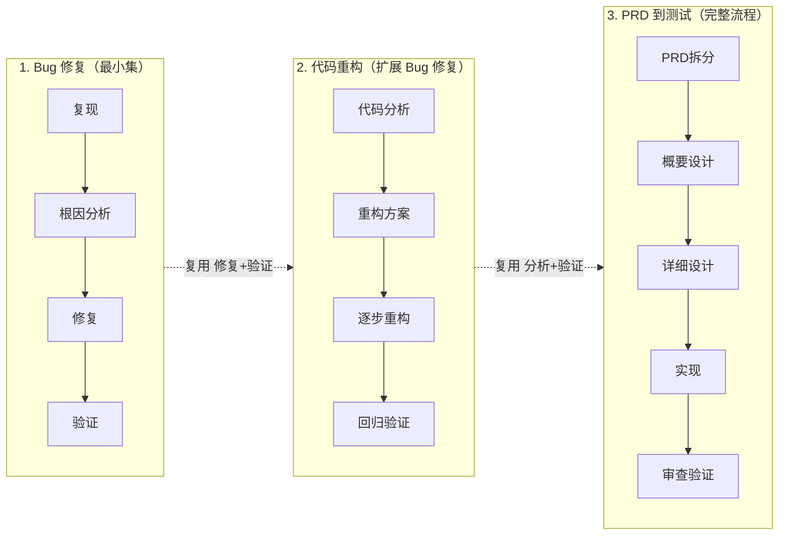
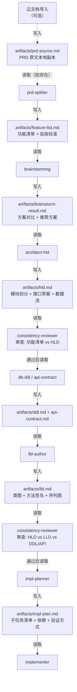
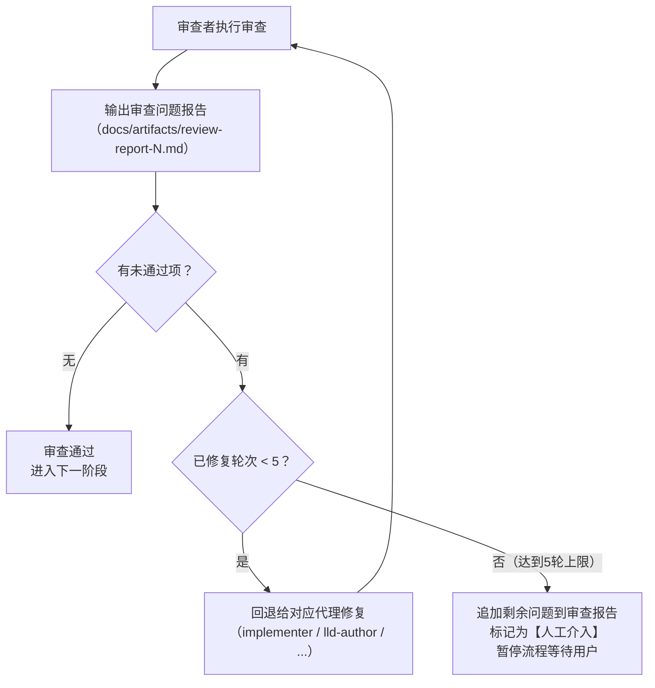

# Harness 工程重整 - 三工作流渐进体系

## 设计思路

三个工作流是渐进包含关系，像俄罗斯套娃：



**核心原则**：混合组织——Rules 按四层语义归类（被动加载，按职责区分），Skills 和 Agents 按工作流场景分组（主动调度，按场景直觉），Workflows YAML 跨层引用资源。

> **结构现状（自 2026-06）**：`rules/`、`skills/`、`agents/` 三类资源目录已全部**扁平化**，原 `memory/`、`orchestration/`、`feedback/`、`execution/` 以及 `shared/`、`bugfix/`、`refactoring/`、`feature/` 子目录不再存在，仅保留为**语义标签**。下文资源清单中出现的 `shared/xxx`、`feature/xxx` 等前缀均表示"语义归属"，实际路径为 `skills/xxx/SKILL.md`、`agents/xxx.md`。

## 目录结构

```
.cursor/
  rules/                         ← 被动规则，全部扁平化直接挂在 rules/ 下（约 49 个，单一职责）
                                    语义四类：编码规范（约 28）、工作流编排（约 6）、门禁守卫（约 9）、安全边界（2）
    projects/broker/               broker 项目特化规则（13 个，靠 broker- 前缀 + globs 锁定生效范围）
  skills/                        ← 主动技能，全部扁平化挂在 skills/<name>/SKILL.md（13 个，每个含 README.md + SKILL.md）
                                    语义四类：共享（4）、bugfix（2）、refactoring（2）、feature（5）
  agents/                        ← 子代理，全部扁平化挂在 agents/<name>.md（16 个）
                                    语义四类：共享（4）、bugfix（3）、refactoring（2）、feature（7）
  workflows/                     ← 工作流编排（跨层引用资源）
    bugfix.yaml                    Bug 修复流水线
    refactoring.yaml               代码重构流水线
    feature-delivery.yaml          功能交付流水线（编排索引，entry_mode: flexible）
    feature-delivery/              功能交付的 8 个最小阶段文件 phase-1-prd-split..phase-8-verify-archive
  scripts/                       ← 校验/初始化脚本（check-rule-cross-refs.ps1 / .sh 等）
  mcp/mcp-template.json          ← MCP 服务配置模板
  plugins/feature-list.md        ← 第三方插件安装清单

AGENTS.md                        ← 顶层代理指令
docs/
  harness-guide.md               ← Harness 工程概念与结构说明
  harness-plan.md                ← 本文件（完整设计方案）
  review-checklist.md            ← AI 产出人工审查清单
  task-template.md               ← 需求拆解模板
  templates/                     ← 文档模板（调试日志 / 决策记录 / 审查清单 / 任务）
  artifacts/                     ← 制品目录（子代理间的交接物）
    archive/                       历史制品归档
```

## 三个工作流的具体设计

### 工作流 1：Bug 修复（bugfix.yaml）

```
触发 → 复现Bug → 根因分析 → 编写修复 → 验证 → 审查 → 完成
```

使用资源：
- **Agents**: `shared/implementer` + `shared/code-reviewer` + `shared/memory-consolidator` + `bugfix/bug-analyst`
- **Skills**: `shared/done-verify` + `bugfix/systematic-debug` + `bugfix/tdd-bugfix`
- **Rules**:
  - memory: `exceptions` + `null-safety` + `logging`（修 bug 最相关的子集）
  - orchestration: `git-branch` + `git-commit`
  - feedback: `compile-guard` + `lint-guard` + `test-guard`
  - execution: `execution-boundary` + `environment-boundary`

### 工作流 2：代码重构（refactoring.yaml）

```
触发 → 代码分析 → 制定方案 → 逐步重构 → 回归验证 → 质量审查 → 完成
```

使用资源（Bug 修复的全部 + 以下新增）：
- **Agents**: + `refactoring/refactoring-planner` + `refactoring/code-quality-reviewer`
- **Skills**: + `refactoring/refactor-plan` + `refactoring/safe-refactoring`
- **Rules 新增**:
  - memory: + `method-design` + `naming` + `comments`
  - orchestration: + `change-implementation`
  - feedback: + `scope-guard`

### 工作流 3：PRD 到测试（feature-delivery.yaml）

```
[可选: 云文档导入→prd-source.md] → 功能拆分 → 头脑风暴 → 概要设计 → [一致性审查] → [HLD→飞书→人工确认] → DDL/API → 详细设计 → [一致性审查] → [LLD→飞书→人工确认] → 实现计划 → 编码 → [规格审查] → [质量审查] → [通用审查] → 验证 → 收尾
```

**首步可选**：从飞书等云文档将 PRD 内容复制到 `docs/artifacts/prd-source.md`，后续全程基于本地 md 文件流转。用户直接口头描述需求时可跳过此步骤。

使用资源（重构的全部 + 以下新增）：
- **Agents**: + `feature/prd-splitter` + `feature/architect-hld` + `feature/lld-author` + `feature/impl-planner` + `feature/db-ddl` + `feature/api-contract` + `feature/spec-reviewer` + `shared/consistency-reviewer`
- **Skills**: + `feature/brainstorming` + `feature/writing-plans` + `feature/feature-delivery-workflow` + `feature/hld-to-feishu` + `feature/lld-to-feishu` + `shared/codegen-guard`

**完整审查链**（渐进继承 + 新增）：
1. `consistency-reviewer` — 阶段交接时校验制品对齐（HLD后、LLD后）
2. `spec-reviewer` — 实现完成后校验代码是否按 LLD 设计
3. `code-quality-reviewer` — 继承自重构流程，校验代码质量（坏味道、可维护性）
4. `code-reviewer` — 继承自 Bug 修复流程，最终审查（正确性、回归、规范）
- **Rules 新增**:
  - memory: + `project-architecture` + `database` + `api-design` + `testing` + `dependencies`（全部 memory 规则激活）
  - orchestration: + `task-decomposition`
  - feedback: + `schema-guard`

## 技能详细说明

### shared/ 共享技能

**harness-debug-logger** — Harness 全局调试日志
- **用途**：记录 harness 工程运行时的完整轨迹，用于调试工作流执行过程。当流程出现偏差或想了解 AI 的决策路径时，查看此日志即可还原全貌
- **触发时机**：每个工作流的每个步骤执行前后自动记录。具体触发点包括：
  - 规则加载时（哪些 `.mdc` 被激活）
  - **资源冲突检测**（规则加载后立即执行，扫描所有激活资源间的冲突）
  - 技能调用时（进入/退出技能）
  - 子代理派发时（启动/完成子代理）
  - 审查闭环时（每轮审查结果）
  - 人工检查点时（暂停/恢复）
- **具体动作**：在 `docs/artifacts/harness-debug.md` 中追加结构化日志条目
- **丢失风险**：中。需要在每个子代理 prompt 和 workflow YAML 中显式调用。通过在 AGENTS.md 顶层指令中硬编码"每个步骤必须调用 harness-debug-logger"来保障

**日志格式设计**：

```markdown
# Harness Debug Log

## [2026-04-16 14:00:05] 工作流启动
- **工作流**: feature-delivery
- **任务**: 用户注册功能
- **触发方式**: 用户指令

---

## [2026-04-16 14:00:06] 规则加载
- **已激活规则**:
  - `rules/naming.mdc`
  - `rules/exceptions.mdc`
  - `rules/git-branch.mdc`
  - `rules/test-guard.mdc`
  - `rules/human-checkpoint.mdc`
  - `rules/execution-boundary.mdc`
  - ...（共 21 条；自 2026-06 起 rules/ 已扁平化）

---

## [2026-04-16 14:00:07] 资源冲突检测
- **扫描范围**: 21 条规则 + 8 个技能 + 10 个子代理
- **发现冲突**: 2 项

### 冲突 #1 — 内容重叠
- **类型**: 职责重叠
- **资源 A**: `skills/done-verify/SKILL.md`
  - 定义: "检查编译通过、测试通过、Lint 通过"
- **资源 B**: `rules/compile-guard.mdc` + `rules/test-guard.mdc` + `rules/lint-guard.mdc`
  - 定义: 分别要求编译通过、测试通过、Lint 通过
- **重叠内容**: 编译/测试/Lint 检查在技能和规则中都有定义
- **风险**: 执行两次同样的检查（浪费），或检查标准不一致（一个宽松一个严格）
- **建议**: 技能负责"编排何时检查"，规则负责"检查的具体标准"，明确分工

### 冲突 #2 — 定义矛盾
- **类型**: 指令冲突
- **资源 A**: `rules/scope-guard.mdc`
  - 定义: "diff 中每行改动都必须追溯到需求，禁止无关改动"
- **资源 B**: `skills/safe-refactoring/SKILL.md`
  - 定义: "每步只做一种重构操作"（重构操作本身不直接追溯到某个需求）
- **矛盾点**: 重构的改动可能无法逐行追溯到具体需求，但 scope-guard 要求必须能追溯
- **建议**: scope-guard 增加例外："重构类变更可追溯到重构计划而非需求"

---

## [2026-04-16 14:00:10] 技能调用 — brainstorming
- **阶段**: 需求分析
- **技能**: `skills/brainstorming/SKILL.md`
- **输入**:
  - PRD 来源: 用户口述 "实现用户注册功能，支持手机号注册"
- **输出**:
  - 产出文件: `docs/artifacts/brainstorm-result.md`
  - 方案数量: 3 个
  - 推荐方案: 方案 A（Spring Security + SMS 验证码）
- **引用文件**: 无（首个阶段）

---

## [2026-04-16 14:05:30] 子代理派发 — architect-hld
- **阶段**: 概要设计
- **子代理**: `agents/architect-hld.md`
- **模式**: 只读
- **输入**:
  - 读取制品: `docs/artifacts/brainstorm-result.md`
  - 读取决策: `docs/artifacts/decision-log.md`（0 条决策）
- **输出**:
  - 产出文件: `docs/artifacts/hld.md`
  - 模块数量: 4 个（注册、验证码、用户存储、通知）
- **引用文件**: `docs/artifacts/brainstorm-result.md`

---

## [2026-04-16 14:10:15] 人工检查点
- **阶段**: 概要设计
- **原因**: 方案抉择 — 验证码服务用自建还是第三方
- **问题**: 详见 `docs/artifacts/decision-log.md` 决策 #1
- **用户决策**: 使用第三方短信服务
- **状态**: 已恢复

---

## [2026-04-16 14:15:00] 审查闭环 — consistency-reviewer（第 1 轮）
- **阶段**: HLD 一致性审查
- **审查者**: `agents/consistency-reviewer.md`
- **输入**:
  - `docs/artifacts/feature-list.md`（3 个功能点）
  - `docs/artifacts/hld.md`（4 个模块）
- **审查结果**: 不通过
  - 问题: 功能点 "注册成功发送欢迎邮件" 在 HLD 中无对应模块
- **处理**: 回退给 architect-hld 修正
- **引用文件**: `docs/artifacts/feature-list.md`, `docs/artifacts/hld.md`

---

## [2026-04-16 14:18:00] 审查闭环 — consistency-reviewer（第 2 轮）
- **阶段**: HLD 一致性审查
- **审查结果**: 通过
- **轮次**: 2/5
- **状态**: 进入下一阶段

---

## [2026-04-16 15:30:00] 制品归档
- **任务**: 用户注册功能
- **归档路径**: `docs/artifacts/archive/2026-04-16-用户注册功能/`
- **归档文件数**: 9 个（含本日志）
- **状态**: 工作流完成
```

**关键设计点**：
1. **粒度**：记录到"步骤"级别（技能调用、子代理派发、审查轮次），不记录代码行级细节
2. **必录字段**：时间戳、阶段、资源名称（技能/规则/代理的文件路径）、输入摘要、输出摘要
3. **引用文件**：每条日志标注读取和产出了哪些文件，方便定位查看
4. **归档**：debug 日志本身也是制品，任务完成后随其他制品一起归入 `archive/`
5. **可选开关**：通过在 workflow YAML 中设置 `debug: true/false` 控制是否启用，默认启用
6. **资源冲突检测**：工作流启动后、正式执行前，自动扫描所有激活资源，检测以下冲突类型：

**冲突检测类型**：

| 类型 | 说明 | 示例 |
|------|------|------|
| 职责重叠 | 两个资源对同一件事都有定义，可能执行两次或标准不一致 | VBC 技能和 test-guard 规则都要求"测试通过" |
| 定义矛盾 | 两个资源对同一件事给出相反的指令 | scope-guard 禁止无关改动 vs safe-refactoring 允许重构改动 |
| 引用缺失 | 某个资源引用了另一个资源，但后者未被激活 | implementer 提到"调用 codegen-guard"，但该技能不在当前工作流中 |
| 覆盖空白 | 工作流的某个阶段没有任何规则/技能覆盖 | bugfix 工作流的"根因分析"阶段没有对应的门禁规则 |

**检测时机**：工作流启动后、第一个步骤执行前
**输出格式**：每项冲突包含——类型、资源 A 路径+定义摘要、资源 B 路径+定义摘要、冲突点描述、建议处理方式
**处理方式**：冲突记入日志作为告警，不阻塞流程。用户可根据日志在工作流结束后修正规则/技能定义

**done-verify** — 完成前验证检查清单
- **用途**：在任何任务标记"完成"前，强制执行一套检查清单，防止带着遗漏问题交付
- **触发时机**：任务即将完成时（AI 准备说"已完成"之前）
- **具体动作**：检查编译是否通过 → 测试是否全绿 → Lint 是否干净 → diff 是否只包含需求相关改动 → 有无遗留 TODO
- **丢失风险**：低。通过 workflow YAML 在收尾阶段强制调用，不依赖 AI 自觉

**git-worktree** — Git Worktree 并行开发
- **用途**：当多个子任务可以并行时，用 git worktree 创建隔离的工作目录，避免分支切换冲突
- **触发时机**：实现计划中识别出 2 个以上可并行子任务时
- **具体动作**：为每个并行任务创建独立 worktree → 各自在独立分支开发 → 完成后合并回主分支
- **丢失风险**：中。仅在并行场景需要，如果 AI 未识别出并行机会可能跳过。通过 workflow YAML 在"派发并行任务"步骤显式调用来保障

**codegen-guard** — 代码生成合规守卫
- **用途**：在生成新代码（新文件/新类/新方法）前，检查是否符合项目规范，防止"能跑但不合规"
- **触发时机**：创建新的源代码文件或新增类/接口时
- **具体动作**：检查分层是否正确（Controller 不写业务逻辑？）→ 命名是否合规 → 是否有现成可复用代码 → 包路径是否正确
- **丢失风险**：中。依赖 AI 在生成代码时主动调用。通过在 `implementer` 子代理的 prompt 中硬编码"生成新文件前必须调用此技能"来保障

### bugfix/ Bug 修复技能

**systematic-debug** — 结构化调试流程
- **用途**：用系统方法定位 bug 根因，避免盲目猜测式修改
- **触发时机**：收到 bug 报告、异常堆栈、或"XX 功能不正常"类问题时
- **具体动作**：1. 收集信息（日志/堆栈/复现步骤）→ 2. 形成假设列表 → 3. 逐个验证假设（二分法/断点/日志插桩）→ 4. 确认根因 → 5. 输出根因分析报告
- **丢失风险**：低。bugfix workflow 的第一步即调用此技能，写死在流程中

**tdd-bugfix** — 测试驱动修复
- **用途**：确保 bug 被真正修复且不引入新问题
- **触发时机**：确认 bug 根因后，进入修复阶段时
- **具体动作**：先写一个失败测试复现 bug → 修改代码让测试通过 → 运行全量回归测试确认无副作用
- **丢失风险**：低。bugfix workflow 在"修复"步骤强制要求先有测试再有代码

### refactoring/ 重构技能

**refactor-plan** — 重构方案规划
- **用途**：将模糊的"这段代码需要重构"转化为有序的、安全的重构步骤
- **触发时机**：收到重构需求，或在开发过程中识别出代码坏味道时
- **具体动作**：识别坏味道类型（过长方法/重复代码/上帝类/特性依恋等）→ 选择重构手法（提取方法/内联/搬移/引入参数对象等）→ 拆分为可独立验证的小步骤序列 → 输出重构计划
- **丢失风险**：低。refactoring workflow 的第二步即调用此技能

**safe-refactoring** — 安全重构执行
- **用途**：确保重构过程中行为不变，每一步都可验证可回滚
- **触发时机**：执行重构计划中的每一个步骤时
- **具体动作**：每步只做一种重构操作 → 每步完成后立即运行测试 → 测试红了立即回滚到上一步 → 禁止在重构中夹带功能变更
- **丢失风险**：低。作为重构过程的执行守则，在 `refactoring-planner` 子代理的 prompt 中强制引用

### feature/ 功能交付技能

**brainstorming** — 需求方案头脑风暴
- **用途**：结构化地探索需求的多种实现方案，避免拿到需求就开始写代码
- **触发时机**：拿到新 PRD 或新需求，还未确定技术方案时
- **具体动作**：梳理需求边界和约束 → 列出至少 2-3 种技术方案 → 对比优劣（性能/复杂度/可维护性/工期）→ 输出推荐方案和理由
- **丢失风险**：低。feature-delivery workflow 在"设计阶段"前强制调用

**writing-plans** — 设计转实现计划
- **用途**：将概要/详细设计转化为可执行的子任务清单，让 implementer 可以直接上手
- **触发时机**：HLD/LLD 设计完成后，进入实现准备阶段时
- **具体动作**：拆分子任务（每个子任务对应一个可独立验证的变更）→ 标注依赖关系 → 判断哪些可并行 → 定义每项的验证方式 → 输出结构化计划文档
- **丢失风险**：低。feature-delivery workflow 在"计划阶段"强制调用

**feature-delivery-workflow** — 全流程交付编排
- **用途**：作为功能交付的总指挥，编排从 PRD 到上线的完整流程
- **触发时机**：用户明确说"做一个新功能"或启动 feature-delivery workflow 时
- **具体动作**：按阶段依次调度子代理（PRD拆分→头脑风暴→概要设计→DDL/API→详细设计→实现计划→编码→审查→验证→收尾）→ 管理阶段间交接物 → 跟踪整体进度 → 处理阶段回退
- **丢失风险**：无。这是 workflow 本身的入口技能，由用户主动触发

## 制品链与一致性审查

子代理会话隔离会导致上下游信息丢失。通过"制品链 + 一致性审查"两层机制解决。

### 第一层：制品链（Artifact Chain）

每个阶段的子代理必须产出一个标准制品文件到 `docs/artifacts/`，下游子代理启动时必须先读取上游制品。



**制品文件清单**：

- `prd-source.md` — PRD 原文本地副本（可选，从云文档导入）
- `feature-list.md` — 功能点列表、优先级、验收标准
- `brainstorm-result.md` — 技术方案选项、对比、推荐理由
- `hld.md` — 模块划分、接口草案、数据流、技术选型
- `ddl.md` — 表结构、索引、约束
- `api-contract.md` — 接口路径、请求/响应体、状态码
- `lld.md` — 类设计、方法签名、序列图、关键算法
- `impl-plan.md` — 子任务清单、依赖关系、并行策略、验证方式
- `decision-log.md` — 用户决策记录（所有暂停问答的完整记录）
- `harness-debug.md` — Harness 调试日志（工作流执行全轨迹）

**保障方式**：每个子代理的 prompt 中硬编码两条指令：
1. "开始前必须先读取 `docs/artifacts/xxx.md`，理解上游产出"
2. "完成后必须将产出写入 `docs/artifacts/yyy.md`"

### 制品生命周期管理

活跃制品始终在 `docs/artifacts/` 根目录，任务完成后自动归档，防止膨胀。

```
docs/artifacts/
  feature-list.md          ← 当前任务的活跃制品（平铺）
  hld.md
  lld.md
  ...
  archive/                 ← 历史归档
    2026-04-16-用户注册功能/
      feature-list.md
      hld.md
      lld.md
      review-report-final.md
    2026-04-15-修复登录NPE/
      root-cause.md
      review-report-final.md
```

**归档规则**：
1. **触发时机**：任务收尾阶段（`done-verify` 技能执行后）
2. **归档动作**：将 `docs/artifacts/` 根目录下所有 `.md` 文件移入 `archive/{日期}-{任务简称}/`
3. **命名格式**：`archive/YYYY-MM-DD-{任务简称}/`，任务简称从工作流启动时的用户输入中提取
4. **根目录清空**：归档后 `docs/artifacts/` 根目录恢复干净状态，只保留 `.gitkeep` 和 `archive/`
5. **不删除**：归档只是移动，不删除任何文件，历史可追溯

### 第二层：一致性审查（Consistency Review）

在关键阶段交接点插入 `consistency-reviewer` 子代理，校验上下游制品对齐。

**审查点 1**：HLD 完成后
- 输入：`feature-list.md` + `hld.md`
- 校验项：每个功能点是否都有对应的模块/接口？HLD 是否引入了功能清单没有的内容？
- 不通过：输出差异报告，回退给 `architect-hld` 修正

**审查点 2**：LLD 完成后
- 输入：`hld.md` + `ddl.md` + `api-contract.md` + `lld.md`
- 校验项：LLD 中的类/方法是否覆盖 HLD 所有接口？DDL 字段是否与 LLD 实体一致？API 契约参数是否与 LLD 方法签名匹配？
- 不通过：输出差异报告，回退给 `lld-author` 修正

**审查点 3**（可选）：实现完成后
- 输入：`lld.md` + 实际代码
- 校验项：代码是否按 LLD 的类/方法设计实现？有无遗漏或偏离？
- 由 `spec-reviewer` 执行（已有代理）

## 审查-修复闭环机制

所有审查节点（一致性审查、规格审查、质量审查、通用审查）统一遵循同一套闭环流程：



**闭环规则**：

1. **输出报告**：每轮审查产出结构化的审查报告，记录到 `docs/artifacts/`，包含：
   - 问题列表（每项标注严重级别：阻塞/警告/建议）
   - 涉及的文件和行号
   - 修复建议

2. **自动回退修复**：审查不通过时，自动将报告发给对应的上游代理：
   - 一致性审查不通过 → 回退给 `architect-hld` 或 `lld-author`
   - 规格审查不通过 → 回退给 `implementer`
   - 质量审查不通过 → 回退给 `implementer`
   - 通用审查不通过 → 回退给 `implementer`

3. **再次审查**：修复完成后重新进入同一审查节点，检查问题是否解决

4. **最多 5 轮**：防止死循环。计数器从第 1 轮开始，每次"审查→修复"算 1 轮

5. **超限处理**：达到 5 轮仍有未通过项时：
   - 将所有历史轮次的审查报告合并为最终报告
   - 剩余未解决问题标记为【人工介入】
   - 暂停流程，等待用户决策

**各工作流的审查闭环**：

- **Bug 修复**：编码 → `code-reviewer`（闭环，最多 5 轮）→ 验证 → 完成
- **代码重构**：重构 → `code-quality-reviewer`（闭环）→ `code-reviewer`（闭环）→ 验证 → 完成
- **功能交付**：编码 → `spec-reviewer`（闭环）→ `code-quality-reviewer`（闭环）→ `code-reviewer`（闭环）→ 验证 → 完成
  - 另外设计阶段的 `consistency-reviewer` 也遵循同一闭环

## 人工检查点与决策记录

工作流执行过程中遇到不确定情况时，暂停询问用户，并将问答记录持久化。

### 暂停条件（human-checkpoint.mdc）

always 加载，所有工作流生效。遇到以下情况时必须暂停问用户：

- **需求模糊**：需求描述有歧义、缺少边界条件、可以有多种理解
- **方案抉择**：存在多个可行方案且各有明显优劣，无法自行判定
- **风险操作**：删表、改接口签名、移除公共方法、破坏性数据迁移等不可逆变更
- **超出范围**：发现需求涉及的改动超出预期范围（比如要改公共模块影响其他功能）
- **假设不确定**：对业务逻辑的理解基于假设，无法从代码/文档中确认

### 决策记录（decision-log.md）

每次暂停问用户后，将问答记录追加到 `docs/artifacts/decision-log.md`：

```markdown
## 决策 #1 — 2026-04-16 14:30
- **阶段**：概要设计
- **问题**：用户注册是否需要支持手机号 + 邮箱两种方式？PRD 只提了"注册"未明确
- **选项**：
  A. 只支持手机号（简单，一期够用）
  B. 同时支持手机号和邮箱（完整，但工作量翻倍）
- **用户决策**：选 A，二期再加邮箱
- **影响**：HLD 中注册模块只设计手机号验证流程

## 决策 #2 — 2026-04-16 15:10
- **阶段**：实现
- **问题**：发现改动会影响公共的 UserService，是否继续？
- **用户决策**：继续，但只改注册相关方法，不动其他方法
- **影响**：implementer 限定修改范围为 UserService.register()
```

**记录规则**：
- 每次暂停必须记录，不允许口头问完不写
- 记录包含：阶段、问题、选项、用户决策、对后续的影响
- 任务完成后随其他制品一起归档到 `archive/`
- 下游子代理启动时也要读取 `decision-log.md`，确保不违背已有决策

## 记忆固化机制

当用户在指导过程中重复指出同类错误时，自动将纠正固化为持久规则。


**correction-detection.mdc**（反馈/门禁类规则）职责：
- always 加载，监听对话中的纠正信号
- 识别模式：用户说"我说过""又犯了""之前提过""第N次了"等
- 当检测到重复纠正时，指示调度 `memory-consolidator` 子代理

**memory-consolidator.md**（共享子代理）职责：
- 接收纠正内容，提取核心规则
- 判断归属分类（如命名→`naming.mdc`，异常→`exceptions.mdc`）
- 以追加方式写入对应的 .mdc 规则文件
- 如果没有匹配的现有文件，在 `rules/` 下新建 .mdc
- 写入后向用户确认："已将【xx 规则】固化到 `rules/xx.mdc`"

**分类映射表**（内置于 memory-consolidator 中；rules/ 已扁平化，引用直接用文件名）：

- 命名相关 → `naming.mdc`
- 异常处理相关 → `exceptions.mdc`
- 日志相关 → `logging.mdc`
- 空值处理相关 → `null-safety.mdc`
- 方法/函数设计相关 → `method-design.mdc`
- 注释相关 → `comments.mdc`
- 数据库相关 → `database.mdc`
- API 相关 → `api-design.mdc`
- 测试相关 → `testing.mdc`
- Git 相关 → `git-branch.mdc` 或 `git-commit.mdc`
- 无法归类 → 新建 `<topic>.mdc`

## 实施状态

本设计方案已落地，骨架与核心文件均已创建并随后持续演进：

- **已完成**：AGENTS.md、3 个 workflow YAML（`feature-delivery` 已进一步拆为 8 个 `phase-*.yaml` 最小阶段文件）、全部 agents（16 个）与 skills（13 个，每个含 README.md + SKILL.md）、全部 rules（约 49 个，含 `correction-detection` / `human-checkpoint` / `java-edit-self-check` 等门禁）
- **结构演进**：`rules/`、`skills/`、`agents/` 已在 2026-06 全面扁平化（详见上文"结构现状"说明）
- **项目特化**：新增 `rules/projects/broker/`（13 个 broker 项目规则，按 globs 锁定作用域）
- **配套工具**：新增 `.cursor/scripts/`（如 `check-rule-cross-refs` 交叉引用门禁脚本）、`.cursor/plugins/feature-list.md`

> 本文件作为设计方案的历史与现状记录；运行时的权威结构以 `AGENTS.md` 与 `harness-guide.md` 为准，三者如有出入以实际仓库目录为准。
