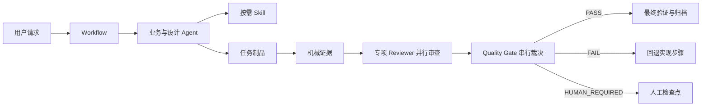

# Harness v2 演讲与培训手册

> **适用对象**：研发工程师、Tech Lead、QA、使用 Cursor 进行 AI 协作交付的团队  
> **建议时长**：60–90 分钟（含 15 分钟实操演示）  
> **版本**：Harness v2 · 2026-07

---

## 如何使用本文件

| 章节 | 用途 |
|---|---|
| **Part A · 幻灯片大纲** | 投屏演讲，每页 3–5 分钟 |
| **Part B · 讲者备注** | 展开说明、举例、答疑要点 |
| **Part C · 实操演练** | 培训现场动手练习 |
| **Part D · 速查与 FAQ** | 课后参考 |

---

# Part A · 幻灯片大纲（约 22 页）

---

## Slide 1 · 封面

**Harness v2 — 可追踪、可恢复、可审查的 AI 工程交付**

- 面向 Cursor 的工程交付资源库
- Agent · Skill · Workflow · Rule 四层协作
- 不是业务框架，不引入运行时依赖

---

## Slide 2 · 我们遇到了什么问题？

**单 Prompt 大杂烩的四大痛点**

```text
❌ 角色漂移      — 分析者突然写代码、实现者自己宣布通过
❌ 上下文膨胀    — 规则、方法、流程全部塞进一个窗口
❌ 阶段遗漏      — 跳过设计门禁、缺少测试与审查
❌ 无法恢复      — 中断后不知道从哪继续、历史决策丢失
```

> **核心命题**：把 WHO / HOW / WHEN / CONSTRAINT 分开，各自有唯一权威来源。

---

## Slide 3 · Harness 是什么？

**一套链接到业务项目的 Cursor 配置 + 制品协议**

```text
Harness 仓库                    业务项目（broker / b2cmall / …）
├─ .cursor/agents/      ──link──►  共享 Agent 角色定义
├─ .cursor/skills/      ──link──►  共享可复用方法
├─ .cursor/workflows/   ──link──►  共享流程编排
├─ .cursor/rules/       ──link──►  共享工程红线
└─ docs/templates/      ──link──►  共享制品模板（Rules/Skills 引用）

业务项目本地保留：
docs/artifacts/work/{task-id}/   ← 每个任务的制品
docs/artifacts/archive/          ← 已完成任务归档
```

---

## Slide 4 · 四层领域模型

| 层 | 一句话 | 典型内容 |
|---|---|---|
| **Agent** | 谁负责、交什么、怎么算完成 | 需求分析、实现、质量审查 |
| **Skill** | 复杂且可复用的 HOW | TDD 修复、安全重构、机械验证 |
| **Workflow** | 何时、顺序、并行、回退 | bugfix / refactoring / feature-delivery |
| **Rule** | 对所有任务始终生效的红线 | 编译门禁、空值规范、租户隔离 |

```text
Agent    = WHO + WHAT + CONTRACT + ROLE POLICY
Skill    = REUSABLE / OPTIONAL / COMPLEX HOW
Workflow = WHEN + ORDER + BINDING + STATE
Rule     = ALWAYS-APPLICABLE CONSTRAINT
```

---

## Slide 5 · 三个稳定入口

| 入口 | 适用场景 | 典型路径 |
|---|---|---|
| **bugfix** | 缺陷、测试失败、构建失败、线上异常 | 意图路由 → 根因 →（可选）TDD 修复 → 质量门禁 |
| **refactoring** | 行为保持的结构调整 | 影响分析 → 切片计划 → 渐进重构 → 质量门禁 |
| **feature-delivery** | PRD 到上线的完整交付 | 8 阶段：需求 → 设计 → 实现 → 验证归档 |

> 入口名称固定，阶段细节只在 Workflow YAML 中维护。

---

## Slide 6 · 整体运行模型



**关键设计**：实现者与质量 Reviewer 上下文隔离；实现者不能自己宣布通过。

---

## Slide 7 · Bugfix：意图路由（重要）

**不是看到 Issue 就改代码**

| 用户表达 | 默认分支 |
|---|---|
| ONES 链接 / Issue Key / 「排查、分析、定位」 | **investigation**（只读，根因分析后结束） |
| 「修复、改代码、实施修复」 | **fix**（计划 → TDD → 门禁 → 归档） |

```text
Issue / 用户描述
→ workflow/intent-routing.md
→ 问题上下文 + 可选日志调查
→ analysis/root-cause.md
├─ investigation：返回结论，不改代码
└─ fix：implementation-plan → TDD → 质量门禁 → 验证
```

---

## Slide 8 · Feature Delivery 八阶段

| # | 阶段 | 核心产出 |
|---|---|---|
| 1 | requirements | `analysis/feature-list.md` |
| 2 | brainstorm | `design/brainstorm-result.md` |
| 3 | hld | `design/hld.md` + HLD 门禁 |
| 4 | db-api | `design/ddl.md` / `design/api-contract.md`（并行） |
| 5 | lld | `design/lld.md` + LLD 门禁 |
| 6 | implementation-plan | `plans/implementation-plan.md` |
| 7 | implementation | 代码 + `delivery/change-manifest.md` + 实现门禁 |
| 8 | verify-archive | 机械证据 + 归档 |

> 支持 **flexible entry**：可从任意已有制品阶段恢复。

---

## Slide 9 · 21 个 Agent 一览

**业务与治理（12）**

`issue-context-fetcher` · `log-investigator` · `requirements-analyst` · `problem-analyst` · `solution-architect` · `database-designer` · `api-designer` · `detail-designer` · `implementation-planner` · `refactoring-planner` · `implementer` · `memory-consolidator`

**质量委员会（9）**

| 必跑 | 风险路由 |
|---|---|
| static-analysis · logic-correctness · maintainability · test-adequacy · quality-gate | security · data-concurrency · diagnosability · consistency |

---

## Slide 10 · 质量协议

**三级严重度**

| 级别 | 含义 | 门禁影响 |
|---|---|---|
| **BLOCKER** | 必须修复 | 未解决 → FAIL |
| **WARNING** | 可随 PASS 交付，须跟踪 | 汇总记录 |
| **ADVISORY** | 改进建议 | 非阻塞 |

**最终结论只有三种**：`PASS` · `FAIL` · `HUMAN_REQUIRED`

- 同一文件追加 `Check 001`、`Check 002`…（禁止覆盖历史）
- 机械证据追加 `Run 001`、`Run 002`…

---

## Slide 11 · 制品目录与任务隔离

```text
docs/artifacts/work/{task-id}/
  context/          ← Issue、PRD、仓库上下文
  analysis/         ← 功能清单、根因分析
  design/           ← HLD、DDL、API、LLD；可执行 SQL 在 design/sql/
  plans/            ← 实现/重构计划
  delivery/         ← 变更清单；订正脚本可选 delivery/sql/
  quality/
    evidence/       ← 编译、测试、覆盖率报告
    gates/          ← 专项审查 + 最终裁决
  workflow/         ← 状态、决策日志、审查路由
```

任务完成后整体移至 `docs/artifacts/archive/{date}-{task-id}/`（只读）。

---

## Slide 12 · Rule：始终生效的工程红线

**示例（部分）**

| Rule | 作用 |
|---|---|
| `compile-guard` | 代码变更后必须编译通过 |
| `test-guard` | 测试通过 + 覆盖率门禁 |
| `java-edit-self-check` | Java 变更前加载规则、变更后自检报告 |
| `human-checkpoint` | 需求模糊、方案抉择、风险操作必须暂停问人 |
| `tenant-isolation` | 多租户数据隔离 |
| `scope-guard` | diff 每行改动可追溯 |

> 项目特化 Rule 位于 `.cursor/rules/projects/{project}/`，通过 `globs` 命中业务代码路径。

---

## Slide 13 · 安装到业务项目

**Windows**

```powershell
.\link-cursor-config.ps1 -Target "D:\Work\Project\your-project"
```

**macOS / Linux**

```bash
./link-cursor-config.sh ~/Work/Project/your-project
```

- 链接 `.cursor` 与 `docs` 子项（含 `docs/templates`）
- `artifacts/work` 与 `archive` 保留在业务项目本地
- 已存在资源默认跳过；确认替换时用 `-Force` / `-f`

---

## Slide 14 · MCP 与外部工具

| 能力 | 典型 MCP | 对应 Agent |
|---|---|---|
| ONES Issue | `user-ones-mcp` | `issue-context-fetcher` |
| 日志调查 | Loki / middle-tool | `log-investigator` |
| 数据库 | dbx / mysql | 调试、设计验证 |
| Redis / MQ | middle-tool | 并发、消息排查 |

在 Cursor **Settings → MCP** 中按环境启用；Agent description 保留平台关键词以便 Cursor 发现能力。

---

## Slide 15 · 会话标题自动命名

| 首条消息格式 | 侧边栏标题 |
|---|---|
| `BTOC-1471 【C端商城】品鉴大师...` + ONES 链接 | Key + 中文（≤40 字） |
| 仅 Issue Key | Key 大写 |
| 其他含中文 | 首行中文（≤40 字） |

机制：`beforeSubmitPrompt` Hook + `session-title.mdc` 调用内置 `rename_chat`。

---

## Slide 16 · 日常协作：你怎么跟 Harness 说话？

**好的开场**

```text
BTOC-1307 【购物车】结算时库存校验遗漏
https://ones.cn/.../issue/BTOC-1307

请走 bugfix workflow，先排查根因，不要改代码。
```

```text
@feature-delivery 从 phase-7 恢复，task-id=member-points-20260714
已有 plans/implementation-plan.md，请继续实现。
```

**避免**

- 「帮我修一下」—— 未说明是排查还是修复
- 「全部做完不用审查」—— 绕过质量门禁
- 在一条消息里混合 PRD 评审 + 写代码 + 部署

---

## Slide 17 · 维护者与贡献者

**修改原则（四问）**

1. 改角色职责？→ **Agent**
2. 改可复用方法？→ **Skill**
3. 改阶段顺序/制品链？→ **Workflow**
4. 改全员红线？→ **Rule**

修改后必跑校验：

```powershell
.cursor/scripts/check-harness-resources.ps1
.cursor/scripts/check-rule-cross-refs.ps1
.cursor/scripts/smoke-workflows.ps1
```

---

## Slide 18 · 与「裸 Cursor」对比

| 维度 | 裸 Cursor | Harness v2 |
|---|---|---|
| 流程 | 靠 Prompt 记忆 | Workflow YAML 唯一来源 |
| 质量 | 实现者自评 | 多 Reviewer + 门禁裁决 |
| 中断恢复 | 难 | 制品 + workflow-state |
| 规范 | 口头约定 | Rule 持续生效 |
| 审计 | 聊天记录 | 结构化制品 + 归档 |

---

## Slide 19 · 团队落地建议

1. **先 link，再开 Agent 会话** — 确保 rules / hooks 生效  
2. **任务 ID 从第一天就规范** — 便于 `artifact_root` 追溯  
3. **设计阶段不要跳过** — HLD/LLD 门禁省下的返工更多  
4. **Bugfix 默认 investigation** — 明确说「修复」才改代码  
5. **质量 WARNING 要有 owner** — PASS 不等于技术债清零  

---

## Slide 20 · 实操演示议程（Trainer）

1. 演示 `link-cursor-config.ps1`（或展示已 link 项目结构）  
2. 新建 Agent 会话，粘贴 ONES Issue → 观察标题命名  
3. 走 bugfix investigation：产出 `root-cause.md`  
4. 展示 `docs/artifacts/work/{task-id}/` 目录树  
5. （可选）展示 quality gate 报告中的 Check 追加  

---

## Slide 21 · 资源索引

| 文档 | 路径 |
|---|---|
| 项目 README | `README.md` |
| 架构与运行模型 | `docs/architecture.md` |
| 资源放置指南 | `docs/resource-placement-guide.md` |
| 制品模板 | `docs/templates/README.md` |
| Cursor 总约定 | `.cursor/AGENTS.md` |

---

## Slide 22 · Q&A

**常见问题预告**

- Harness 会改我业务代码吗？→ 只有走 fix/implementation 且 Agent 被授权时  
- 能否只用 Rule 不用 Workflow？→ 可以，但失去阶段与质量协议  
- 多项目如何共享？→ link 同一 Harness 仓库；制品各项目本地  
- 如何定制项目 Rule？→ `projects/{name}/*.mdc` + globs  

---

# Part B · 讲者备注

## B.1 开场（5 分钟）

**目标**：让听众建立「Harness 是流程与治理层，不是又一个 Spring Starter」的认知。

可讲的故事：一次「AI 直接改生产代码导致回归」或「PRD 没拆清就写代码返工两周」的真实案例（可替换为本团队经历）。引出：我们需要的是**分工、门禁、制品**，而不是更大的 Prompt。

## B.2 四层模型（10 分钟）

**类比**：把软件团队映射到 Harness

- Agent ≈ 岗位 JD + 交付标准（产品经理、架构师、开发、QA）
- Skill ≈ 部门 SOP / _RUNBOOK（如何跑 `mvn verify`、如何做 TDD bugfix）
- Workflow ≈ 项目里程碑与审批流
- Rule ≈ 公司级编码规范 + CI 门禁

强调 **Agent 与 Skill 不必 1:1**。例如 `solution-architect` 主要依赖 ROLE POLICY，而 `implementer` 会按需加载 `tdd-bugfix`、`codegen-guard`、`done-verify`。

## B.3 Bugfix 意图路由（8 分钟）

这是培训中**最容易被误解**的点。务必用对比表讲清：

| 场景 | 正确说法 | 错误说法 |
|---|---|---|
| 线上告警，还不确定根因 | 「先 investigation，不要改代码」 | 「帮我 fix」 |
| 根因已确认，要出补丁 | 「根因是 X，请走 fix 分支实施 TDD 修复」 | 「继续」 |

`workflow/intent-routing.md` 是审计证据：事后能回答「当时是否授权改代码」。

## B.4 质量委员会（10 分钟）

**为什么不让 implementer 自评？** LLM 对刚写出的代码有确认偏误；独立 Reviewer prompt + 结构化报告可部分缓解。

讲解 **fan-out / join**：

- 静态分析、逻辑、可维护性、测试 → 并行
- security 等 → 看 `review-routing.md` 决定是否启动
- 全部到齐后 → `quality-gate-reviewer` 串行裁决

**BLOCKER 示例**（口述）：未做租户隔离的 SQL、缺少鉴权的 Admin API、测试被 `@Disabled`。

## B.5 Feature Delivery（8 分钟）

强调 **flexible entry**：不是每次都要从 PRD 开始。常见恢复方式：

- 「已有 HLD，从 db-api 阶段继续」
- 「LLD 已评审通过，请生成 implementation-plan」

八阶段中 **phase-4 db-api 并行** 是效率点：DB 与 API 可同时进行，但都要回溯 HLD。

## B.6 安装与 MCP（5 分钟）

演示 link 脚本的 **junction/symlink** 行为：Harness 更新后，业务项目自动获得新 Agent/Rule（除非本地 `-Force` 覆盖过）。

提醒：`docs/templates` 已随 link 脚本链接 — Rules/Skills 中的模板路径可直接解析；任务制品仍写入本地 `artifacts/work`。

## B.7 结束（2 分钟）

给出课后作业（见 Part C），收集「最想先在本项目试哪个入口」的投票。

---

# Part C · 实操演练

## 练习 1 · 链接与目录认知（10 分钟）

**步骤**

1. 在测试项目执行 link 脚本（或使用已 link 项目）。
2. 确认存在 `.cursor/agents/implementer.md` 且为链接/ junction。
3. 列出 `docs/artifacts/work/` 下是否为空。
4. 阅读 `.cursor/rules/compile-guard.mdc` 前 20 行，用自己的话说明门禁要求。

**验收**：能画出「Harness 仓库 vs 业务项目本地」各存什么。

---

## 练习 2 · Bugfix Investigation（15 分钟）

**背景**：使用一个真实或虚构 Issue（建议用 TEST-001 类测试 Key）。

**步骤**

1. 新建 Cursor Agent 会话，首条消息粘贴 Issue 标题 + 描述 + 「请 bugfix investigation，不要改代码」。
2. 观察会话标题是否按 `session-title` 规则命名。
3. 任务结束后检查是否生成：
   - `docs/artifacts/work/{task-id}/context/issue-context.md`
   - `docs/artifacts/work/{task-id}/analysis/root-cause.md`
   - `docs/artifacts/work/{task-id}/workflow/intent-routing.md`
4. 确认 **没有** 业务代码 diff（investigation 分支）。

**讨论**：若 Agent 仍尝试改代码，应如何纠正？（明确引用 intent-routing + human-checkpoint）

---

## 练习 3 · 制品与质量报告结构（10 分钟）

**步骤**

1. 打开 `docs/templates/quality/gates/implementation/logic-correctness.md`。
2. 找到 `Check 001` 应包含的字段：问题 ID、严重级别、证据、修复要求。
3. （若有历史归档）打开 `docs/artifacts/archive/` 任一任务，找 quality gate 文件，看是否有 `Check 002` 追加。

**验收**：说清「为什么不能覆盖旧 Check」。

---

## 练习 4 · 贡献一条 Rule 候选（选修，15 分钟）

**步骤**

1. 回忆一个被重复纠正的编码习惯（需 ≥2 次同类证据，见 `correction-detection.mdc`）。
2. 按模板起草 `workflow/memory-change.md`（状态 `PENDING`）。
3. 说明目标 Rule 文件与目标章节。
4. **不要**直接改 `.mdc` — 等 `APPROVED` 后由 `memory-consolidator` 写入。

---

# Part D · 速查与 FAQ

## D.1 一句话速查

| 我想… | 说什么 / 用什么 |
|---|---|
| 查线上 bug 根因 | bugfix + investigation + Issue 链接 |
| 修已确认 bug | bugfix + fix + 根因文档 |
| 做重构 | refactoring workflow + 行为基线 |
| 新功能从 PRD 开始 | feature-delivery + PRD |
| 从设计继续 | feature-delivery + task-id + 已有制品路径 |
| 加公司级编码约束 | 提 Rule 候选 → 批准 → memory-consolidator |
| 跑完全部检查 | `check-harness-resources` + `check-rule-cross-refs` + `smoke-workflows` |

## D.2 FAQ

**Q：Harness 会拖慢开发吗？**  
A：短任务（一行 typo）不必走完整 Workflow；Harness 价值在中大型变更的可审查交付。Rule 中的 compile/test 门禁本来就应该在 CI 存在。

**Q：能否只 link rules，不 link workflows？**  
A：脚本整体 link `.cursor`；若需裁剪需团队自行约定，但不推荐——会破坏制品与 Workflow 契约一致性。

**Q：task-id 怎么起名？**  
A：建议 `{issue-key}-{slug}` 或 `{feature}-{date}`，全局唯一即可，例如 `BTOC-1471-cart-stock-20260714`。

**Q：质量 Reviewer 用什么模型？**  
A：默认继承 Cursor 模型；可在各 Agent frontmatter 手工指定不同模型做交叉验证，Workflow 无需改。

**Q：历史 archive 能改吗？**  
A：不能。archive 是审计证据；结构变更应写迁移说明，而非改历史目录。

**Q：和 Cursor Plan / Background Agent 关系？**  
A：Harness 定义「做什么、按什么标准交」；Cursor 原生能力负责执行环境。二者互补。

## D.3 推荐培训节奏（90 分钟版）

| 时间 | 内容 |
|---|---|
| 0:00–0:10 | Slide 1–4，痛点与四层模型 |
| 0:10–0:25 | Slide 5–8，三入口 + Feature 八阶段 |
| 0:25–0:40 | Slide 9–12，Agent / 质量 / 制品 / Rule |
| 0:40–0:50 | Slide 13–16，安装、MCP、日常话术 |
| 0:50–1:05 | 练习 1–2 演示 + 学员跟做 |
| 1:05–1:15 | Slide 17–19，维护与落地 |
| 1:15–1:30 | Q&A + 练习 3 讲评 |

---

## 附录 · Marp 导出提示

若需导出 PDF/PPTX，可将 **Part A** 各 Slide 转为 [Marp](https://marp.app/) 幻灯片：

```markdown
---
marp: true
theme: default
paginate: true
header: 'Harness v2 培训'
---

# Harness v2
## 可追踪、可恢复、可审查的 AI 工程交付
```

每页以 `---` 分隔，将 Part A 的 `## Slide N` 改为 Marp 的 `#` 标题即可。

---

*本手册依据仓库 `README.md`、`docs/architecture.md`、`docs/resource-placement-guide.md` 与 `.cursor/AGENTS.md` 编写。资源数量（Agent/Skill/Workflow）以仓库校验脚本为准。*
